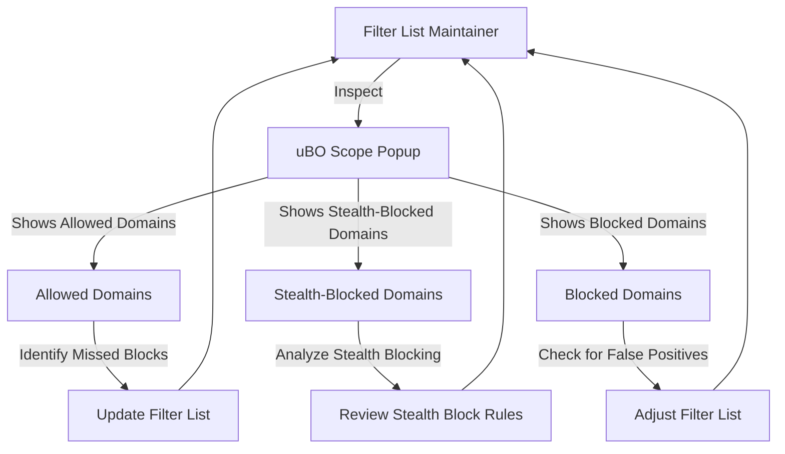

# Supporting Filter List Maintenance

A targeted workflow designed specifically for filter list maintainers to leverage uBO Scope's detailed network request outcome data. This guide helps you pinpoint missed connections and unnecessary allow rules, even on devices with limited access to browser developer tools. Learn how to uncover stealthy requests and fine-tune your filter lists to improve blocking accuracy and efficiency.

---

## Workflow Overview

### What This Guide Helps You Accomplish

As a filter list maintainer, your goal is to maintain precise and effective filters that block undesirable network requests without causing unnecessary breakage or false positives. This guide shows you how to use uBO Scope's data to:

- Detect third-party domains that evade your filters ('missed connections').
- Identify overly permissive or redundant allow rules.
- Reveal stealth-blocked requests that may impact user experience.

### Prerequisites

Before you start:

- Ensure uBO Scope is installed and correctly running in your browser.
- Familiarity with the uBO Scope popup interface and basic network request outcomes (allowed, stealth-blocked, blocked).
- Understand core domain concepts such as domain vs. hostname and public suffix lists.

### Expected Outcome

By following this guide, you will:

- Confidently interpret uBO Scope's detailed domain and hostname listings.
- Identify specific network connections that your filters do not currently block or may block unnecessarily.
- Improve your filter lists with precise adjustments based on actual network activity.

### Time Estimate

15-30 minutes per analysis session,
depending on the complexity of the site and amount of network activity.

### Difficulty Level

Intermediate — assumes familiarity with filter lists and filter logic.

---

## Step-by-Step Instructions

### Step 1: Launch uBO Scope for the Target Webpage

1. Navigate to the webpage under inspection in your browser.
2. Click the uBO Scope extension icon to open the popup.
3. Confirm that the badge count and the popup summary reflect recent network activity from the current tab.

*Expected Result:* The popup lists the page's domain at the top and sections for `not blocked`, `stealth-blocked`, and `blocked` remote server domains with request counts.

### Step 2: Review Domains Listed Under “Not Blocked”

- These represent distinct third-party domains that your filters currently allow.
- Examine if any domains appear unexpectedly or seem unnecessary.
- Consider whether these domains should be added to your filter list to tighten blocking.

*Decision Point:* Use your knowledge of the site’s legitimate third-party requirements. 

*Verification:* Confirm domain relevance by cross-referencing with existing filter rules.

### Step 3: Analyze the “Stealth-Blocked” Domains

- These are requests identified as stealth-blocked — typically blocked in a way that prevents the webpage from detecting the block (e.g., redirects or modified responses).
- Stealth-blocking helps avoid webpage breakage but can mean your filters aren't visibly reflected in the network tab.

*Tip:* Stealth-blocked domains may warrant special attention, especially if they frequently appear but are critical to the site’s functionality.

*Verification:* Confirm impact by testing page behavior with and without these domains present.

### Step 4: Examine the “Blocked” Domains

- These are domains successfully blocked by your content blocker.
- Verify if any essential domains are mistakenly blocked causing broken site features.

*Best Practice:* Maintain a balance to avoid overblocking that harms user experience.

### Step 5: Drill Down Using Domain and Hostname Counts

- The popup shows request counts per domain to indicate frequency.
- Frequent requests to unexpected domains suggest missed or insufficient filtering.
- Hostname details reveal subdomains; refine filters to be as specific or broad as necessary.

### Step 6: Formulate Filter List Updates

- Based on findings:
  - Add new blocking rules for allowed but unwanted domains.
  - Adjust existing rules where stealth-blocked domains should be more explicitly handled.
  - Remove or relax rules blocking necessary domains to reduce breakage.

*Example:* If `tracker.example.com` is frequently found in `Not Blocked` but known to track users, add a blocking rule for `||example.com^` or a more targeted filter.

### Step 7: Test Updates Across Multiple Pages and Devices

- Deploy your filter changes in your test environment.
- Run uBO Scope to confirm improvements by comparing badge counts and popup domains.

*Verification:* Reduced unwanted distinct third-party domains and improved stealth or blocked category accuracy.

### Step 8: Repeat the Process Regularly

- Filter list maintenance is ongoing. Use uBO Scope during new releases and after user feedback.
- Monitor devices with limited developer tools where uBO Scope provides valuable visibility.

---

## Practical Examples

### Example: Detecting Missed Tracker Domains

Visiting `example-news-site.com` reveals in uBO Scope’s popup:

- Allowed domains including `ads.trackercdn.com` with a high request count.
- Stealth-blocked domains like `analytics.hiddentracker.com` appearing frequently.

Action:

- Add `||trackercdn.com^` blocking rule to your filter.
- Investigate stealth-blocked `hiddentracker.com` and consider custom handling.

### Example: Avoid Blocking Essential CDN Domains

A site uses `cdn.legitimatecdn.com` frequently. Initially listed under blocked domains causing images to fail.

Action:

- Modify filters to allow `cdn.legitimatecdn.com` explicitly via an exception or allow rule.

---

## Troubleshooting & Tips

### Common Issues

- **No Data Displayed:** Ensure the tab is active and uBO Scope has permission to read network requests.
- **Unexpected Domains Appear in Allowed List:** Confirm if the domain is truly related to the site or a benign third party.
- **Badge Count Does Not Reflect Changes:** Restart the browser or reload tabs to refresh data.

### Best Practices

- Use the Public Suffix List and domain understanding to avoid overbroad filters.
- Prefer blocking on domain level but use hostname-specific filters if finer control is required.
- Leverage stealth-blocked domain insights to tune filters without breaking websites.

### Performance Considerations

- uBO Scope processes data asynchronously; allow a few seconds for all network requests to be recorded.

### Alternative Approaches

- Combine uBO Scope data with browser developer tools and other network analyzers to cross-validate findings.

---

## Next Steps & Related Content

- After mastering this page, explore [Validating Content Blocker Effectiveness](/guides/practical-use-cases/validate-content-blocker) to test your filters alongside content blockers.
- For deep understanding of domains and network request concepts, review [Core Concepts & Key Terms](/overview/getting-started/core-concepts-and-terminology).
- If new to uBO Scope, start with [Running Your First Network Analysis](/guides/getting-started/first-analysis) for basic usage.
- Visit the [What is uBO Scope?](/overview/getting-started/what-is-ubo-scope) page for product context and rationale.

---

## Appendix: Understanding the uBO Scope Popup Interface

The popup interface categorizes domains based on network request outcomes:

| Section           | Meaning                                                         |
|-------------------|-----------------------------------------------------------------|
| Not Blocked       | Domains from which network requests succeeded and were allowed. |
| Stealth-Blocked   | Domains with requests blocked invisibly to the webpage.         |
| Blocked           | Domains from which network requests failed or were blocked.     |

Each domain row displays the domain name (unicode decoded) and the number of requests observed. The summary shows the total count of distinct allowed domains.

<Accordion title="Common Terms for Filter Maintainers">

- **Third-party domain:** A domain different from the website’s main domain.
- **Stealth-blocked:** Blocking that prevents detection by webpages.
- **Filter list:** A set of rules defining which requests to block or allow.
- **Hostname vs Domain:** Hostname is the full subdomain; domain is the registrable main domain.

</Accordion>

---

## Troubleshooting Checklist

<AccordionGroup title="Troubleshooting Tips for Filter List Maintenance with uBO Scope">
<Accordion title="Popup Shows No Data or 'NO DATA'">
- Make sure uBO Scope has appropriate permissions.
- Confirm you have an active tab open.
- Refresh the tab or restart the browser.
</Accordion>
<Accordion title="Domains Do Not Appear as Expected in Outcomes">
- Allow several seconds for data collection.
- Verify the site is correctly loading resources.
- Check for browser or extension conflicts.
</Accordion>
<Accordion title="Badge Count Does Not Update">
- Refresh the affected tab.
- Close and reopen browser.
- Check extension logs or console for errors.
</Accordion>
</AccordionGroup>

---

## Useful Tips

- Use the domain count to focus on the most frequent third-party domains.
- Stealth-blocked lists help uncover requests that evade visible blocking.
- Filter list maintenance on limited devices benefits enormously from uBO Scope’s transparency without requiring developer tools.

---

For more information or to report issues, visit the [uBO Scope GitHub repository](https://github.com/gorhill/uBO-Scope).

---

# Diagram: How uBO Scope Helps in Filter List Maintenance

---

# References

- [Understanding the Popup & Badge Count](/guides/getting-started/understand-popup-badge)
- [Validating Content Blocker Effectiveness](/guides/practical-use-cases/validate-content-blocker)
- [Core Concepts & Key Terms](/overview/getting-started/core-concepts-and-terminology)
- [Running Your First Network Analysis](/guides/getting-started/first-analysis)

##### This documentation is part of the practical use cases and best practices series for uBO Scope filter list maintainers.

---