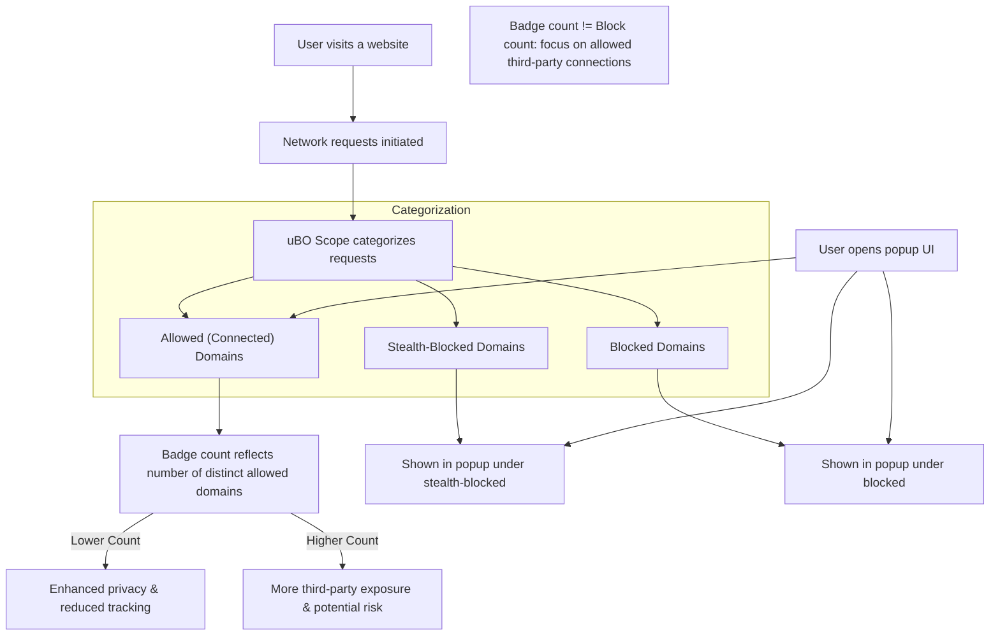

# Interpreting Badge Counts Effectively

Understanding the badge count displayed by uBO Scope is crucial for making informed judgments about your browsing privacy and the effectiveness of your content blockers. This guide clarifies the meaning behind the badge number, explains why a lower count is better, and dispels common myths users encounter when interpreting these metrics.

---

## 1. What the Badge Count Represents

The badge count on the uBO Scope toolbar icon shows the **number of distinct third-party remote servers** contacted by the active browser tab during page load and browsing.

- **More specifically:** It counts unique third-party domains that had at least one successful network request allowed.
- **Lower count = better:** A lower number indicates fewer external parties connected to, which typically means less exposure to tracking and unwanted content.

<u>**Note:**</u> The count excludes first-party domains and focuses solely on third-party remote servers, highlighting your actual network footprint.

---

## 2. Why a Lower Badge Count Is More Desirable

Websites often load resources from multiple external servers such as ad networks, analytics services, and content delivery networks (CDNs). Each third-party connection can be a potential privacy risk:

- **Tracking:** Each domain may track your behavior across websites.
- **Unwanted content:** Extra connections may introduce ads, trackers, or insecure resources.
- **Performance impact:** More connections can slow down page load times.

By minimizing third-party connections (hence a lower badge count), you achieve better privacy, reduced tracking, and more efficient browsing.

---

## 3. Understanding the Three Connection Categories in the Popup

The uBO Scope popup (opened by clicking the toolbar icon) categorizes domains as:

- **Allowed (Not Blocked):** Domains from which resources loaded successfully.
- **Stealth-Blocked:** Domains whose requests were redirected stealthily to avoid page breakage or detection.
- **Blocked:** Domains where network requests failed due to blocking.

Your badge count reflects the size of the **Allowed** set — the ones actually connected from the page.

---

## 4. Common Misconceptions Dispelled

<u>### Myth 1: "Higher block count means better blocking"

- A high block count can be misleading. Sometimes, more blocks mean the content blocker lets more third-party servers connect before blocking requests, increasing your exposure.
- What ultimately matters is how many distinct third-party servers actually fetched resources — the badge count shows this.

<u>### Myth 2: "Ad blocker test pages accurately reflect blocker effectiveness"

- Specialized test sites often use unrealistic network requests that do not represent real-world browsing.
- They cannot detect stealth blocking strategies used by extensions like uBO Scope.
- Relying on these tests may give false confidence or mislead about actual privacy protection.

---

## 5. How to Contextualize the Badge Number

### Practical Tips:

- **Compare badge counts across sites:** Some sites naturally connect to many third parties (news outlets, social media).
- **Consider legitimate third parties:** CDNs and essential third-party services often appear and should be expected; not all third parties are harmful.
- **Use the popup to explore which domains made connections:** This helps identify suspicious or unexpected domains.

### Example:

| Scenario                  | Badge Count | Interpretation                                |
| ------------------------- | ----------- | --------------------------------------------- |
| Minimal external content  | 2           | Likely only essential third-party CDNs       |
| High number (20+)          | 20+         | Many third parties potentially tracking you  |
| High block count, low badge | 0-3          | Blocking effective in limiting third parties |

---

## 6. Step-by-Step: Using the Badge and Popup Together

<Steps>
<Step title="Observe the Badge Count">
- Look at the number on the toolbar icon when browsing.
- A non-zero number indicates the count of distinct third-party servers connected.
</Step>
<Step title="Open the Popup for Details">
- Click the uBO Scope icon.
- Review the summary number of domains connected.
- Explore domains under Allowed, Stealth, and Blocked sections.
</Step>
<Step title="Interpret Domains">
- Identify known CDNs or trusted services to avoid false positives.
- Flag unfamiliar or suspicious domains for further investigation.
</Step>
<Step title="Evaluate Blocking Effectiveness">
- If you use content blockers, check the Blocked and Stealth sections.
- Confirm if the badge count drops when blockers are enabled.
</Step>
</Steps>

---

## 7. Troubleshooting Badge Count Confusion

<AccordionGroup title="Troubleshooting Badge Count Issues">
<Accordion title="Badge shows zero or no count despite network activity">
- Possible causes:
  - Permissions not properly granted (verify `webRequest` permission).
  - Browsing tab not yet fully analyzed.
  - Network requests made outside monitored URLs or protocols.
- Solution: Reload the page and verify permissions; see documentation on [Basic Configuration and Permissions](/getting-started/setup-and-troubleshooting/basic-configuration).
</Accordion>
<Accordion title="Badge count is unexpectedly high despite blocking">
- Possible causes:
  - Some third-party connections are allowed by filter rules.
  - Stealth blocking may conceal some blocked calls.
  - Tracking scripts may get resource access through stealth redirects.
- Solution: Examine the popup's allowed and stealth sections for domain details; adjust filters if necessary.
</Accordion>
<Accordion title="Confusing about allowed vs stealth-blocked counts">
- Stealth blocked domains mean redirects were processed to stealthily block without causing page breakage.
- Allowed means requests were not blocked and successfully loaded.
- The badge only reflects allowed domains counted.
</Accordion>
</AccordionGroup>

---

## 8. Best Practices for Interpreting Badge Counts

- Use badge count as a privacy fingerprint indicator rather than an absolute security measure.
- Focus on reduction of allowed third-party domains over literal block counts.
- Regularly review popup details to familiarize with normal domain sets for your favorite websites.
- Combine with uBO Scope's detailed network insights for audit workflows.

---

## 9. Next Steps & Related Guides

- Learn how to perform a [Site Privacy Audit using uBO Scope](/guides/practical-use-cases/site-privacy-audit-guide) to deepen your understanding of network connections and privacy risks.
- Explore the [Popup UI guide](/guides/getting-started-journeys/exploring-the-popup-ui) to master the interface and its domain categorizations.
- Understand how uBO Scope contrasts with other blockers in [Comparing Content Blocker Results](/guides/practical-use-cases/comparing-content-blockers).

---

<u>Empower your browsing privacy by knowing exactly what your badge count means — a clear window into your web footprint, not just a number to chase.</u>

---

## References and Further Reading

- [What is uBO Scope?](../overview/introduction-value/what-is-ubo-scope)
- [Core Concepts & Terminology](../overview/core-concepts-system/core-terminology)
- [Basic Configuration and Permissions](../../getting-started/setup-and-troubleshooting/basic-configuration)
- [First Network Request Analysis](../../guides/getting-started-journeys/first-network-request-analysis)

---

## Visual Overview

---