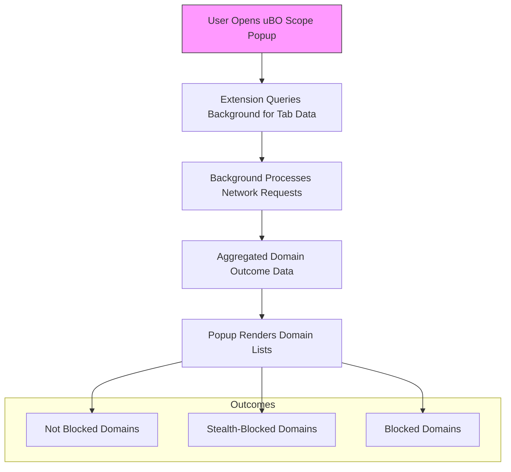

# Monitoring Third-party Connections with uBO Scope

## Overview
This guide walks you through using uBO Scope to identify and analyze all third-party domains a visited webpage attempts to reach. It helps you distinguish essential connections, such as content delivery networks (CDNs), from potentially undesirable or privacy-invasive third parties. Practical examples and explanations ensure you can effectively interpret the data uBO Scope presents for your active browser tab.

---

## What You Will Achieve
- See all third-party domains contacted by the webpage you visit
- Understand categories of connection outcomes: not blocked, stealth-blocked, and blocked
- Differentiate benign essential services from potentially unwanted third parties
- Use real-world examples to make informed decisions about privacy exposure

---

## Prerequisites
- uBO Scope installed and activated on your Chromium, Firefox, or Safari browser
- Permissions granted for uBO Scope to monitor network requests
- Familiarity with basic web browsing and extension toolbar interaction
- Recommended: Review the [Feature Quick Tour](/overview/core-architecture-concepts/feature-quick-tour) for a primer on popup UI elements

---

## Understanding the Popup Interface
The uBO Scope popup summarizes all remote server connections initiated by the active tab, grouping them into three distinct outcome categories:

- **Not blocked:** Domains from which connections succeeded
- **Stealth-blocked:** Domains whose connections were silently redirected or stealthily blocked
- **Blocked:** Domains whose connections failed or were explicitly blocked by the system

At the top, the domain and hostname of the current active tab are shown. Below that, a domain count indicates how many distinct third-party domains were contacted successfully (not blocked).

  

---

## Step-by-Step: Monitoring Third-party Connections

<Steps>
<Step title="Open the uBO Scope Popup">
Click the uBO Scope toolbar icon while on the webpage you want to analyze. The popup will load the summary data for the current active tab.

**Expected Result:** The popup displays the tab hostname at the top and lists domains under the three outcome categories.
</Step>

<Step title="Interpret the Tab Hostname">
Review the top header that shows the tab's full hostname and its registered domain in Unicode format. This helps you ensure you are examining the correct webpage.

**Tip:** The popup translates punycode to human-readable Unicode for internationalized domains.
</Step>

<Step title="Review the Domain Count">
Look at the 'domains connected' summary. This number reflects the count of unique third-party domains successfully contacted (not blocked).

**Decision Point:** A lower count generally means reduced third-party exposure and potentially better privacy.
</Step>

<Step title="Analyze Each Outcome Section">
Expand each of the three sections — not blocked, stealth-blocked, and blocked — to review the domains listed. Each domain has a request count badge showing how many connections involved it.

- **Not blocked:** Identify domains you recognize, such as CDNs (e.g., `cloudflare.com`, `akamai.net`) which are typically essential.
- **Stealth-blocked:** Domains whose presence indicates that some connections were silently redirected or obscured.
- **Blocked:** Domains that the browser or content blockers prevented from loading.

**Example:** Seeing domains like `google-analytics.com` under not blocked might indicate tracking activity.
</Step>

<Step title="Distinguish Essential vs. Unwanted Third Parties">
Use your knowledge or external resources to differentiate legitimate third parties (e.g., CDN providers, social media widgets) from potentially privacy-invasive trackers or advertising domains.

**Tip:** Consider frequently visited websites: a low number of benign CDNs is expected, while a high diversity of unknown or advertising domains could signal privacy concerns.
</Step>

<Step title="Use Insights to Adjust Your Blocking or Browsing Behavior">
Based on what you discover, decide whether to adjust your content blocker settings or avoid certain sites to enhance privacy.

**Verification:** Refresh the webpage and check if domain counts or domain lists change, indicating dynamic third-party requests.
</Step>
</Steps>

---

## Practical Example Scenario
Suppose you visit a news website and open the uBO Scope popup:

- Tab hostname shows `www.examplenews.com` with domain `examplenews.com`.
- The not blocked section lists 12 domains, including `examplenews.com` CDN domains and some ad network domains.
- The stealth-blocked section contains a few ad-related domains that seem to be stealth-blocked.
- The blocked section has no entries.

**Analysis:** The site connects to known CDNs plus several advertising-related domains. Stealth blocking is present but no outright blocks were triggered. You decide to increase privacy by using stricter filters or avoid pages with high exposure counts.

---

## Best Practices and Tips
- **Regular Monitoring:** Check uBO Scope regularly to track changes in third-party exposure as websites update their content.
- **Familiarize with Domains:** Maintain a list or use privacy tools to identify known trackers versus legitimate services.
- **Check Multiple Tabs:** Each tab has independent connection data reflecting its unique network activity.
- **Beware of False Assumptions:** A higher number of blocked domains does not always mean better privacy. Focus on the unique allowed domains count.

---

## Troubleshooting Common Issues

<AccordionGroup title="Troubleshooting Common Popup Observations">
<Accordion title="Popup Shows ‘NO DATA’ or Empty Lists">
Ensure uBO Scope has the necessary permissions enabled. Verify the extension has access to active tabs and webRequest API as described in installation guides.
</Accordion>
<Accordion title="Domain Counts Do Not Update After Navigating">
Refreshing the page and reopening the popup forces data refresh. If problem persists, restart the browser or check for extension conflicts.
</Accordion>
<Accordion title="Unexpected Domains Appear in All Sections">
Some domains may appear due to redirects or stealth blocking. Consult documentation on stealth blocked behavior to better interpret these results.
</Accordion>
</AccordionGroup>

---

## Visualizing the Data Flow

This flow illustrates how clicking the toolbar icon triggers a query to the background script, which aggregates network request outcomes per tab. The popup then presents this data sorted by blocking results.

---

## Next Steps
- Consult the [Exploring the Popup Interface](/guides/getting-started/exploring-popup) to deepen your understanding of all UI elements.
- Learn about analyzing stealth and blocked requests in the [Analyzing Stealth and Blocked Requests](/guides/advanced-insights/analyzing-stealth-blocking) guide.
- If you encounter any issues during setup or popup usage, refer to [Troubleshooting Common Setup Issues](/getting-started/first-run-usage/troubleshooting-install).

---

## Additional Resources
- [System Architecture Overview](/overview/core-architecture-concepts/system-architecture-overview): Understand how uBO Scope monitors network traffic
- [Core Concepts and Terminology](/overview/core-architecture-concepts/core-concepts-and-terminology): Clarify key terms like stealth blocking
- [What is uBO Scope?](/overview/product-introduction/what-is-ubo-scope): Background on product mission

---

<Tip>
Monitoring third-party connections empowers you to see unseen network activities that affect your privacy. Consistency with uBO Scope helps you stay informed and make better decisions about your browsing habits and blocker configurations.
</Tip>

<Check>
Always verify you're viewing data for the active tab to avoid confusion about domains belonging to different websites.
</Check>
