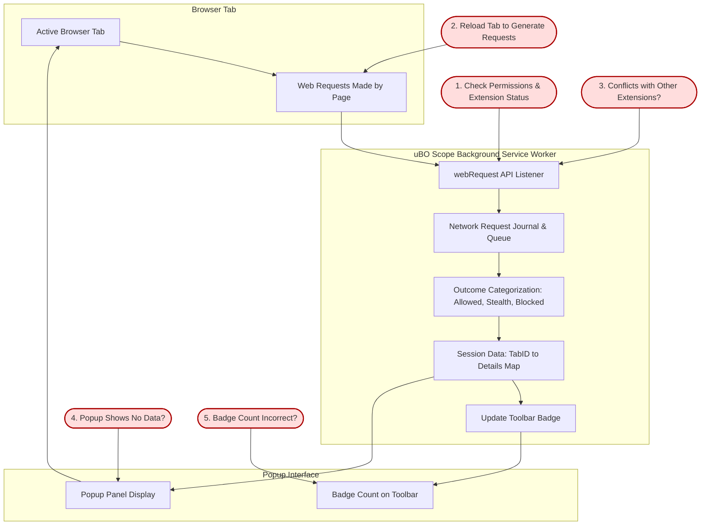

# Troubleshooting, Limitations, and Common Questions

## Overview
This guide helps you diagnose issues related specifically to missing or incomplete data in the uBO Scope extension, interpret unexpected results in domain connection information, and understand key technical limitations related to how the extension tracks network requests. It also provides advice on managing session data for reliable results and clarifies the boundaries of data accuracy due to browser and API constraints.

---

## 1. Diagnosing Missing or Incomplete Data

### Understanding What Data uBO Scope Tracks
uBO Scope captures network requests at the browser level using the `webRequest` API. This means it only monitors requests visible to the browser's API, not those made by the operating system, plugins, or other external software.

### Step-by-Step Troubleshooting for Missing Data

<Steps>
<Step title='Check Browser Permissions and Extension Status'>
Ensure uBO Scope has been granted all required permissions (`webRequest`, `activeTab`, and `storage`) and is enabled. Missing permissions or disabled extension will result in no data.
</Step>
<Step title='Reload the Page'>
After installing or updating uBO Scope, refresh the active browser tab to allow the extension to capture new network requests.
</Step>
<Step title='Open uBO Scope Popup on Active Tab'>
Click the toolbar icon to open the popup interface and verify if domains are listed. An empty popup often signals no network requests were captured for that tab.
</Step>
<Step title='Verify Badge Count Matches Expectation'>
The badge on the toolbar icon shows the count of distinct allowed third-party remote servers. Zero or unexpectedly low counts may indicate incomplete tracking or filtering issues.
</Step>
<Step title='Check for Conflicts or Interference'>
Other extensions like aggressive content blockers or privacy tools may interfere with network request visibility. Temporarily disable other extensions to verify if data appears.
</Step>
</Steps>

### Expected Results at Each Step
- Permissions are set properly.
- After reload, network requests are captured.
- Popup displays domain lists under allowed, stealth, and blocked categories.
- Badge displays a numeric count reflecting detected connections.

<Check>
If data remains missing despite these checks, consider restarting the browser or reinstalling the extension.
</Check>

---

## 2. Interpreting Unexpected Results

### All Domains Count is Zero or Very Low
- This may happen if the URL of the active tab lacks network activity or the browser does not emit `webRequest` events for certain types of requests.
- Local or internal pages (`about:blank`, `file://`) do not generate network requests interceptable by uBO Scope.

### Presence of Domains Under "Stealth" or "Blocked" Categories
- "Stealth" indicates requests redirected or modified to hide blocking.
- "Blocked" means the browser reported failed network requests.
- Some legitimate third-party services may appear blocked if blocked by your other extensions or privacy settings.

### Badge Count Does Not Match Popup Domain Count
- The badge counts only distinct allowed third-party domains.
- The popup separately lists allowed, stealth, and blocked domains, each with their own counts.
- Stealth and blocked domains do not add to the badge count.

### Domains Displayed But Not Recognized as Third-Party
- The extension uses the Public Suffix List to determine base domains.
- Some uncommon or private domains may be misclassified.

<Note>
Review domain appearances over multiple page loads to see consistent patterns; transient connections may cause fluctuations.
</Note>

---

## 3. Technical Limitations

### Browser API and WebRequest Coverage
- uBO Scope depends on the browser's `webRequest` API to monitor network requests.
- Requests made outside the browser environment (e.g., OS background services, plugins, native applications) are not visible.

### HTTPS and WebSocket Support
- Modern browsers restrict extension access to certain protocols.
- uBO Scope supports HTTP, HTTPS, WebSocket (ws://), and Secure WebSocket (wss://) where permitted.
- Safari does not use WebSocket in some permissions and versions.

### Timing and Session Persistence
- The extension processes network requests asynchronously, batching to optimize performance.
- Data is stored per tab session and cleared upon tab closure.
- Some requests are retried internally, which may cause transient delays in domain appearance.

### Domain Resolution and Public Suffix List Accuracy
- The extension uses the Public Suffix List to extract base domains.
- Updates to the Public Suffix List occur periodically; outdated PSL data can cause domain parsing issues.
- Users cannot configure or edit the PSL within the extension.

### Impact of Other Security Tools
- Third-party security or privacy tools intercepting or blocking network requests can limit data visibility.
- VPNs, proxy servers, or custom DNS may alter visible connections.

<Warning>
Due to these fundamental boundaries, uBO Scope should be considered as a best-effort monitoring tool, revealing most but not every remote connection.
</Warning>

---

## 4. Best Practices for Session Handling

### Keep Browsing Sessions Stable
- Avoid frequent tab reloads or rapid tab closures when analyzing connection data.
- Use dedicated tabs or windows for monitoring when possible.

### Avoid Extension Overlap
- Disable overlapping content blockers temporarily to assess uBO Scope's independent measurements.

### Refresh PSL and Extension Updates
- uBO Scope automatically refreshes its Public Suffix List.
- Keep the extension updated to take advantage of improvements and PSL corrections.

---

## 5. Common Questions

### Why Doesn't uBO Scope Report Every Network Request?
Because it relies exclusively on the browser's `webRequest` API, any requests made behind the scenes or not exposed to that API will not be reported.

### What Does 'Stealth-Blocked' Mean?
It represents requests that were redirected or altered silently by content blockers or privacy features, making their blocking invisible to the page but detectable by uBO Scope.

### Can I Trust the Badge Count As My Total Number of Connections?
The badge count reflects only the number of distinct allowed third-party domains for the currently active tab. It’s a privacy indicator: lower is better.

### Will uBO Scope Work With All Browsers?
uBO Scope supports Chromium-based browsers (Chrome 122+), Firefox (128+), and Safari (18.5+) with some functionality uniquely varying by browser due to API support.

<Tip>
Check the browser-specific installation guides if you experience functionality differences.
</Tip>

### How Do I Report Bugs or Get Support?
uBO Scope is maintained with minimal frequent updates; report issues or feature requests via the [official GitHub repository](https://github.com/gorhill/uBO-Scope).

---

## 6. Troubleshooting Checklist

<AccordionGroup title="Troubleshooting Checklist">
<Accordion title='Extension Icon or Badge Missing'>
- Verify extension installation and enablement.
- Confirm browser version meets minimum requirements.
- Check browser permissions for uBO Scope.
- Restart browser if needed.
</Accordion>
<Accordion title='Popup Shows "No Data" or Empty Lists'>
- Reload the active tab to trigger network request capture.
- Disable conflicting extensions.
- Confirm the page generates network traffic.
- Check console logs for error clues (developer tools).
</Accordion>
<Accordion title='Badge Count Never Updates or Incorrect'>
- Allow some seconds after page load for processing.
- Verify that the tab is active and recognized.
- Clear browser cache or restart browser.
- Inspect browser `webRequest` API access restrictions.
</Accordion>
<Accordion title='Data Appears Incomplete or Inconsistent'>
- Understand that domains are counted per tab session;
  closing tab clears data.
- Stealth or blocked categories may show delayed updates.
- Extension may batch process requests asynchronously.
</Accordion>
</AccordionGroup>

---

## 7. Additional Resources

- [How uBO Scope Works: Architecture & Data Flow](https://docs.uBO-Scope/guides/overview/core-concepts-workflow/how-it-works-architecture)
- [Understanding Domain Statuses: Allowed, Blocked, Stealth](https://docs.uBO-Scope/guides/getting-started/understanding-domain-statuses)
- [Installation and Setup](https://docs.uBO-Scope/guides/getting-started/installation-and-setup)
- [Launching uBO Scope for the First Time](https://docs.uBO-Scope/getting-started/first-run-validation/running-extension)
- [Troubleshooting Setup Issues](https://docs.uBO-Scope/getting-started/first-run-validation/troubleshooting)

---

## 8. Summary Diagram: Data Flow and Troubleshooting Points

---

## 9. Summary
This documentation equips users with pragmatic troubleshooting steps to resolve issues with missing or unexpected data in uBO Scope, clarifies technical limitations inherent to browser extension architecture, and provides best practices for reliable session management and data interpretation. The guide concludes with a troubleshooting checklist and a data flow diagram highlighting key user checkpoints.