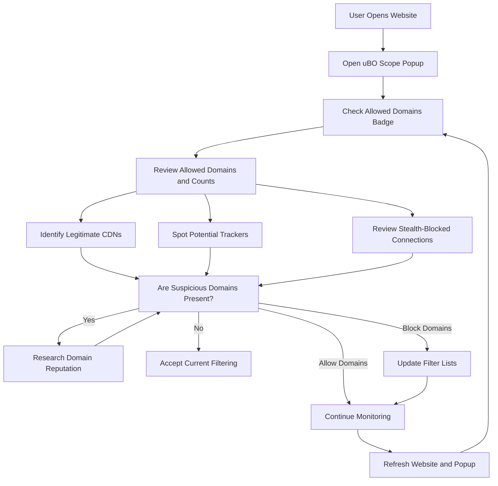

# Best Practices for Privacy Analysis with uBO Scope

## 1. Overview

When using uBO Scope to analyze network connections generated by webpages, understanding the data it surfaces is essential to effectively distinguish between legitimate content delivery infrastructure and potential tracking or unwanted third-party endpoints. This guide delivers actionable tips and proven patterns to interpret connection categories, spot common pitfalls, and make informed decisions to enhance your privacy.

### What This Guide Helps You Achieve
- Identify and differentiate legitimate CDN domains from third-party tracking endpoints.
- Understand the implications of allowed, stealth-blocked, and blocked connection categories.
- Apply practical methods to evaluate real network data with uBO Scope.
- Avoid common analysis mistakes and misconceptions.

### Who Should Use This Guide
Privacy-conscious users, filter list maintainers, content blocker evaluators, and anyone interested in accurately interpreting uBO Scope data for privacy protection.

---

## 2. Key Concepts to Frame Your Workflow

Before diving into practical tips, recalling how uBO Scope classifies network connections sharpens analysis clarity.

- **Allowed Connections**: Third-party domains and hostnames that successfully loaded resources.
- **Blocked Connections**: Network requests the browser or content blockers actively prevented.
- **Stealth-Blocked Connections**: Requests intercepted quietly by stealth mechanisms without exposing block actions to the page.

<u>Understanding connection counts and categories is crucial:</u> the toolbar badge shows the *number of distinct allowed third-party domains* currently connected to the active tab. Lower counts usually translate to stronger privacy.

<u>Domains vs. Hostnames:</u> Connections are grouped firstly by domain (effective second-level domain plus suffix) and secondly into hostnames under those domains. A domain like `cdn.example.com` belongs to domain `example.com`.

---

## 3. Practical Tips & Patterns for Accurate Analysis

### 3.1. Validate the Nature of Third-party Domains

- **CDNs and Legitimate Providers**: Domains operated by Content Delivery Networks (CDNs) are common and often necessary for webpage assets like scripts, styles, images, or fonts. Typical CDN domains include:
  - `cdn.jsdelivr.net`
  - `cdnjs.cloudflare.com`
  - Large cloud providers like `aws.amazon.com` or `cloudfront.net`

  Use online domain lookup to verify reputation and ownership. Typically, few CDNs per site is normal.

- **Tracking or Ad-related Endpoints**: Domains unfamiliar or related to advertising, analytics, or social trackers frequently appear in the allowed list. If you find multiple such domains with numerous requests or high resource counts, the site likely engages in extensive tracking.

- **Unusual Domain Patterns**:
  - Single-character subdomains or random alphanumeric hostnames often signal tracking.
  - Domains with mixed or suspicious TLDs that differ from the main site should be scrutinized.

### 3.2. Interpreting Stealth-Blocked Connections

Stealth-blocked connections represent network requests blocked invisibly, often by stealthy content blockers to avoid detection or webpage breakage.

- These domains are still requested but blocked before loading resources.
- A high number of stealth blocks paired with lower allowed counts suggests effective content blocking with stealth techniques.
- Do **not** confuse stealth-blocked domains as harmless or allowed.

### 3.3. Contextualize Blocked Connections

- Blocked domains have network requests prevented by uBO Scope or cooperating blockers.
- A large blocked list compared to allowed domains can indicate strict filtering.
- Some legitimate domains may appear here temporarily if transiently blocked; always verify before outright blocking.

### 3.4. Use the Badge Count as Privacy Indicator

- The badge count reflects distinct allowed third-party domains.
- A **lower badge count means fewer third parties delivering resources**, directly enhancing privacy.
- Avoid judging blockers by their block count alone; focus on allowed third-party connections.

<Tip>
Always prioritize the lowest number of allowed third-party remote domains over the highest block counts for meaningful privacy assessment.
</Tip>

### 3.5. Peruse Request Counts within Domains

- Domain entries display how many successful requests were made.
- High counts for a single domain, especially unknown ones, can mean extensive tracking.
- Legitimate CDNs typically have moderate counts matching asset load volumes.

### 3.6. Beware of Synthetic 'Ad Blocker Test' Sites

- These test pages are usually unreliable, as confirmed by uBO Scope's real data capture.
- Focus your analysis on actual, real-world sites to get authentic insights.

### 3.7. Domain Categorization Heuristics

- Use browser tools or public suffix lists to correctly identify domains and public suffixes.
- uBO Scope uses the public suffix list internally to avoid misclassifying subdomains.

### 3.8. Combine uBO Scope Data with Other Privacy Tools

- To deepen insights, use uBO Scope alongside filter lists and privacy analyzers.
- Cross-check domains with privacy-oriented blocklists like EasyPrivacy or Disconnect.

---

## 4. Step-by-Step Practical Analysis Workflow

<Steps>
<Step title="Open the uBO Scope Popup for Your Target Site">
Click the uBO Scope toolbar icon while visiting the site you want to analyze. The popup shows connection summaries for the active tab.
</Step>

<Step title="Review the Badge Count and Domain Summary">
Observe the badge number for distinct allowed third-party domains. Confirm if the count aligns with your privacy expectations.
</Step>

<Step title="Study Allowed Domains and Their Request Counts">
Scroll to the allowed connections section and note the domains, especially those with high request counts. Research unfamiliar domain reputations.
</Step>

<Step title="Check Stealth-Blocked and Blocked Domains">
Assess stealth-blocked domains to understand what was silently blocked. Use the blocked list to identify explicit filtration.
</Step>

<Step title="Look for Patterns and Anomalies">
Identify large numbers of subdomains under a single domain, strange TLDs, or unexpected domain names.
</Step>

<Step title="Correlate with Filter Lists and Additional Research">
Use external tools and blocklists to verify if questionable domains are tracking related.
</Step>

<Step title="Make Informed Decisions on Blocking or Allowing Domains">
Based on your analysis, refine your filter list or browser settings to enhance privacy.
</Step>
</Steps>

---

## 5. Common Pitfalls and How to Avoid Them

<AccordionGroup title="Common Pitfalls">
<Accordion title="Mistaking Block Count for Privacy Strength">
Block counts vary widely and don't directly translate to privacy quality. Focus on allowed third-party domains and their necessity.
</Accordion>

<Accordion title="Assuming All Third Parties Are Malicious">
Some third parties like CDNs are essential for website functionality. Don't block legitimate infrastructure missing in context.
</Accordion>

<Accordion title="Misinterpreting Stealth Blocks as Allowed Connections">
Stealth-blocked connections are blocked requests; treat them as part of your privacy gain, not allowed.
</Accordion>

<Accordion title="Relying Solely on Synthetic Ad Blocker Test Sites">
Use real world websites for privacy analysis with uBO Scope to avoid misleading conclusions.
</Accordion>

<Accordion title="Ignoring Domain Hierarchy and Suffixes">
Be sure to correctly identify domains with public suffix lists to avoid false positives or missed tracking domains.
</Accordion>
</AccordionGroup>

---

## 6. Additional Tips for Advanced Users

- **Pattern Recognition:** Over time, build a mental list of known CDN providers and trackers for quicker analysis.
- **Automation:** Consider creating scripts or filter rules informed by your uBO Scope analyses.
- **Session Tracking:** Monitor how repeated visits affect the allowed domain counts.

---

## 7. Troubleshooting Your Privacy Analysis

<AccordionGroup title="Troubleshooting Tips">
<Accordion title="Unexpected High Allowed Domain Counts">
Check that uBO Scope is properly installed with all required permissions. Verify no browser or extension updates have changed network APIs.
</Accordion>

<Accordion title="No Data or Missing Domains in Popup">
Confirm the active tab is properly reporting connections, refresh the page, or restart your browser.
</Accordion>

<Accordion title="Unfamiliar Domains with High Request Counts">
Use domain lookup tools and privacy blocklists; remember some legitimate services might use unexpected domains early in their lifecycle.
</Accordion>
</AccordionGroup>

---

## 8. Next Steps & Related Resources

- Explore the [Understanding the Popup Panel guide](/guides/core-workflows/understanding-the-popup) to master the UI.
- Use the [Monitoring Third-party Connections guide](/guides/core-workflows/monitoring-connections) for deep inspection workflows.
- Test your findings with the [Comparing Content Blockers guide](/guides/privacy-analysis-patterns/comparing-content-blockers) to evaluate blocker efficiency.
- Validate your installation following the [Validate Your Installation guide](/getting-started/validation-troubleshooting/validate-installation).

---

<u>Combining these best practices with consistent usage of uBO Scope will greatly enhance your privacy awareness and empower you to make smarter filtering choices.</u>

---

# References
- [uBO Scope GitHub Repository](https://github.com/gorhill/uBO-Scope)
- [Public Suffix List](https://publicsuffix.org)
- Official uBO Scope documentation navigation: see the Guides tab for privacy analysis and core workflows

---

# Diagram: Privacy Analysis Flow Using uBO Scope

---