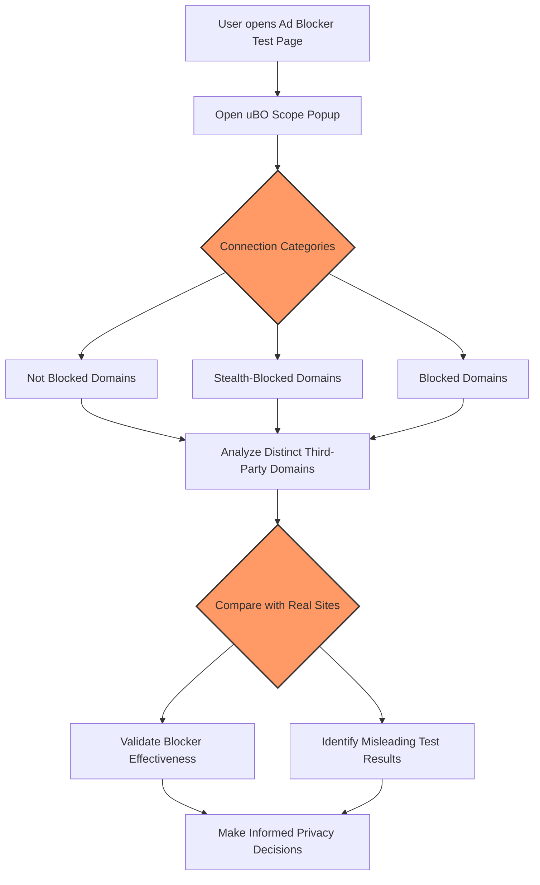

# Debunking Ad Blocker Test Myths with uBO Scope

---

## Overview

This guide empowers you to use uBO Scope as a powerful reality check against misleading ad blocker test webpages. Traditional ad blocker test sites often fail to reflect the real-world effectiveness of content blockers because they use synthetic, unrealistic network request patterns and don't capture stealth blocking techniques. By examining detailed network request outcomes captured by uBO Scope, you can uncover the true privacy impact and connection behavior of your content blocker.

---

## What You'll Achieve

- Understand why common ad blocker test pages can give false impressions.
- Learn how to utilize uBO Scope’s detailed connection data to distinguish real blocking effectiveness.
- Interpret the difference between blocked, stealth-blocked, and allowed connections in real browsing scenarios.
- Develop practical strategies to assess content blocking using uBO Scope instead of misleading benchmarks.

---

## Prerequisites

- uBO Scope installed and active in your supported browser (Chrome, Firefox, Safari).
- Basic familiarity with opening browser extensions and the uBO Scope popup interface.
- Understanding of network requests and domains terminology (refer to [Terminology & Core Concepts](../overview/core-concepts-architecture/terminology-core-concepts)).

---

## Why Traditional Ad Blocker Test Pages Are Misleading

### 1. Synthetic Network Patterns
Ad blocker test pages generate network requests to domains and resources that do not exist or are rarely used in the wild. This artificial traffic can misrepresent how blockers perform against real third-party connections.

### 2. Stealth Blocking Techniques Are Invisible
Many modern blockers employ stealth tactics to prevent sites from detecting blocking activity. Test pages, however, cannot detect or emulate these subtle mechanisms, leading to false positives or inaccurate block counts.

### 3. Block Count ≠ Privacy Effectiveness
High block counts on test pages often signal more requests intercepted, but this doesn't translate to fewer third-party connections overall. uBO Scope focuses on distinct third-party domains connected — the true metric of privacy impact.

<Tip>
Understanding these limitations helps you interpret test results appropriately and avoid misleading conclusions about the effectiveness of your content blocker.
</Tip>

---

## Using uBO Scope to Reveal True Privacy Impact

### Step 1: Open the uBO Scope Popup While Browsing the Test Page

1. Navigate to the ad blocker test webpage you're interested in evaluating.
2. Click the uBO Scope extension icon in your browser toolbar.
3. The popup will display three sections of domains:
   - **Not Blocked:** Connections allowed by your blocker.
   - **Stealth-Blocked:** Requests blocked stealthily without site detection.
   - **Blocked:** Requests overtly blocked.

### Step 2: Examine the Network Request Details

- Assess the *count* of distinct third-party domains in each section.
- Notice if stealth blocking is actively used. A significant stealth-blocked domain list indicates advanced blocker behavior.
- Check the overall badge count on the toolbar icon, representing unique third-party domains connected.

### Step 3: Compare With Real-World Sites

- Visit commonly used websites and observe their connection patterns using uBO Scope.
- Contrast these with test page data to understand real impact versus synthetic results.

<Tip>
Focus on reducing the number of distinct third-party domains connected rather than simply maximizing the blocked request count.
</Tip>

---

## Interpreting Connection Categories

| Category         | What It Means                                    | Why It Matters                          |
|------------------|-------------------------------------------------|---------------------------------------|
| **Not Blocked**  | Domains with connections allowed by blocker     | Represents third-party servers actually reached |
| **Stealth-Blocked** | Domains where requests were blocked stealthily  | Indicates subtle blocking that preserves site functionality and avoids detection |
| **Blocked**      | Domains with overtly blocked requests            | Shows direct, visible blocking events  |

Understanding these distinctions helps accurately assess the blocker’s behavior beyond simple block tallies.

---

## Practical Example: Busting the Myth of “Better” Block Counts

Suppose two content blockers claim superiority based on higher block counts reported on popular test pages:

- Using uBO Scope, you observe that the blocker with a higher block count still allows connections to more distinct third-party domains.
- The blocker with stealth blocking reduces overall third-party domains more effectively, despite fewer overt block events.

This real data highlights that a lower uBO Scope badge count signals stronger privacy protection.

---

## Best Practices for Using uBO Scope in This Context

- **Regularly check the popup data** instead of relying on block count alone.
- **Focus on distinct third-party domains** as a meaningful privacy metric.
- Use uBO Scope in real browsing scenarios for accurate evaluation.
- Avoid overreacting to test page results without cross-verifying.

<Warning>
Do not uninstall or disable uBO Scope based solely on traditional test page results. Use it as a diagnostic tool to gain an accurate view.
</Warning>

---

## Troubleshooting Common Issues

### Issue: uBO Scope Does Not Show Data on Test Pages
- Ensure uBO Scope is installed correctly and permissions are granted ([see Initial Configuration](../getting-started/installation-setup/initial-configuration)).
- Reload the test page and open uBO Scope popup again.

### Issue: Badge Count and Popup Data Seem Inconsistent
- Remember the badge counts distinct third-party domains; multiple requests to the same domain count as one.
- Popup shows categories with counts per domain; differences might appear due to session timing.

---

## Summary

By using uBO Scope to look beyond superficial block counts on ad blocker test pages, you gain a transparent, trustworthy view of how many third-party servers your blocker actually allows or blocks, including stealth behavior. This guide encourages a shift from misleading benchmarks to genuine, data-driven privacy insights.

---

## Next Steps & Related Content

- Explore the detailed explanations of uBO Scope's connection data in [Interpreting the Badge Count: What Really Matters?](./interpreting-badge-count)
- Learn about core terminology to better understand connection outcomes in [Terminology & Core Concepts](../overview/core-concepts-architecture/terminology-core-concepts)
- Verify your installation and usage with [Accessing the Popup & Verifying Installation](../../getting-started/first-steps-usage-validation/accessing-popup-verifying-install)
- Deepen your understanding of uBO Scope's architecture with [How uBO Scope Works](../overview/core-concepts-architecture/how-ubo-scope-works)

---

## Additional Resources

- [Official uBO Scope GitHub Repository](https://github.com/gorhill/uBO-Scope)
- [Understanding Third-Party Connections and Blocking](../overview/introduction-core-value/what-is-ubo-scope)

---

## Visualizing the Evaluation Flow

This workflow guides users through examining ad blocker test results with uBO Scope, enabling informed conclusions based on real network data rather than misleading benchmarks.
