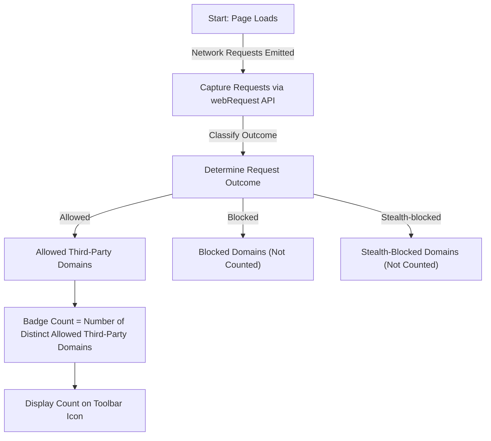

# Interpreting the Badge Count: What Really Matters?

Understanding the badge count displayed by the uBO Scope extension is crucial for users who want to gain real insights into their browser's network activity and privacy status. This guide explains what the badge number represents, why fewer third-party connections generally mean better privacy, and debunks common misconceptions arising from other privacy or ad-blocking tools.

---

## 1. What the Badge Count Represents

- **Core Meaning:** The badge count on the toolbar icon reflects the **number of distinct third-party remote servers** from which your browser requested content and successfully connected.
- **Not a Block Count:** Contrary to some other blockers, this number is *not* about the total blocked requests but about third parties that your browser reached.
- **Third-Party Defined:** A third-party server is any domain different from the first-party domain of the webpage you are visiting.

> For example, if you visit `news.example.com` and connect to `cdn.examplecdn.com` and `analytics.tracker.com`, your badge count will be `2` since two distinct third-party domains were contacted.

---

## 2. Why Fewer Third-Party Connections Are Better

- **Privacy Significance:** Each third-party connection potentially exposes you to tracking, profiling, or unwanted data collection.
- **Reduced Attack Surface:** Minimizing third-party servers contacted limits vulnerabilities and data leakage.
- **Content Delivery Networks (CDNs) Exception:** Some third parties like CDNs are common and often essential for speed; a very low number here usually means stronger privacy but watch for unusual spikes.

---

## 3. How uBO Scope Counts Connections

- It listens to browser `webRequest` events capturing all connection outcomes.
- It distinguishes these outcomes:
  - **Allowed (Not Blocked):** Requests that succeeded.
  - **Blocked:** Requests blocked by extensions or network policies.
  - **Stealth-Blocked:** Requests that failed or were redirected stealthily (not necessarily visible to other tools).
- The badge count only increments for distinct domains reported as **allowed** third-party connections.

---

## 4. Common Misinterpretations and Myths

### Myth 1: "Higher Block Count Means Stronger Privacy"

This misunderstanding arises because some extensions show the number of blocked requests as a badge. However:

- A high block count may occur alongside a high number of allowed third-party connections.
- More allowed third parties mean more potential tracking regardless of block count.
- uBO Scope focuses on **disclosing actual connections**, not just blocking attempts.

---

### Myth 2: "Ad Blocker Test Webpages Provide Accurate Measurements"

Many "ad blocker test" pages create artificial, unrealistic network requests to test blocking. These tests are unreliable because:

- Real websites rarely generate such synthetic requests.
- Extensions, including uBO Scope, may stealthily block or allow requests in ways undetectable by these tests.
- Relying on these test pages leads to distorted privacy assumptions.

---

## 5. Example Scenario

You visit a news site with the following behavior:

| Third-Party Domain           | Request Outcome | Counted in Badge? |
|-----------------------------|-----------------|-------------------|
| `cdn.newsprovider.com`       | Allowed         | Yes               |
| `ads.thirdpartyads.com`      | Blocked         | No                |
| `tracking.analytics.com`     | Stealth-blocked | No                |
| `anothercdn.examplecdn.com`  | Allowed         | Yes               |

**Badge Count:** 2 (for the two allowed CDN domains)

This example helps clarify that the badge strictly reflects successful third-party connections.

---

## 6. Best Practices for Users

- Use the badge count to monitor your browser’s exposure to third-party connections continuously.
- Aim for a low badge count relative to the sites you visit for enhanced privacy.
- Investigate spikes or sudden increases in the count by opening the popup UI to see which domains are involved.
- Avoid relying on block count metrics from other extensions as sole privacy indicators.

---

## 7. Troubleshooting and Tips

- **Badge Does Not Update:** Refresh your current tab or open a new tab for uBO Scope to register network activity.
- **Unexpectedly High Count:** Check the popup UI to identify domains and verify if they are legitimate third parties like CDNs or potentially unwanted servers.
- **Zero Count on Busy Sites:** Ensure permissions are enabled; uBO Scope requires access to `webRequest` API to monitor connections accurately.

---

## 8. Next Steps & Further Reading

- Explore the [First Use: Viewing and Interpreting Connections](https://docs.ubosco.pe/guides/getting-started-essentials/first-use) guide to understand how to navigate the popup UI.
- Read the [Debunking Ad Blocker Test Myths](https://docs.ubosco.pe/guides/privacy-insight-advanced-use/debunking-adblock-tests) guide for deeper insights into test page misconceptions.
- Review [How uBO Scope Works](https://docs.ubosco.pe/overview/core-concepts-architecture/how-ubo-scope-works) for technical background on data capture.

---

## Summary Diagram: Understanding Badge Count Flow

---

<u>By interpreting the uBO Scope badge count correctly, you gain a clearer, actionable picture of your browser's network interactions — empowering you to make smarter privacy decisions.</u>

---

For detailed guidance, consult related documentation and visit the [official GitHub repository](https://github.com/gorhill/uBO-Scope).

---

<Tip>
Remember: The badge encourages privacy awareness—it’s a snapshot of actual third-party connections, guiding you to reduce exposure rather than just blocking attempts.
</Tip>