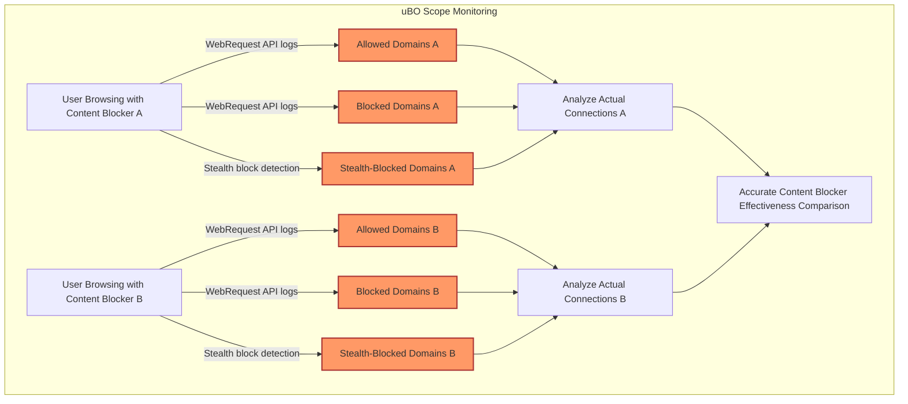

# Mythbusting: Comparing Content Blockers with uBO Scope

---

## 1. Introduction

Users often face confusing claims when comparing content blockers — particularly the assumption that "more blocks mean better protection." This guide clarifies how to use uBO Scope to meaningfully compare content blockers and debunk such myths by observing actual third-party connection outcomes.

By walking through concrete user workflows and examples, you will learn how to:

- Understand what block counts really represent.
- Use uBO Scope to measure real network connections instead of surface metrics.
- Conduct side-by-side content blocker comparisons grounded in actual browser network activity.

---

## 2. Why Block Counts Can Be Misleading

Content blockers report numbers like "blocked requests" but these counts may not correlate directly with privacy or security. Here's why:

- A higher block count does **not** guarantee fewer third-party connections; it could mean more aggressive blocking triggers but also more allowed requests.
- Some blockers stealthily prevent connections without triggering browser-level events, causing discrepancies in counts.
- DNS-level blocking can obscure requests from the browser’s tracking, meaning those requests never appear in `webRequest` API logs.

<u>**Value of uBO Scope:**</u> It tracks **distinct remote server domains** your browser tries to contact after all blocking and filtering layers — the true measure of exposure.

---

## 3. Workflow: Using uBO Scope to Compare Content Blockers

### Prerequisites

- Installed uBO Scope on your browser. See [Installation Guide](/guides/getting-started-essentials/install-activate) for details.
- At least two content blockers installed (e.g., uBlock Origin, AdGuard).
- Basic understanding of uBO Scope's popup interface. Familiarity with [First Inspection Guide](/guides/getting-started-essentials/first-inspection) is helpful.

### Expected Outcome

You will accurately assess and compare the number of unique third-party remote servers each content blocker allows or blocks during page loads.

### Time Estimate

Approximately 15-30 minutes for initial comparison.

---

### Step 1: Prepare Your Browsing Environment

1. Enable only the first content blocker you want to test.
2. Open uBO Scope’s popup on your active tab.
3. Navigate to or refresh a realistic, content-rich webpage (e.g., news site or blog).

<Check>
Ensure the page has fully loaded and uBO Scope badge updates to reflect connections.
</Check>

### Step 2: Observe Allowed, Blocked, and Stealth-Blocked Domains

1. Open uBO Scope popup and review the lists under "not blocked," "blocked," and "stealth-blocked" sections.
2. Note the **number of distinct domains** connected to (shown in summary).

<Tip>
Focus on the "not blocked" count as it represents the actual remote servers your browser fetched resources from.
</Tip>

### Step 3: Record Data for Comparison

1. Write down or screenshot the counts and domain lists.
2. Disable the first content blocker and enable the second one.
3. Repeat browsing the same webpage, refreshing if needed.
4. Open uBO Scope popup and compare the new domain counts and lists to the first.

### Step 4: Analyze the Results

- **Lower "not blocked" domain count indicates fewer third-party connections, usually better privacy.**
- A high "blocked" count but also a high "not blocked" count in parallel indicates the blocker is not blocking effectively.
- Differences in "stealth-blocked" reveal blockers that manipulate network requests without standard blocking signals.

---

## 4. Practical Example

| Content Blocker   | Allowed Domains (Third-Parties) | Blocked Domains | Stealth-Blocked Domains |
| ----------------- | ------------------------------- | --------------- | ----------------------- |
| uBlock Origin     | 12                              | 8               | 1                       |
| AdGuard           | 18                              | 15              | 0                       |

<u>Interpretation:</u>

- Although AdGuard shows more blocks, it also allowed more third-party domains, meaning it allowed more actual connections.
- uBlock Origin achieves a lower number of unique third-party domains contacted, suggesting stronger privacy protection in this context.

---

## 5. Best Practices for Meaningful Comparison

- **Use real-world, content-rich websites** rather than synthetic "ad blocker test" pages.
- **Disable all but one content blocker** at a time to avoid compounded effects.
- **Clear cache or use incognito/private mode** between tests to reset network states.
- **Observe the badge counts carefully**; lower numbers are preferable.
- **Check domain lists in the popup** to understand which third parties are active.

---

## 6. Common Pitfalls & Troubleshooting

<AccordionGroup title="Troubleshooting Common Issues">
<Accordion title="Popup Shows 'NO DATA' or Empty Lists">
- Ensure the extension has proper permissions and is active.
- Reload the webpage completely.
- Try restarting the browser.
- Refer to the [Troubleshooting Installation Issues](/getting-started/first-steps-and-validation/troubleshooting-setup) guide.
</Accordion>
<Accordion title="Badge Count Does Not Update">
- Confirm the page is fully loaded.
- Verify the active tab is the one uBO Scope is monitoring.
- Incremental tab changes or fast reloads might delay update; wait a moment.
- See the [Badge Count Explained](/guides/getting-started-essentials/badge-count-explained) documentation.
</Accordion>
</AccordionGroup>

---

## 7. Why Avoid "Ad Blocker Test" Webpages

Many commonly used IAB or "ad blocker test" websites produce unrealistic scenarios:

- They generate synthetic network requests to obscure domains not typical in actual browsing.
- They cannot see stealth-blocked requests.
- They falsely indicate a blocker is ineffective.

<u>uBO Scope empowers you to cut through these marketing gimmicks by showing real network outcomes at the browser API level.</u>

---

## 8. Summary Diagram: Comparing Content Blocker Network Outcomes

---

## 9. Next Steps & Further Reading

- For a detailed walkthrough of inspecting the domain lists, see [First Inspection: Viewing Third-Party Connections](/guides/getting-started-essentials/first-inspection).
- Understand how to interpret the toolbar badge counts in [Understanding the Toolbar Badge Count](/guides/getting-started-essentials/badge-count-explained).
- Learn about how uBO Scope integrates with browsers and content blockers in [Integration with Content Blockers and Browsers](/overview/architecture-concepts/integration-extension-ecosystem).
- For resolving setup issues, consult [Troubleshooting Installation Issues](/getting-started/first-steps-and-validation/troubleshooting-setup).

---

## 10. References

- [Core Features & Benefits](/overview/introduction-core-value/core-features-benefits)
- [System Architecture Overview](/overview/architecture-concepts/system-architecture-overview)
- Official uBO Scope Repository: [https://github.com/gorhill/uBO-Scope](https://github.com/gorhill/uBO-Scope)

---

Thank you for choosing uBO Scope to gain clarity and control over your network privacy. Use it to see beyond misleading numbers and get to the truth of your browsing connections.