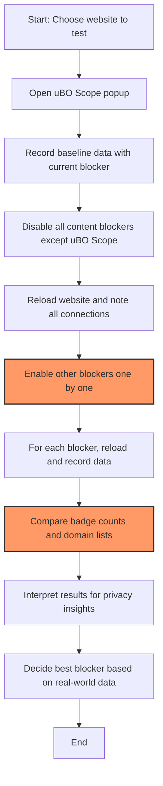

# Comparing Content Blockers with uBO Scope

## Overview
This guide empowers you to use **uBO Scope** alongside other browser content blockers to compare their real-world effects on remote server connections. By following practical workflows, you will learn to accurately assess and debunk common misunderstandings related to block counts, enabling you to measure true privacy performance effectively.

While most content blockers focus on blocking network requests, uBO Scope uniquely measures and reports *all* connection attempts your browser makes — regardless of which blocker is active. This perspective provides unmatched insight when comparing how different content blockers handle third-party connections.

---

## Prerequisites
- Install uBO Scope in your browser. Visit the [installation guides](https://github.com/gorhill/uBO-Scope#installation) if needed.
- Have one or more browser content blockers installed for comparison, such as uBlock Origin, AdGuard, or Brave Shields.
- Basic familiarity with opening your browser’s extensions toolbar and understanding network requests.

---

## What You Will Achieve
- Learn a workflow to compare various content blockers' effectiveness using uBO Scope data.
- Gain clarity on what block counts truly mean and why higher block counts don't necessarily mean better blocking.
- Develop a method to measure distinct third-party remote servers your browser contacts, which is the critical metric for privacy.

---

## Time Estimate
Approximately 15–30 minutes.

---

## Difficulty Level
Intermediate – You will be using different browser extensions together and interpreting network data.

---

# Step-by-Step Workflow to Compare Content Blockers

### Step 1: Prepare Your Browser Setup
1. Open your browser and ensure uBO Scope and the content blockers you want to compare are installed and enabled.
2. If any content blocker has multiple modes (e.g., aggressive blocking, default, relaxed), pick the mode you want to test.

### Step 2: Open uBO Scope Popup for Baseline Observation
1. Navigate to a typical website you want to test.
2. Click the uBO Scope extension icon in your browser toolbar.
3. Inspect the popup view that lists:
   - Domains where connections were **allowed** (not blocked).
   - Domains where connections were **blocked**.
   - Domains where connections were **stealth-blocked** (cancelled early).
4. Note the number shown in the toolbar badge; this is the count of distinct third-party domains connected.

### Step 3: Record Baseline Data
1. Browse different pages on the same site or similar typical sites.
2. Observe how the badge count and popup domains change; this reflects the content blocker in operation.
3. Take screenshots or write down the “allowed” and “blocked” domains.

### Step 4: Disable Other Content Blockers
1. Temporarily disable all other content blockers except uBO Scope (which does not block content).
2. Refresh the same websites and observe the uBO Scope popup data.
3. This data captures the true picture of all connections your browser makes with no blocking.

### Step 5: Enable Another Content Blocker One by One
1. Enable a second content blocker you want to compare.
2. Refresh your test websites.
3. Check uBO Scope's popup again. This time, it shows connections allowed or blocked with that blocker active.
4. Record the badge counts and domain lists.

### Step 6: Interpret the Results
- Compare the badge counts:
  - Lower counts generally indicate fewer third-party connections allowed.
  - A blocker may show higher block counts but still allow more different third-party connections, revealing less effective blocking.
- Analyze domain lists to identify *which* domains remain connected under each blocker and their potential privacy implications.

### Step 7: Repeat for All Target Content Blockers
Use the same workflow for other blockers you want to evaluate, allowing direct comparison supported by objective data from uBO Scope.

---

## What Block Counts Really Mean

| Misconception | Reality |
|---------------|---------|
|"A higher block count means better blocking."|Block counts reflect number of *requests blocked*, but not how many *unique third-party domains* were successfully connected. You could have many blocked requests but still allow more unique remote servers overall.| 

uBO Scope reports the true privacy-relevant metric — the number of distinct remote servers contacted. This matters more than raw blocked request counts, which might be inflated by multiple requests to the same or different servers.

---

## Debunking Common Myths Using uBO Scope

### Myth: "More blocking means more privacy"
- Using uBO Scope, you will see instances where a content blocker with a high block count still permits connections to many more distinct third-party domains.
- This happens because some blockers may block many superficial or repeated requests but let through connections to new servers, potentially compromising privacy.

### Myth: "Ad blocker test pages provide accurate reliability results"
- uBO Scope helps reveal that these test pages perform unrealistic or contrived requests that do not match usual browsing behavior.
- Since uBO Scope monitors *actual* network requests, it empowers you to ignore such misleading benchmarks and focus on real-world data.

---

## Practical Tips and Best Practices
- Always test on real websites you regularly visit or representative sites for your privacy concerns.
- Disable other extensions that might interfere with network requests during testing.
- Refresh pages fully (Ctrl+Shift+R or Cmd+Shift+R) to avoid cache bias.
- Keep in mind that stealth blocking means connections are canceled early to be less detectable — it’s an advanced blocking technique uBO Scope reveals.
- Use uBO Scope’s domain lists (allowed/blocked/stealth) to audit third parties you trust or want to avoid.

---

## Troubleshooting

### Issue: uBO Scope shows no data or badge count is missing
- Verify that uBO Scope has permissions to monitor web requests.
- Make sure the browser version meets requirements ([Supported Browsers & Requirements](../getting-started/installing-ubo-scope/supported-browsers-and-requirements)).
- Refresh the website after enabling uBO Scope.
- Restart the browser if needed.

### Issue: Unexpectedly high block counts with certain blockers
- Remember block count doesn’t equate to total unique third-party connections blocked.
- Check uBO Scope’s popup domain lists for clarity.
- Consider that count spikes could be due to repeated requests to a smaller number of servers.

---

## Workflow Diagram

---

## Next Steps

- Explore the [Understanding the Toolbar Badge and Popup Data](../guides/getting-started-essentials/badge-and-status-explained) guide to deepen insight into uBO Scope’s data presentation.
- Review [Debunking 'Ad Blocker Test' Pages](../guides/real-world-scenarios-and-best-practices/debunking-ab-tests) to learn more about misleading benchmarks.
- Use [Workflows for Filter List Maintainers](../guides/real-world-scenarios-and-best-practices/filter-list-maintainers) if you maintain or design content blocker filters.

---

## Additional Resources
- GitHub Repository: [https://github.com/gorhill/uBO-Scope](https://github.com/gorhill/uBO-Scope)
- Browser Compatibility and Installation: [Supported Browsers & Prerequisites](../getting-started/installing-ubo-scope/supported-browsers-and-requirements)
- Installation Instructions: [Installing uBO Scope](../getting-started/installing-ubo-scope/installation-guides)
- Interpretation Help: [Interpreting Network Insights](../getting-started/first-run-setup/understanding-the-popup)

---

<Tip>
Always rely on *distinct third-party domains contacted* rather than raw block counts to evaluate content blocker effectiveness. uBO Scope reveals this critical metric clearly and reliably.
</Tip>

<Note>
uBO Scope passively monitors network requests reported by your browser through the webRequest API; it does not block any content itself. Your content blockers remain in full control of blocking behavior.
</Note>