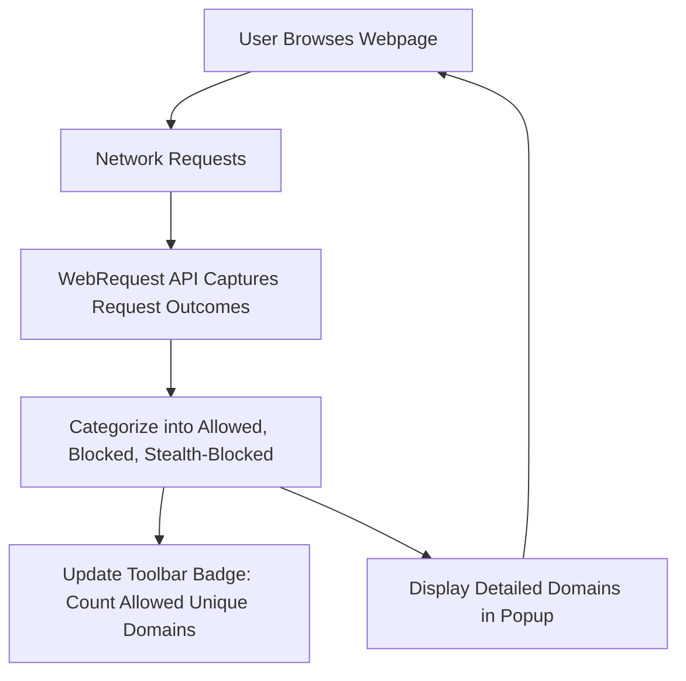

# Interpreting Badge Counts and Request Outcomes

## Overview

This guide helps you understand the meaning of the toolbar badge count in uBO Scope and how to interpret the categorized network request outcomes—allowed, blocked, and stealth-blocked—displayed in the extension popup. Understanding these metrics is essential for accurately assessing your privacy exposure and the behavior of content blockers.

---

## What the Toolbar Badge Represents

- **Definition:** The badge count on the uBO Scope icon indicates the number of **distinct third-party remote servers** contacted by the active browser tab.
- **Why Unique Third-Party Servers Matter:** Each count represents a unique third-party domain from which a connection was attempted or succeeded, not the total number of network requests.
- **Lower is Better:** A lower count indicates fewer third-party remote servers connected, which usually means less exposure to tracking or unwanted content.
- **Not All Third Parties Are Bad:** Some third-party domains, such as well-known CDNs (Content Delivery Networks), are benign or required for proper webpage function.

<Tip>
The badge count is a **privacy metric**, not a performance or security score. Focus on the number of unique third-party domains rather than total requests or block counts.
</Tip>

---

## Understanding Request Outcome Categories

uBO Scope classifies remote server requests into three outcome categories in the popup UI:

### 1. Allowed (Not Blocked)

- These are the third-party requests that were successfully connected.
- The domains listed here represent remote servers from which resources are actively loaded.
- The toolbar badge count corresponds to how many unique domains appear in this category.

### 2. Blocked

- Requests uBO Scope detected but blocked by content blockers or the browser.
- These connections were prevented from fetching resources.
- While these are blocked, they reflect attempts by web pages to reach additional third parties.

### 3. Stealth-Blocked

- Requests that were blocked in a way that attempts to be stealthy (not obvious to the web page).
- This is typically done by some content blockers to avoid detection by scripts.
- These still count as blocked but indicate a more subtle blocking mechanism used.

### Relating Outcomes to Privacy

- The **allowed** set directly impacts privacy because these connections succeed.
- **Blocked** and **stealth-blocked** requests show what connections were attempted but prevented.
- A high number of blocked but low allowed third parties indicates effective blocking.

---

## How to Read the Popup Badge and Panel

1. **Check the badge count** on the toolbar icon for the active tab. This is the number of unique allowed third-party domains.
2. **Open the popup** to see the detailed list under each category (allowed, blocked, stealth).
3. **Review the domain lists:** domains with their number of hits (requests).
4. Use this information to assess what third parties are active or blocked on the current page.

---

## Step-by-Step: Assessing Privacy Exposure Using Badge and Popup

<Steps>
<Step title="Observe the Toolbar Badge">
Look at the badge number on the extension icon for the tab you’re browsing. It shows the count of unique third-party domains allowed.
</Step>
<Step title="Open the Popup Panel">
Click the toolbar icon to open the popup and see the detailed domains grouped by allowed, stealth-blocked, and blocked categories.
</Step>
<Step title="Compare Allowed vs. Blocked">
Evaluate how many unique domains are allowed versus blocked. More allowed domains means more network connections to third parties.
</Step>
<Step title="Identify Domains of Interest">
Look for unfamiliar or suspicious domains under the allowed and stealth-blocked sections.
</Step>
<Step title="Use Context to Interpret Results">
Recognize that some known legitimate third parties (like CDN providers) are expected; excessive unknown third parties could be a privacy concern.
</Step>
</Steps>

<Info>
The badge count updates live as network requests are processed and can fluctuate when navigating or refreshing a webpage.
</Info>

---

## Practical Tips & Best Practices

- **Keep the badge count low** by verifying your content blockers are configured properly.
- **Review stealth-blocked entries** to understand when your blocking tools are using stealth techniques.
- **Watch out for sudden badge increases** when visiting new sites—this indicates new third-party connections.
- **Use domain names from the popup** to refine blocklists or investigate privacy risks.

---

## Common Pitfalls and Troubleshooting

<AccordionGroup title="Common Interpretation Issues">
<Accordion title="Confusing Allowed vs. Blocked Requests">
Remember the badge counts **only allowed domains**. Blocked and stealth-blocked domains do not add to the badge count.
</Accordion>
<Accordion title="Badge Shows No Count or Blank">
If the badge is empty or missing:
- The active tab might have no third-party connections.
- The extension might not have permission or is not properly installed.
- Try refreshing the page or reopening the popup.
</Accordion>
<Accordion title="High Badge Count but Low Block Count on Other Tools">
Other blockers might show different block counts. The focus here is **unique third-party domain count**, not total blocked requests. High block counts in another tool might still mean high allowed domain count.
</Accordion>
</AccordionGroup>

---

## Visualizing the Data Flow

---

## Summary

The toolbar badge and popup request outcome categories in uBO Scope provide a clear, actionable view of third-party network exposure for your active browsing tab. Properly interpreting the badge as the number of unique allowed third-party domains, alongside reviewing blocked and stealth-blocked requests, empowers you to make informed decisions about privacy and filtering strategies.

---

## Next Steps & Related Documentation

- [Using the Popup: Viewing Domain Connections](../guides/getting-started-ubo-scope/using-the-popup) – Learn how to navigate and use the popup UI effectively.
- [Debunking Content Blocking and Ad Blocker Test Myths](../guides/real-world-usage-analysis/debunking-content-blocking-myths) – Understand common misconceptions related to block counts.
- [Your First Run: Opening the Popup & Seeing Results](../../getting-started/setup-begin/first-launch) – Get started with accessing and reading your first network connections.
- [Troubleshooting Common Installation Issues](../../getting-started/troubleshoot-validate/troubleshooting-install) – Resolve problems if the badge or popup don’t update.
