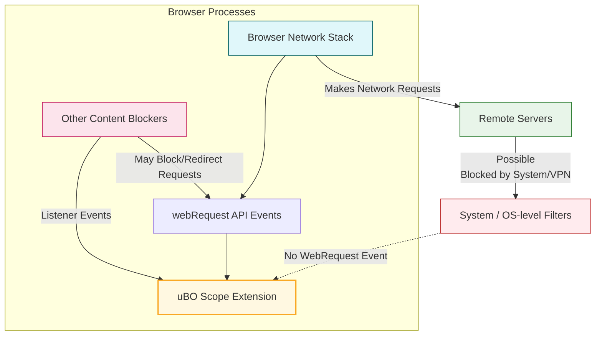

# Understanding Limitations and Browser Integrations

Explore the boundaries of what uBO Scope can measure given browser API constraints, and learn how it interacts with other privacy and content-blocking tools. This guide helps you understand which network requests are captured, where measurement may not be possible, and how to interpret integration scenarios for an accurate privacy overview.

---

## 1. Overview

uBO Scope monitors network connections using the browser's `webRequest` API. However, this API has inherent limitations based on browser support, permissions, and how other extensions or native privacy features interact with network requests.

This page explains:

- The scope and limits of network request measurement in different browsers.
- Compatibility considerations when using other content blockers or privacy tools.
- Best practices for recognizing what types of requests are captured or missed.

## 2. What uBO Scope Can and Cannot Measure

### What uBO Scope Measures

- **Network requests observable via the browser's `webRequest` API**: These include HTTP/S and WebSocket requests initiated by websites.
- **Third-party remote server connections**: uBO Scope tallies distinct domains contacted per browser tab, based on these observable requests.

### What uBO Scope Cannot Measure

- **Requests made outside the `webRequest` API scope**: Some browser-internal requests or low-level DNS operations are invisible.
- **Requests blocked by system-level or external apps** (e.g., OS-level firewalls or VPNs) if they don’t pass through the browser's webRequest events.
- **Network activities from other extensions or native browser blocking without triggering webRequest events**.

<Tip>
The badge count on uBO Scope reflects distinct third-party domains that the browser network stack actually attempted to connect with and were reported by the webRequest API—not all theoretical requests or those blocked prior to browser reporting.
</Tip>

## 3. Browser API Support and Permissions

### Supported Browsers and Minimum Versions

- **Chromium-based browsers**: Version 122.0 and above
- **Mozilla Firefox**: Version 128.0 and above
- **Safari**: Version 18.5 and above

Each browser version supports `webRequest` API functionality differently. uBO Scope requires permission to access `webRequest` and host permissions for HTTP, HTTPS, WebSocket, and secure WebSocket schemes.

### Permissions Required

- `webRequest` permission allows uBO Scope to listen for request lifecycle events: redirects, successes, and errors.
- Host permissions (`http://*/*` and `https://*/*`, plus WebSocket variants where supported) grant access to network activity across all sites.

### Variations Across Browsers

- Firefox and Chromium can report both HTTP/S and WebSocket connections.
- Safari currently limits access to HTTP/S traffic only.

<Info>
Check your browser's version and assigned extension permissions before relying on uBO Scope’s data completeness.
</Info>

## 4. Interaction With Other Privacy and Content Blocking Tools

### Independent Operation

uBO Scope works independently and in parallel with third-party content blockers like uBlock Origin, Privacy Badger, or native browser tracking protection. It does not block or alter network requests; instead, it listens passively.

### Impact of Other Blockers on Measurement

- When other blockers prevent requests from reaching the network stack, uBO Scope may still see the blocked event if the browser emits it via the `webRequest` API.
- Some stealthy blockers may prevent requests earlier or manipulate how requests appear, potentially causing discrepancies.

### Compatibility Considerations

- Running multiple extensions with overlapping `webRequest` listeners is generally supported but may have performance implications.
- Certain blockers or privacy tools might reduce the visibility of some network requests to uBO Scope if they implement lower-level blocking.

### Stealth Mode and Stealth-Blocked Requests

uBO Scope categorizes requests as "stealth-blocked" when they are redirected or filtered in ways that obscure the original request URL from direct observation.

This is visible in the popup panel to help you understand which connections are subtly blocked or modified.

<Tip>
To get the most accurate readings, ensure uBO Scope has not been disabled or limited by other extensions’ permissions, including in incognito/private browsing modes.
</Tip>

## 5. Recognizing Which Requests Are Captured

### Request Outcomes Classified by uBO Scope

- **Allowed**: Network requests completed successfully and reported by the browser.
- **Blocked**: Requests which failed to reach their destination, with events flagged in the API.
- **Stealth (Redirected)**: Requests redirected in ways that obscure some details.

### Requests You May Not See

- Requests made by browser internal services or other system components.
- DNS queries or prefetching that bypasses the `webRequest` API.
- Requests filtered or canceled before the browser processes them at network stack level.

### Practical Identification

Open the extension’s popup panel and note:

- Presence of domain lists separated by their outcome.
- The badge count on the extension icon reflecting distinct allowed third-party remote servers.

Use this data considering the above limitations when assessing your privacy posture.

## 6. Best Practices When Using uBO Scope With Other Tools

1. **Verify Permissions:** Ensure uBO Scope has full permissions, including webRequest and host permissions, for your browser.
2. **Update Browser:** Use recommended minimum browser versions for maximum functionality.
3. **Use in Compatible Mode:** Disable other network monitoring extensions temporarily if you suspect interference.
4. **Understand Measurement Scope:** Interpret data as representing what the browser network layer knows, not all possible blocks.
5. **Combine Tools Wisely:** Use uBO Scope alongside content blockers for complementary insights—uBO Scope reveals connections, blockers control them.

## 7. Troubleshooting Common Limitations

### No Data or Empty Popup Panel

- Confirm uBO Scope has the required `webRequest` permissions.
- Check your browser supports the required APIs and is updated.
- Ensure network requests are occurring (try visiting multiple websites).

### Badge Count Does Not Change

- The count reflects *distinct third-party servers connected*, not total requests.
- Some blockers or privacy modes may prevent event reporting.

### Data Is Incomplete or Unexpected

- Requests can be blocked before browser observation by external factors.
- Some stealth-blocked requests may appear under the "stealth" category but might not provide full info.

<Warning>
uBO Scope cannot measure network requests bypassing the browser’s webRequest API; if your privacy tools operate outside the browser or at a lower level, data may be partial.
</Warning>

---

## 8. Summary Diagram: How Browser APIs and uBO Scope Interact

---

## 9. Next Steps & Related Documentation

- Review the [How uBO Scope Works](../overview/architecture-concepts/how-it-works) page for deeper insight into extension architecture.
- Explore the [Popup Panel Overview](../overview/feature-glance/popup-overview) to learn how to interpret data presented.
- Consult the [Core Concepts & Terminology](../overview/architecture-concepts/core-terminology) page to understand all network request outcomes.
- If encountering setup issues, see [Troubleshooting Common Setup Issues](../../getting-started/getting-going/troubleshooting-common).

<Tip>
Understanding these limitations will empower you to use uBO Scope effectively alongside your preferred privacy tools, achieving the best real-world insights into network connections.
</Tip>
