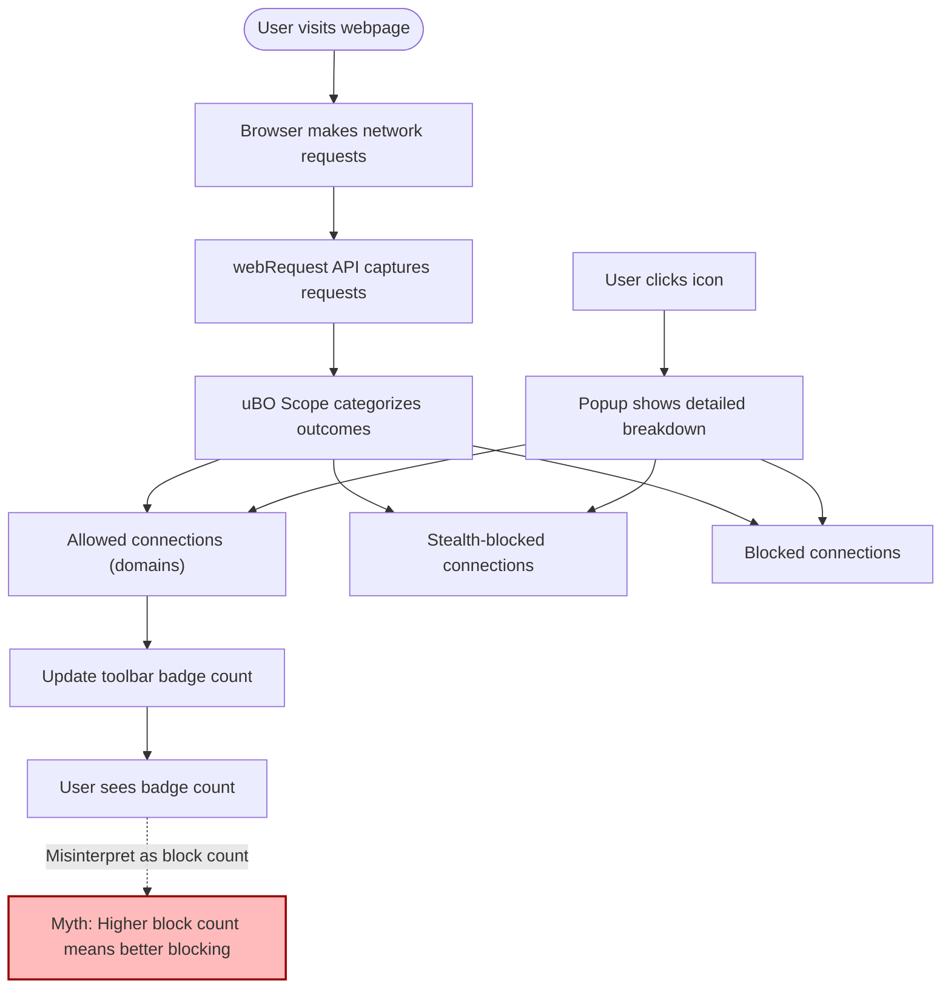

# Debunking Toolbar Badge Myths: Effective Content Blocking Analysis

## 1. Understanding the Toolbar Badge

The toolbar badge on the uBO Scope extension icon shows the number of distinct third-party remote servers connected to by the active webpage. This number reflects **network connections made**, **not the number of requests blocked or allowed**.

**Key Insight:** A lower badge count means fewer third-party connections. This is what truly matters for privacy and blocking effectiveness, not how many requests were blocked.

### What the Badge Represents
- The **count of unique third-party domains** from which resources or data were fetched or attempted.
- Does **not** represent the number of blocked requests.
- Includes allowed, stealth-blocked, and blocked connections, but counts domains primarily by allowed connections.

### Common Misconception

It's a myth that a higher block count on the badge means a better content blocker. In reality, a high block count may indicate more connections are being initiated and blocked **but does not guarantee fewer total third-party connections.**

<Tip>
Remember, a content blocker that blocks many requests but still lets through connections to many distinct third-party domains results in a higher overall exposure and privacy risk.
</Tip>

## 2. Why Badge Count Alone is Misleading

Badge count alone offers a superficial metric and can misrepresent content blocking effectiveness for several reasons:

- **Higher block counts can correspond with more allowed connections.** Some blockers block aggressively on more requests but what matters is *how many unique third-parties stay connected to*.
- **Stealth blocking and DNS-level blocking are transparent to badge counts.** uBO Scope detects requests post-blocking, so the badge reflects what the browser attempted, not only what was permitted.
- **Myth of "Better Blocker" from badge comparison:** Comparing badge counts across blockers is invalid because each blocker’s filtering logic and reporting differ, and many factors influence network requests.

<Warning>
Do not use badge counts to compare content blockers across different environments or extensions.
</Warning>

## 3. Using uBO Scope to Gain a Real Understanding

uBO Scope reveals the true picture of third-party connectivity by categorizing connections clearly and independently from blocking technology:

- Provides a **Breakdown Panel** showing domains categorized as:
  - **Allowed:** Connections made successfully or not blocked.
  - **Stealth-Blocked:** Connections blocked invisibly by stealth techniques.
  - **Blocked:** Known blocked connections.

- Tracks **all remote servers contacted** by the browser regardless of the blocking method (extension-based, DNS-level, or stealth).
- Uses the **Public Suffix List** for accurate domain normalization, grouping subdomains appropriately.

This transparency lets you inspect the *actual outcome* of your blocking setup instead of relying on guesswork from badge counts.

## 4. Key Workflow to Evaluate Content Blocking Effectiveness

<Steps>
<Step title="Open the Popup Panel">
Click the uBO Scope toolbar icon to display the popup detailing connections for the current active tab.
</Step>
<Step title="Review the Domain Counts">
Observe the number of unique domains in the **Allowed** section — this is how many distinct third-party connections were successful.
</Step>
<Step title="Check Stealth-Blocked and Blocked Domains">
Explore the **Stealth-Blocked** and **Blocked** sections to understand what connections were invisibly blocked or overtly stopped.
</Step>
<Step title="Interpret the Badge in Context">
Use the badge count only as an initial indicator of third-party domain count, and always confirm by reviewing the popup panel data.
</Step>
</Steps>

<Info>
This workflow gives you an actionable, evidence-based way to assess network privacy risks and content blocker performance.
</Info>

## 5. Practical Example

Suppose you visit example.com using uBO Scope installed.

- Toolbar badge shows `5`.
- Popup reveals:
  - Allowed: 3 domains
  - Stealth-Blocked: 1 domain
  - Blocked: 1 domain

This means:
- Your browser connected with 3 distinct third-party servers.
- 2 other distinct third-party servers were blocked, stealthily or overtly.

If a different blocker showed `10` on badge, but allowed 7 domains, it means it allowed more unique third-party connections, indicating a less privacy-protective scenario.

## 6. Troubleshooting Badge Count Confusion

If you notice unexpected badge count or believe blocking is ineffective:

- Verify your browser and extension permissions are correctly configured (see Installation & Setup guides).
- Open the popup and cross-check domains in allowed, stealth-blocked, and blocked categories.
- Reload the webpage to refresh counts.
- Consult [Troubleshooting Common Issues](https://your-docs-link/getting_started/validation_and_support/troubleshooting_common_issues) if counts remain puzzling.

## 7. Best Practices

- Use **badge counts as an overview only**, never as definitive proof of blocking strength.
- Always correlate badge counts with popup panel data.
- Review connection categories after visiting privacy-sensitive sites to verify blocking effectiveness.
- Keep your extension and browser updated to benefit from the latest blocking and reporting improvements.

## 8. Next Steps and Related Documentation

- [Revealing All Remote Connections on a Webpage](/guides/core-workflows/reveal-remote-connections): Learn how to fully visualize third-party connections.
- [Interpreting the Badge Count and Popup Breakdown](/guides/core-workflows/interpreting-badge-and-popup): Dive deeper into UI interpretation.
- [Installation and Setup Guides](/getting_started/installation_and_setup/installing_ubo_scope): Ensure your extension is correctly installed.
- [Troubleshooting Common Issues](/getting_started/validation_and_support/troubleshooting_common_issues): Resolve common display or functionality problems.

---

### Diagram: Badge vs. Actual Third-Party Connections Flow

This diagram illustrates how the badge shows count of allowed third-party domains and how it connects to the actual network request analysis.

---

## References

- [What Is uBO Scope?](/overview/intro-value/about-ubo-scope) — Introduction to the product
- [Why Use uBO Scope?](/overview/intro-value/value-proposition) — Benefits and value
- [Interpreting Badge and Popup](/guides/core-workflows/interpreting-badge-and-popup) — Detailed interpretation guide
- [Revealing Remote Connections](/guides/core-workflows/reveal-remote-connections) — How to see all remote connections
- [Troubleshooting Common Issues](/getting_started/validation_and_support/troubleshooting_common_issues)

---

[uBO Scope Official Repository]: https://github.com/gorhill/uBO-Scope

---