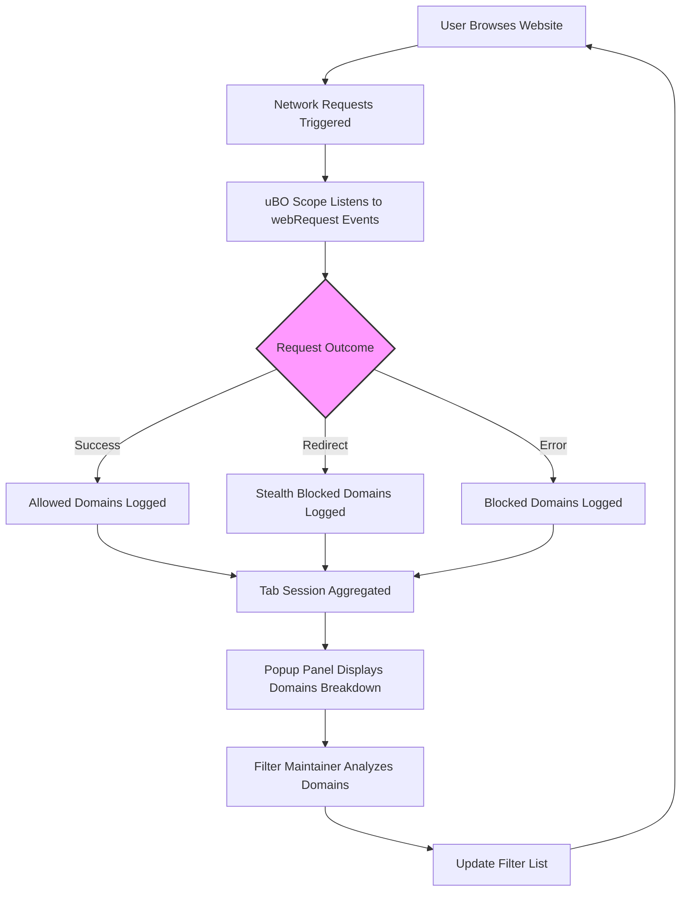

# Using uBO Scope as a Filter List Maintainer

## Overview

This guide provides filter list maintainers with practical approaches to auditing and analyzing network requests using **uBO Scope**. It focuses on how to leverage the extension to expose stealth tracking and remote third-party requests in real-world scenarios—particularly on platforms or devices where native browser developer tools are limited or unavailable.

Whether you’re validating existing blocklists or discovering new third-party connections for future filters, uBO Scope delivers transparent, actionable insight into network activity.

---

## What You Will Achieve

- Understand how to use uBO Scope for **detecting stealthy and remote tracking requests**.
- Learn best practices for **auditing filter lists** with real user traffic.
- Gain proficiency in **analyzing popup data and badge counts** to surface distinct third-party domains.
- Develop workflows to **optimize filter efficiency and detect gaps** in blocking.

---

## Prerequisites

- uBO Scope installed in a supported browser (Chrome, Firefox, Safari) — see [Installing uBO Scope](https://github.com/gorhill/uBO-Scope#installation).
- Basic familiarity with browser extensions and network requests.
- Access to websites of interest for testing and analysis.

---

## Why Use uBO Scope for Filter Maintenance?

Most browsers' developer tools have limitations or do not expose all network request details needed for comprehensive filter list auditing. uBO Scope compensates by:

- Reporting **all remote server connections attempted or succeeded**, including those stealth-blocked or blocked.
- Offering a **clear breakdown of allowed, stealth-blocked, and blocked domains** per browsing session.
- Being **independent from content blockers and DNS-based filtering**, always reporting true network request outcomes provided the browser supports the `webRequest` API.

This transparency is essential to verify a filter list's real-world effectiveness and prevent false assumptions from simplistic block counts.

---

## Step-by-Step Workflow for Filter List Auditing

### 1. Install and Launch uBO Scope

- Install the extension from your browser's official store.
- Navigate to a website to audit.
- Click the uBO Scope toolbar icon to open the popup panel.

### 2. Observe Network Connections in Realistic Scenarios

- With the website loaded, review the **domains connected** count at the top — this shows the number of distinct third-party domains the page connected to.
- Examine the three sections:
  - **Not Blocked:** Domains where requests succeeded.
  - **Stealth-Blocked:** Domains where requests were silently redirected or modified by a content blocker (not fully exposed to the site).
  - **Blocked:** Domains where requests were prevented (errors reported).

### 3. Analyze Third-Party Domains

- Focus on domains not blocked or stealth-blocked to identify filter gaps.
- Use the domain counts to prioritize high-frequency domains for investigation.
- For domains that should be blocked but appear under 'Not Blocked', verify and update filter lists accordingly.

### 4. Validate Filter Rules Across Browsers and Platforms

- Since uBO Scope operates independently of blocking engines, it helps cross-check that filters behave consistently.
- Compare connection reports from different browsers or devices where developer tools may not be available.

### 5. Repeat Testing With Varied Content

- Test multiple pages and interaction flows on the site.
- Use real user actions (e.g., navigating, clicking, interacting) to stimulate realistic network activity.
- Repeated audits ensure detection of delayed or conditional requests.

### 6. Maintain Session Data for Comparison

- uBO Scope preserves session data per tab. Use this to compare connection patterns before and after filter changes.
- Export or document key domains for ongoing list refinement.

---

## Practical Tips & Best Practices

- **Avoid using synthetic 'ad-blocker test' pages:** These often generate unrealistic requests which do not reflect real-world browsing, giving misleading audit results.
- **Lower distinct third-party domain count is preferable:** Focus on legitimate third parties such as CDNs.
- **Leverage Stealth-Blocked domain data:** They reveal connections that sophisticated filters handle invisibly.
- **Use Badge Counts as a Quick Indicator:** The toolbar badge shows distinct third-party domains connected—guiding you where attention is needed.
- **Always verify domain normalization:** uBO Scope applies Public Suffix List norms to group subdomains—to avoid overlooking variations.
- **Consider domain prevalence:** Frequent connection domains may represent major trackers or risky resources.
- **Document findings precisely:** Note domains and counts regularly to track improvements or regressions.

---

## Common Pitfalls to Avoid

- Assuming a high block count means better filtering—uBO Scope shows that more blocks can coincide with more allowed connections.
- Using uBO Scope without realistic browsing—static pages or test sites may miss important connections.
- Ignoring stealth-blocked domains—these can be important for identifying trackers hidden by some blockers.
- Confusing hostname with domain—uBO Scope normalizes using the Public Suffix List for clarity.
- Neglecting to monitor multiple tabs or browsing sessions.

---

## Troubleshooting

| Issue                           | Solution                                                                       |
| -------------------------------| ------------------------------------------------------------------------------ |
| No badge count is displayed    | Verify uBO Scope permissions and browser support for `webRequest` API.       |
| Popup shows 'NO DATA'          | Make sure the tab is active and has loaded content with network requests.      |
| Unexpected domains in allowed | Check if filters are outdated or missing those domains in the blocklist.       |
| Stealth blocking not seen      | Some browsers may limit the exposure of certain webRequest events. Confirm browser version meets requirements. |

For more issues, consult [Troubleshooting Common Issues](../getting_started/validation_and_support/troubleshooting_common_issues).

---

## Example Scenario

Imagine you maintain a filter list targeting trackers commonly seen on e-commerce sites. You open a popular online store, activate uBO Scope, and see 12 distinct domains under 'Not Blocked', including domains you expect to block. By identifying these domains:

- You refine your filter list rules to cover these missing domains.
- Restart the browsing session and confirm those domains now appear under 'Blocked' or 'Stealth-Blocked'.

This iterative auditing approach ensures your filters remain effective against evolving tracking methods.

---

## Diagram: How uBO Scope Supports Filter Maintainers

---

## Next Steps

- Explore related guides on [Debunking Toolbar Badge Myths](../real-world-usage-strategies/debunking-badge-myths) to deepen insight on badge interpretation.
- Review [Revealing All Remote Connections on a Webpage](../core-workflows/reveal-remote-connections) to master popup details further.
- Stay updated with the [uBO Scope GitHub repository](https://github.com/gorhill/uBO-Scope) for new features useful to maintainers.

---

## Additional Resources

- **uBO Scope Overview:** [What Is uBO Scope?](../../getting_started/introduction/what_is_ubo_scope)
- **Installation Instructions:** [Installing uBO Scope](../../getting_started/installation_and_setup/installing_ubo_scope)
- **Basic Configuration:** [Basic Configuration](../../getting_started/installation_and_setup/basic_configuration)
- **Troubleshooting:** [Troubleshooting Common Issues](../../getting_started/validation_and_support/troubleshooting_common_issues)

By adopting the strategies outlined in this guide, filter list maintainers gain a robust methodology to audit, validate, and enhance their filter lists using uBO Scope's network transparency capabilities.

---