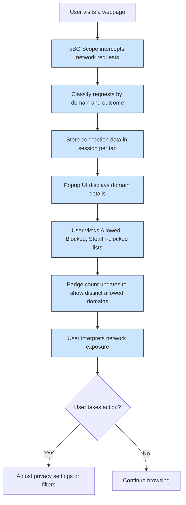

# Analyzing Website Network Connections

## Workflow Overview

### What This Guide Helps You Accomplish
This guide walks you through using **uBO Scope** to analyze live network connections initiated by any webpage you visit. It focuses on real-time discovery of remote server connections, helping you distinguish between first-party and third-party requests, and interpreting the outcomes of those requests as allowed, blocked, or stealth-blocked.

### Prerequisites
- Ensure that uBO Scope is **installed and active** in your compatible browser (Chromium 122+, Firefox 128+, Safari 18.5+).
- Familiarize yourself with how to open the uBO Scope popup interface from your browser toolbar.
- Understand basic networking terms like domain, hostname, request, and the distinction between first-party and third-party servers.

### Expected Outcome
By following this guide, you will be able to:
- View all remote server connection attempts made by the current webpage.
- Identify which requests were successfully allowed, which were blocked, and which were stealth-blocked.
- Distinguish between the main site domain and third-party domains.
- Use uBO Scope's detailed reporting to enhance privacy awareness and auditing of websites.

### Time Estimate
~ 5 to 10 minutes to perform initial analysis and interpretation per website.

### Difficulty Level
Beginner - intermediate. Basic understanding of web browsing and domains expected.

---

## Step-by-Step Instructions

### 1. Open the uBO Scope Popup
1. Navigate to the webpage you want to analyze.
2. Click the uBO Scope extension icon in your browser toolbar.
3. Wait a moment for the popup to load and display connection data.

### 2. Understand the Popup Header
- The header shows the website's hostname and domain, clearly separating what is considered first-party.
  - For example, if the hostname is `news.example.com` and the domain is `example.com`, the popup visually distinguishes the subdomain from the main domain.

### 3. Review the Summary Section
- The summary displays the **number of distinct domains** connected to by the webpage.
- This count reflects third-party domains contacted, which signals the network exposure caused by the website.

### 4. Explore Domain Connection Outcomes
The popup groups connected domains into three outcome categories:

#### Allowed (Not Blocked)
- These are domains that the browser successfully connected to from the webpage.
- Typically includes legitimate first-party servers and essential third-party services.

#### Stealth-Blocked
- Domains in this category are those where connections were redirected or somehow stealthily blocked by the content filtering mechanism or browser.
- The extension captures these to indicate requests that were attempted but prevented from fully reaching their target.

#### Blocked
- These domains represent connection attempts that were explicitly blocked (failed) according to the webRequest API observations.

### 5. Analyze Domains and Connection Counts
- Each domain is listed along with a count showing how many requests were made to that domain during the session.
- Sort and compare these counts to identify domains with heavy or suspicious network activity.

### 6. Recognize First-Party vs. Third-Party Connections
- The domain in the popup header is considered the **first-party domain** (the website you access).
- All other domains shown in the Allowed, Stealth, or Blocked lists are considered **third-party** and represent external services.

### 7. Interpret Badge Counts on the Toolbar Icon
- The toolbar badge shows the number of distinct third-party domains contacted (Allowed domains count).
- Lower badge counts generally indicate fewer third-party connections, which can mean better privacy.

### 8. Refresh and Revisit
- Reload the website to collect fresh connection data.
- Reopen the uBO Scope popup to analyze new or changing network requests.

---

## Examples & Scenarios

### Example: Analyzing a News Website
Suppose you visit `https://news.example.com`:
- The popup header will show `news` as the hostname and `example.com` as the domain.
- Under Allowed, you might see `cdn.example.net` with a count of 25, representing content delivery network requests.
- Under Stealth-Blocked, domains like `trackers.example.org` may appear, indicating blocked tracking attempts.
- The badge count might show `5`, meaning 5 distinct third-party domains were contacted successfully.

### Example: Identifying Excessive Third-Party Connections
On an e-commerce site, seeing dozens of different third-party domains in the Allowed list may raise privacy concerns or indicate many tracking and advertising services.

---

## Tips & Best Practices

- **Use Public Suffix List Awareness:** uBO Scope uses the public suffix list to accurately detect domain boundaries; this prevents misclassification of domains.
- **Check Consistency:** Domains contacted repeatedly across sessions may be core services; random or one-off domains could be suspicious.
- **Monitor Badge Counts Regularly:** Sudden spikes or higher-than-expected counts might signal unwanted tracking or ad networks.
- **Combine with Filter List Insights:** Use alongside content blockers to validate if domains you want blocked are actually not contacted.

---

## Troubleshooting Common Issues

### No Data Shown in Popup
- Ensure uBO Scope is enabled and has the required permissions.
- Refresh the webpage to trigger network activity.
- Check browser compatibility and minimum version requirements.

### Badge Count Not Updating
- Switch browser tabs or refresh the page to refresh data collection.
- Confirm extension is not disabled or conflicts with other extensions.

### Domain Names Appear Punycode-Encoded
- The popup automatically converts punycode to readable Unicode; if you see encoded names, this might be a display glitch or rare configuration issue.

---

## Next Steps & Related Documentation

- For learning how to interpret the badge counts effectively, consult the guide [Interpreting Badge Counts](./interpreting-badge-counts).
- To get started with installation and setup, see [Installation and Setup](./installation-and-setup).
- For exploring the popup UI in depth, see [Exploring the Popup UI](./exploring-the-popup-ui).
- Interested in understanding core concepts? Visit [Core Concepts & Terminology](../../overview/architecture-and-core-concepts/core-concepts-terminology).
- To learn more about using uBO Scope for filter list maintenance and auditing, refer to [Using uBO Scope for Filter List Maintainers](../using-ubo-scope-for-filter-list-maintainers).

---

## Visualizing the Workflow

---

## Summary
This guide empowers you to make the most of uBO Scope's live reporting for analyzing website network connections. By following practical steps, you will uncover all remote server interactions, interpret their outcomes, and enhance your web privacy insights.

---