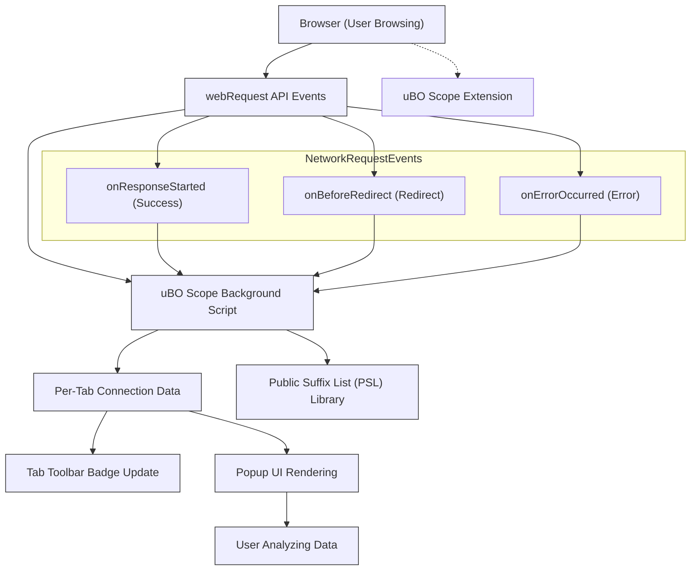

# Analyzing Websites: What Happens Behind the Scenes

## Overview

This guide reveals how uBO Scope works in the background to track and report every third-party connection your browser makes when you visit websites. By understanding this data flow, you gain clear visibility into the multitude of remote servers your browser interacts with, empowering you to assess privacy exposure and content blocker effectiveness more accurately.

Whether you're navigating a popular news site, streaming platform, or complex web application, uBO Scope uncovers the third-party network activity driving your browsing session.

---

## What This Guide Helps You Accomplish

- Gain insight into how uBO Scope monitors network requests behind the scenes.
- Understand the classification of allowed, blocked, and stealth-blocked requests.
- Learn how uBO Scope aggregates connection data per browser tab.
- Explore practical scenarios showing what to watch for when inspecting third-party servers.

## Prerequisites

- uBO Scope installed and enabled in your supported browser (Chrome, Firefox, or Safari).
- Basic familiarity with browser tabs and navigation.
- Understanding of the popup UI to view connection summaries (see [Reading Connection Summaries](/guides/getting-started/reading-popup)).

## Expected Outcome

- You will be able to interpret uBO Scope’s connection data with confidence.
- You will know what data the extension tracks and how it organizes this data per tab.
- You will understand key terms and outcomes (allowed, stealth-blocked, blocked) in the context of actual network requests.
- You will be better equipped to detect and evaluate third-party network activity on any website.

## Time Estimate

Approximately 10–15 minutes.

## Difficulty Level

Intermediate — Assumes basic understanding of network concepts and browser extensions.

---

## How uBO Scope Monitors Network Activity

### 1. Capturing Network Requests Using the Browser's webRequest API

uBO Scope hooks into your browser’s native `webRequest` API, which provides detailed events for outgoing network requests initiated by web pages. This allows the extension to observe:

- Requests to main frames (the main webpage) and sub-frames (iframes, embedded content).
- Requests for scripts, images, styles, media, and other resources.
- WebSocket connection attempts.

The extension listens to three critical network events:

- **onBeforeRedirect:** Detects when requests are redirected to a new URL, often indicating stealthy or hidden loading behavior.
- **onErrorOccurred:** Captures requests that failed to connect (blocked or errored).
- **onResponseStarted:** Records successful network connections, including status codes and resolved IPs.

The extension filters these events for all URLs matching HTTP(S) and WS(S) protocols.

---

### 2. Organizing and Classifying Connection Outcomes

Every network request event is recorded and categorized according to outcome:

- **Allowed:** Requests that succeeded, indicating a connection was made to that third-party.
- **Blocked:** Requests that failed due to network errors or content blocking.
- **Stealth-Blocked:** Redirects that user-initiated content blockers intercepted without browser API-visible blocking.

These outcomes are stored per active browser tab. The extension keeps track of:

- Domains and hostnames contacted.
- Counts of requests per domain.

By aggregating at the domain and hostname level, uBO Scope distills a large volume of network traffic into concise connection summaries.

---

### 3. Resetting and Tracking on Main Frame Navigation

When you load a new page in a tab (main frame request), uBO Scope resets the tab’s connection data and begins fresh tracking for that session. This means:

- The tab’s hostname and domain are recorded as the base site.
- All subsequent requests from scripts, ads, embedded content, or trackers are monitored relative to this origin.

This allows for a clean, up-to-date snapshot of third-party network activity for each browsing session per tab.

---

### 4. Using the Public Suffix List (PSL) to Aggregate Domains

uBO Scope leverages the Public Suffix List — a maintained catalog of internet domain suffixes (e.g., `.com`, `.co.uk`) to identify "registered domains."

Why is this important?

- Grouping connections by registered domain (e.g., grouping all `ads.example.com` and `tracking.example.com` under `example.com`) gives a clearer picture of distinct third-party entities.
- The extension’s embedded PSL library efficiently matches hostnames to registered domains.

When viewing connection summaries in the popup, domains are shown in their registered form to make interpretation easier.

---

## Practical User Flow Examples

### Example 1: Visiting a News Website

1. Load the news site `news.example.com` in a new tab.
2. uBO Scope resets tracking for that tab, setting the domain to `example.com`.
3. The site loads content along with embedded ads and analytics:
   - Allowed: Requests successfully connecting to `cdn.contentdelivery.net` and `analytics.trackerxyz.com`.
   - Blocked: Requests to `ads.adnetwork.com` that your content blocker stopped.
   - Stealth-blocked: Redirects from hidden trackers attempting to load alternative tracking URLs.
4. The popup shows:
   - Total distinct connected domains.
   - Breakdown by Allowed, Blocked, and Stealth-blocked.
5. The badge number reflects the count of allowed distinct third-party domains.

### Example 2: Streaming Platform with Multiple Analytics

1. Open `video.example.tv`.
2. Tracking begins and resets on main frame navigation.
3. Connections may include multiple CDN domains, player services, and third-party analytics tools.
4. A higher count in allowed does not necessarily mean the site is less private — many CDNs and service domains are legitimate.
5. Review blocked and stealth data to identify which third-party domains are being filtered by your blockers.

---

## What to Watch For When Evaluating Network Activity

- **High Count of Allowed Third-Party Domains:** Typically means the page loads many external resources. This is common for sites heavy on ads, trackers, or third-party services.

- **Blocked Domains vs Allowed Domains:** A larger blocked count reflects attempts to load unwanted resources but doesn't necessarily correlate to better content blocking effectiveness — focus on allowed domain count.

- **Stealth-Blocked Domains:** These are requests stopped silently via redirects without direct browser visibility. They highlight sophisticated blocking or redirection methods.

- **Domain Grouping & Repetition:** Seeing many subdomains grouped under the same parent domain gives perspective on the true number of distinct third-party entities.

- **Unexpected Domains:** Spot domains that you don’t expect to load resources from the visited website, which may signal tracking or advertising commercialization.

---

## Step-by-Step Instructions to Analyze a Website Using uBO Scope

<Steps>
  <Step title="Open uBO Scope Popup">
    Click the uBO Scope icon in your browser toolbar to open the popup window displaying connection summaries for the active tab.
  </Step>
  <Step title="Review the Page Hostname and Domain">
    At the top of the popup, verify the main site hostname and domain that uBO Scope is tracking for this tab.
  </Step>
  <Step title="Inspect Allowed Domains">
    Look under the "not blocked" section to see all third-party domains that the page connected to during load.
  </Step>
  <Step title="Check Stealth-Blocked Domains">
    Review this section to understand which requests were indirectly blocked by stealth techniques.
  </Step>
  <Step title="Check Blocked Domains">
    See which domains were completely blocked by your content blocking setups.
  </Step>
  <Step title="Interpret Counts and Summary">
    Observe the total number of distinct allowed domains displayed in the summary. Use this to compare privacy exposure between sites.
  </Step>
  <Step title="Revisit Site with Different Settings (Optional)">
    If desired, adjust your content blocker and reload the site to observe changes in connection outcomes reflected in uBO Scope.
  </Step>
</Steps>

---

## Common Pitfalls and Tips

- **Pitfall:** Expecting all blocked connections to reduce the badge count.
  - **Tip:** Badge counts reflect allowed distinct third-party domains. Block counts do not lower this number but provide insight into blocking efforts.

- **Pitfall:** Misinterpreting subdomains as separate entities.
  - **Tip:** Focus on registered domain grouping to avoid overcounting.

- **Pitfall:** Ignoring stealth-blocked entries.
  - **Tip:** Stealth-block blocking signals nuanced content blocking that may not appear in the block count but impacts connections.

- **Tip:** Use uBO Scope on multiple site types (news, social, streaming) to build intuition on typical third-party networks.

- **Tip:** Combine uBO Scope insights with your main content blocker’s logs for detailed analysis.

---

## Troubleshooting

- If the popup shows "NO DATA," ensure:
  - The tab has fully loaded a webpage.
  - uBO Scope has proper permissions to observe network requests.

- If the badge count doesn't update:
  - Reload the tab to trigger fresh tracking.
  - Confirm uBO Scope is enabled and not disabled by the browser.

- For advanced troubleshooting, refer to [Troubleshooting Common Issues](/getting-started/essentials/troubleshooting).

---

## Next Steps

- Explore how to [Read the Popup Connection Summaries](/guides/getting-started/reading-popup) for a detailed understanding of the UI.
- Learn to [Interpret Badge Counts & Make Decisions](/guides/getting-started/interpret-badge-counts) based on your browsing activity.
- Deepen your knowledge about [Stealth-Blocking & Advanced Request Outcomes](/guides/advanced-insights/stealth-blocking-details).

---

## Diagram: uBO Scope Network Monitoring Flow

---

## Additional Resources

- [What Is uBO Scope?](/overview/intro-value/what-is-ubo-scope)
- [Reading Connection Summaries](/guides/getting-started/reading-popup)
- [Interpreting Badge Counts](/guides/getting-started/interpret-badge-counts)
- [Troubleshooting Common Issues](/getting-started/essentials/troubleshooting)
- GitHub Repository: [https://github.com/gorhill/uBO-Scope](https://github.com/gorhill/uBO-Scope)

---

Utilize this understanding to confidently analyze the connections your browser makes and take better control over your online privacy and content filtering strategy.