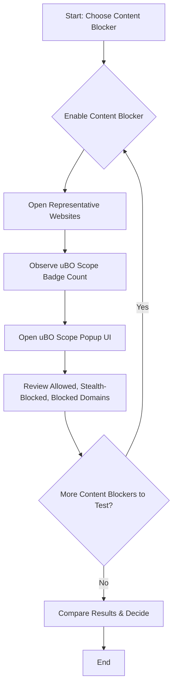

# Comparing Content Blockers: Evidence-Based Approaches

## 1. Introduction

When evaluating content blockers, a common challenge is to objectively compare their effectiveness. This guide helps you leverage network connection data reported by uBO Scope to accurately assess how different content blockers perform in real browsing conditions. By focusing on actual network request outcomes rather than relying on misleading metrics or synthetic test sites, you will gain clear, evidence-backed insight.

### What This Guide Helps You Accomplish
- Understand why traditional metrics like block counts and ad blocker test sites can be deceptive.
- Use uBO Scope's detailed network connection reports to compare content blockers.
- Follow a step-by-step methodology for objective, practical evaluation.

### Prerequisites
- Install uBO Scope and at least two different content blockers you want to compare.
- Familiarity with uBO Scope’s toolbar badge and popup UI (see [Understanding the Toolbar and Popup UI](../getting-started/first-use-configuration/basic-usage)).
- Basic understanding of third-party connections and domain statuses (recommended: [Core Concepts & Terminology](../../overview/introduction-core-concepts/core-concepts-terminology)).

### Expected Outcome
By completing this guide, you will be able to:
- Reliably measure and compare how many unique third-party domains each content blocker allows.
- Detect stealth-blocked and blocked domains for better insight.
- Debunk common myths about content blocker metrics.

### Estimated Time
Around 15–30 minutes, depending on how thorough your browsing tests are.

### Difficulty Level
Intermediate – requires some familiarity with browser extensions and network privacy concepts.

---

## 2. Understanding the Problem with Common Metrics

Before you start comparing content blockers using uBO Scope data, it’s essential to understand why certain popular comparison methods fail:

- **Block Counts Are Not Equal to Effectiveness:** A blocker showing a higher number of blocked requests does not necessarily mean it is better. More blocks with a higher block count can paradoxically lead to the browser making connections to more unique third-party servers, thus potentially increasing privacy exposure.

- **Ad Blocker Test Pages Are Misleading:** Test pages that simulate ad blocking scenarios are often unrealistic. They use fabricated or rarely accessed hosts and do not capture the stealth techniques used by real extensions. Consequently, results on these pages do not reflect real-world privacy protection.

### Callout
<Info>
Instead of relying on block count badges or suspicious test pages, focus on the number of distinct allowed third-party connections reported by uBO Scope. This number directly correlates with your actual privacy exposure.
</Info>

---

## 3. Methodology: How to Compare Content Blockers Using uBO Scope

### Step 1: Prepare Your Environment
- Disable all content blockers except the one you want to test.
- Open uBO Scope and ensure it is running and monitoring your browser tabs (see [First Launch and Extension Activation](../getting-started/first-use-configuration/first-launch)).

### Step 2: Visit Representative Websites
- Select a diverse set of websites that you frequently use or that pose privacy concerns.
- For each site, load the page fully while uBO Scope monitors network activity.

### Step 3: Check the Toolbar Badge Count
- Observe the badge count on uBO Scope’s icon; this number shows the distinct allowed third-party domains for the current tab.
- Lower badge counts indicate fewer third-party connections, which usually mean better blocking impact.

### Step 4: Inspect Popup UI for Domain Breakdown
- Click uBO Scope’s toolbar icon to open the popup UI.
- Review the domains listed under:
  - **Not blocked:** Domains with allowed connections.
  - **Stealth-blocked:** Domains that were stealthily blocked, invisible to the page but reported by uBO Scope.
  - **Blocked:** Domains with explicitly blocked connections.
- Note any domains that you recognize as trackers or known privacy risks.

### Step 5: Switch Content Blockers
- Disable the current content blocker and enable the next one.
- Repeat steps 2 to 4 on the same set of websites.

### Step 6: Compare Results
- Examine the badge counts side-by-side for each site.
- Review differences in allowed, stealth-blocked, and blocked domains.
- Look for patterns indicating which blocker reduces third-party connections more effectively.

### Step 7: Consider Aggregate Privacy Impact
- Because some third-party servers are more privacy-sensitive than others, consider both the count and identity of allowed domains.
- Use uBO Scope’s domain breakdown to prioritize blockers that reduce risky connections.

---

## 4. Practical Tips and Best Practices

- **Use Real Browsing Scenarios:** Test blockers on websites you normally visit rather than manufactured test pages.
- **Monitor Multiple Tabs:** Third-party connections can differ per tab; compare results across tabs for accuracy.
- **Beware of False Positives:** Some allowed domains are legitimate CDNs or essential services; focus on unnecessary third-party trackers.
- **Track Changes Over Time:** Privacy exposure varies with site content and blocker updates; periodically re-evaluate.

<Tip>
When switching between content blockers, restart your browser session occasionally to reset caches and state that could influence connection results.
</Tip>

---

## 5. Common Pitfalls to Avoid

- **Relying on Block Counts Only:** The number of blocked requests often correlates poorly with actual tracking reduction.
- **Trusting Synthetic Testing Sites:** These do not represent real-world browsing.
- **Ignoring Stealth Blocking:** Some blockers hide their actions, which only uBO Scope reveals via stealth-blocked domain reporting.
- **Assuming Lower Counts Always Mean Better:** Verify that the fewer connections do not come at the cost of site breakage or functionality loss.

---

## 6. Troubleshooting

### Problem: Badge Count Does Not Change When Switching Blockers
- Verify that uBO Scope is active and monitoring (see [Quick Validation and Testing](../getting-started/first-use-configuration/quick-validation)).
- Refresh the web pages after switching blockers to trigger new connection captures.
- Ensure no conflicting extensions prevent network monitoring.

### Problem: No Domains Listed in Popup UI
- Confirm the active tab is loading web content.
- Check that uBO Scope popup is not in a loading state.
- Restart browser if the problem persists.

### Problem: Confusing Domain Names or Punycode
- uBO Scope uses Punycode decoding to display domain names. Some obfuscated or internationalized domain names may appear unusual.
- Use external domain lookup if necessary to verify domain legitimacy.

---

## 7. Advanced Example

Below is a simplified scenario comparing two content blockers on a popular news website:

| Content Blocker | uBO Scope Badge Count | Not Blocked Domains | Stealth-Blocked Domains | Blocked Domains |
|-----------------|-----------------------|---------------------|-------------------------|-----------------|
| Blocker A       | 12                    | examplecdn.com       | tracker1.net            | adserver.xyz    |
| Blocker B       | 7                     | trustedcdn.com       | tracker1.net, tracker2.org| adserver.xyz    |

In this example, Blocker B allows fewer third-party domains, suggesting better privacy protection. The popup UI also reveals that Blocker B stealth-blocks additional trackers.

---

## 8. Next Steps & Related Content

- Perform **privacy audits** on more complex sites using [Conducting a Third-Party Tracker Audit](../real-world-usage/privacy-audits).
- Understand detailed connection outcomes with [Interpreting Detailed Request Outcomes](../advanced-and-troubleshooting/request-outcomes).
- Learn about [Debunking Ad Blocker Metrics and Test Sites](../real-world-usage/debunking-myths) to reinforce critical thinking.
- Ensure proper installation and activation with [Installing and Enabling uBO Scope](../getting-started/installation-basics/installing-ubo-scope).

---

## Appendix: Summary Diagram of Workflow

---