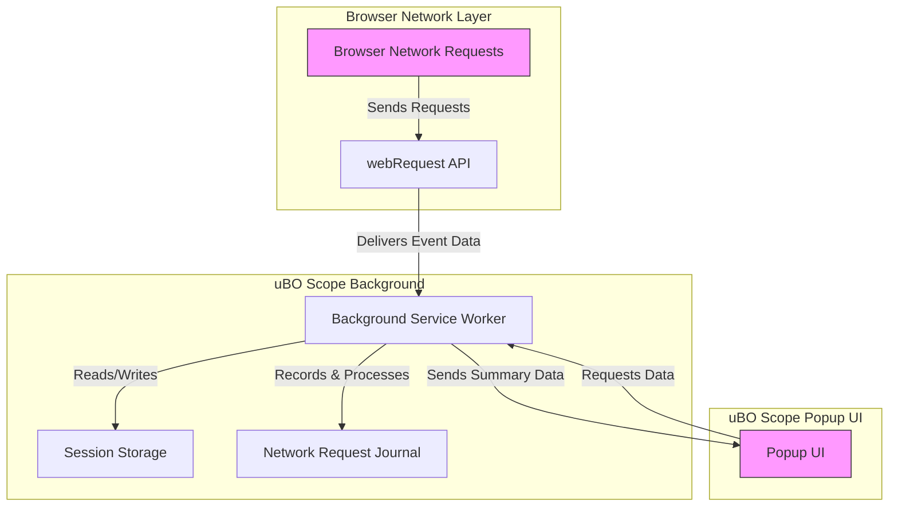

# Debunking Content Blocker Myths with uBO Scope

## Introduction

This guide empowers you to use uBO Scope to **accurately assess the real-world performance of content blockers** by revealing the true network connections your browser makes. It clarifies common misconceptions around block counts and badge metrics to help you understand what truly matters when evaluating content blocking effectiveness. 

You will learn how to interpret the badge count, compare multiple blockers, and understand why certain third-party connections persist.

---

## 1. Understanding the True Metrics Behind Content Blocking

### Why Block Counts Can Be Misleading

Many users assume that a higher block count means better blocking quality. uBO Scope explains why this is not the case:

- The extension’s **badge count reflects the number of distinct third-party remote servers connected to**, i.e., those that were **not blocked**.
- A higher block count on a toolbar doesn’t necessarily indicate better blocking; it can mean more frequent or noisier blocking attempts while allowing more distinct connections overall.
- **What truly protects your privacy and reduces exposure are fewer distinct third-party connections**, not just the block count.

### Real-World Scenario

> Imagine two blockers:
>
> - Blocker A reports it blocked 100 requests but allowed connections to 50 third-party domains.
> - Blocker B reports it blocked 25 requests but actually allowed connections to only 10 third-party domains.
>
> uBO Scope tells you that **Blocker B effectively reduces your exposure more**, despite the lower block count.

<Note>
Always rely on the badge count in uBO Scope as a better indicator of real-world blocking effectiveness because it shows distinct allowed third-party servers.
</Note>

---

## 2. Using uBO Scope to Compare Multiple Content Blockers

### Workflow Overview

- **Task**: Compare content blockers by observing real domain connection outcomes through uBO Scope.
- **Prerequisites**: Have uBO Scope installed and access to browsers with different content blockers enabled, one at a time.
- **Expected Outcome**: Understand which content blocker best limits third-party connections.
- **Time Estimate**: 15–30 minutes depending on number of blockers tested.
- **Difficulty**: Beginner to Intermediate.

### Step-by-Step Instructions

<Steps>
<Step title="Install and Prepare uBO Scope">
Ensure uBO Scope is installed on your browser. Open the extension popup to familiarize yourself with the badge count and detailed domain data.
</Step>
<Step title="Activate the First Content Blocker">
Enable the first content blocker you want to test. Close other blockers to avoid interference.
</Step>
<Step title="Visit Target Websites">
Browse a set of typical websites you frequent. Let uBO Scope monitor the network requests.
</Step>
<Step title="Inspect the Badge and Popup">
Click the uBO Scope toolbar button to open the popup and observe:
- The badge count showing the number of distinct allowed third-party domains.
- The detailed list of allowed, stealth-blocked, and blocked third-party domains.
</Step>
<Step title="Record Findings">
Note the badge count and any observations about third-party connections.
</Step>
<Step title="Repeat with Other Content Blockers">
Disable the first blocker and enable the next one. Repeat browsing and inspection.
</Step>
<Step title="Analyze the Results">
Compare the badge counts and the lists of allowed third-party domains for each blocker to determine which best limits real connections.
</Step>
</Steps>

### Tips and Best Practices

- Disable all other network-affecting extensions except for the one you are testing.
- Clear browsing data between tests for accurate assessment.
- Avoid using 'ad blocker test' sites, as they do not reflect real network behavior.

---

## 3. Interpreting uBO Scope’s Badge and Popup Data

The badge and popup are your windows into what your content blocker is achieving.

### Badge Count Meaning

- Shows **the number of distinct third-party domains your browser connected to**, successfully fetched resources from.
- **A lower number means fewer third parties were allowed through, indicating better blocking coverage**.

### Popup Sections Explained

- **Not Blocked (Allowed):** Domains where resources were successfully loaded.
- **Stealth-Blocked:** Domains where requests were silently blocked or redirected in ways that websites cannot easily detect.
- **Blocked:** Domains where requests were explicitly blocked by the content blocker.

### Understanding Persistence of Some Third-Party Connections

Certain third-party connections might be unavoidable due to:
- **Essential CDN use:** Core content delivery networks frequently serve site assets.
- **Browser or extension mechanisms:** Some requests may be needed for browser features or extensions.
- **Stealthy blocking:** Blocking methods aiming to minimize site breakage may allow certain harmless requests.

<u>**Important:** uBO Scope shows these connections transparently so you can accurately assess exposure without misinterpretation.</u>

---

## 4. Why "Ad Blocker Test" Webpages Are Not Reliable

### Understanding the Pitfalls

- These pages often create **artificial, unrealistic network requests** that don’t occur on real sites.
- Content blockers frequently operate in stealth mode to avoid webpage breakage or detection, making their blocking invisible to such tests.
- Relying on block counts these tests produce leads to misleading conclusions.

### uBO Scope’s Advantage

uBO Scope taps into the browser’s **webRequest API** to monitor actual network requests in real-time, revealing true connections regardless of stealth blocking or indirect blocking techniques.

<Warning>
Avoid using 'ad blocker test' webpages as benchmarks. Always prefer real-world browsing combined with uBO Scope data for accurate assessment.
</Warning>

---

## 5. Practical Tips to Maximize Your Content Blocking Assessment

- **Focus on distinct allowed third-party domains, not just block counts.**
- Use uBO Scope's popup to inspect domain details rather than relying solely on the badge count.
- Consider privacy goals – some third-party domains may be essential and safe.
- Run tests with a fresh profile or after clearing cache for clean data.
- Use multiple browsing sessions during different times to see varied network behaviors.

---

## 6. Troubleshooting Common Issues

<AccordionGroup title="Troubleshooting & Tips">
<Accordion title="Badge Count Stuck or Missing">
- Ensure the browser permissions include access to the webRequest API.
- Check that uBO Scope is enabled and running.
- Reload the extension or browser to refresh background processes.
</Accordion>
<Accordion title="Popup Shows No Data or 'NO DATA'">
- Confirm you have active tabs loaded with websites.
- Check if content blockers or other extensions are interfering.
- Reload the page to generate fresh network requests.
</Accordion>
<Accordion title="Discrepancies Between Expected and Shown Domains">
- Remember some connections may be stealth-blocked or silently allowed.
- Review log data more closely for redirected or errored requests.
- Clear session storage via cleanup to reset stale data.
</Accordion>
</AccordionGroup>

---

## 7. Next Steps & Related Documentation

After mastering this guide, deepen your expertise:

- Explore the [Analyzing Network Requests](https://docs.example.com/guides/real-world-usage/analyzing-network-requests) guide for advanced popup interpretation.
- Review [Key Concepts & Terminology](https://docs.example.com/overview/core-concepts-architecture/network-terminology) to understand essential terms.
- Learn how to install and validate uBO Scope in [Installing uBO Scope](https://docs.example.com/guides/getting-started/installing-ubo-scope) and [Validating and Troubleshooting](https://docs.example.com/getting-started/first-use-setup/validating-installation).
- Use uBO Scope to assist filter list maintenance in [Using uBO Scope for Filter List Maintenance](https://docs.example.com/guides/real-world-usage/using-ubo-scope-for-filter-list-maintenance).

Harness these insights to confidently evaluate content blockers and enhance your browsing privacy.

---

## Architecture Diagram: How uBO Scope Evaluates Requests

This diagram illustrates how uBO Scope listens to browser network requests, processes them in the background service worker, stores summarized data, and exposes it through the popup user interface.

---

## Summary

This guide equips you to use uBO Scope to *debunk common myths* about content blockers by focusing on **distinct third-party domains connected to** as a more meaningful metric than block counts. You will gain confidence in **accurately comparing blockers**, interpreting badge counts and popup data, and recognizing why some connections exist despite blocking efforts.

<Check>
Use this guide in conjunction with real browsing tests to build a clear picture of your content blocking effectiveness.
</Check>
