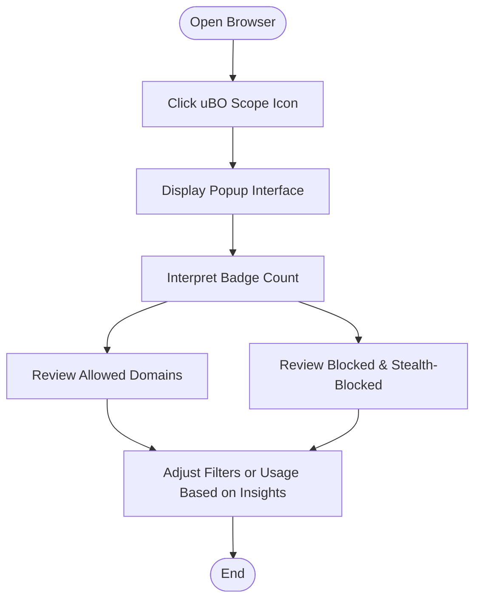

# Interpreting Badge Counts for Privacy Insights

## Workflow Overview

### Task Description
This guide helps you understand how to interpret the badge counts shown by the uBO Scope extension's toolbar icon. It explains why a lower badge count indicates better privacy, how to read the various domain categories, and how uBO Scope's metrics differ from traditional ad blocker statistics.

### Prerequisites
- uBO Scope extension installed and enabled in your supported browser (Chromium 122+, Firefox 128+, Safari 18.5+).
- Basic familiarity with browsing web pages and opening browser extension popups.
- Understanding of what third-party connections are, or refer to the [Core Terms & Concepts](https://example.com/overview/architecture-core-concepts/core-terms-concepts) page.

### Expected Outcome
By the end of this guide, you will confidently interpret the badge count and domain lists in the uBO Scope popup, enabling you to make informed privacy evaluations based on distinct third-party servers contacted during page loads.

### Time Estimate
5–10 minutes.

### Difficulty Level
Beginner to Intermediate.

---

## Step-by-Step Instructions

### 1. Open the uBO Scope Popup
- Click the uBO Scope icon in your browser toolbar.
- The popup window appears showing:
  - The current tab's hostname and domain.
  - A summary count of connected domains.
  - Three domain categories: Allowed, Stealth-Blocked, and Blocked.

### 2. Understand the Badge Count
- The badge on the toolbar icon shows the **number of distinct third-party domains with successful connections** (Allowed).
- A **lower badge count is better**, indicating fewer remote servers your browser contacted, enhancing privacy.
- The count reflects unique domains contacted, not the number of requests.

### 3. Interpret Domain Categories in the Popup
- **Allowed:** Domains successfully contacted without blocking. These represent third-party servers that exchanged data.
- **Stealth-Blocked:** Domains that were redirected stealthily or otherwise blocked without raising visible errors. These are detected by uBO Scope’s indirect monitoring.
- **Blocked:** Domains where connection attempts failed or were actively blocked.

### 4. Recognize the Privacy Implications
- More distinct third-party domains contacted means a larger surface for user tracking and data exposure.
- Reducing allowed domain counts is a primary privacy goal.

### 5. Avoid Misinterpretation of Block Counts
- Do **not** equate a higher block count with better privacy or blocking effectiveness.
- A high block count can coincide with allowing more third-party domains overall, resulting in worse privacy.

### 6. Compare uBO Scope to Traditional Ad Blocker Stats
- Unlike traditional ad blockers displaying block counts, uBO Scope focuses on **distinct server exposure**.
- This approach aligns better with understanding actual privacy impact.

### 7. Use Insights to Adjust Your Filter Lists or Browsing Habits
- If badge counts are high, consider tightening filter lists or blocking strategies.
- Revisit uBO Scope after changes to confirm reduced domain exposure.

### Verification Steps
- Confirm the badge count updates as you visit different websites.
- Look at the domain lists to see which third parties are contacted.
- Validate that the Allowed list matches third-party domains you expect or want to allow.

---

## Examples & Scenarios

### Example 1: Privacy-Conscious Browsing
Visit a common news website.
- Badge shows “3”.
- Allowed: cdn.example.com, analytics.safe.net, ads.example-ad.com.
- Blocked: trackers.badad.com.
Interpretation: You’re connecting to three distinct third-party domains, one of which is an ad server. Lower badge count suggests limited exposure; blocking appears effective.

### Example 2: Evaluating Content Blocker Effectiveness
On a social media site, your ad blocker reports 200 blocked items, but uBO Scope badge shows “15” allowed third-party domains.
- High block count but also high allowed domain count indicates more servers contacted despite blocking.
- The meaningful privacy metric is the 15 distinct domains allowed, which is high.

### Example 3: Avoiding Test Myths
Some webpages designed to test ad blockers artificially load many unrepresentative domains.
- uBO Scope emphasizes real-world domain counts.
- Ignore misleading block test pages; focus on badge count for privacy insights.

---

## Troubleshooting & Tips

<AccordionGroup title="Troubleshooting & Best Practices">
<Accordion title="Badge Count Not Updating or Missing">
- Ensure uBO Scope has the necessary permissions.
- Confirm your browser version meets minimum requirements.
- Reload or restart the browser. Check for conflicting extensions.
</Accordion>
<Accordion title="Understanding Unexpected High Counts">
- Some legitimate sites use multiple CDNs or analytics providers.
- Review domains in the popup's Allowed list to identify legitimate third parties.
- Adjust filter lists cautiously to avoid breaking site functionality.
</Accordion>
<Accordion title="Misinterpretation of Block Counts">
- Don't rely on block count overlays or badges from other content blockers.
- Use uBO Scope’s distinct domain count as your main privacy metric.
</Accordion>
<Accordion title="Optimizing Privacy">
- Regularly review your filter lists.
- Use uBO Scope to test before and after changes.
- Avoid visiting suspicious or heavily tracker-laden sites.
</Accordion>
</AccordionGroup>

<Tip>
Remember: uBO Scope reveals actual exposure by counting distinct third-party servers contacted, a metric that directly reflects your browsing privacy beyond traditional block counts.
</Tip>

---

## Next Steps & Related Content

- Explore [Understanding the Popup Interface](https://example.com/guides/getting-started/understanding-popup) to master interpreting all UI elements.
- Read [Debunking Ad Blocker Test Myths](https://example.com/guides/real-world-usage/debunk-test-myths) to understand limitations of traditional ad blocker tests.
- Follow [Your First Analysis: Reviewing Connections](https://example.com/guides/getting-started/first-analysis) for practical exercises.
- Check [Basic Configuration and Permissions](https://example.com/getting-started/installation-and-setup/basic-configuration) to ensure your setup is correct.


---

## Appendix: Key Terminology

| Term               | Meaning                                              |
|--------------------|------------------------------------------------------|
| Badge Count        | Number of distinct third-party domains successfully connected during page load.
| Allowed Domains    | Third-party servers that successfully responded.
| Stealth-Blocked    | Connections blocked or redirected without obvious failure.
| Blocked Domains    | Connections explicitly blocked or failed.
| Third-Party Domain | Domains different from the first-party site domain.


---

## Visualization of User Flow




---

## References
- [Core Terms & Concepts](https://example.com/overview/architecture-core-concepts/core-terms-concepts)
- [Understanding the Popup Interface](https://example.com/guides/getting-started/understanding-popup)
- [Debunking Ad Blocker Test Myths](https://example.com/guides/real-world-usage/debunk-test-myths)
- [Basic Configuration and Permissions](https://example.com/getting-started/installation-and-setup/basic-configuration)
- [uBO Scope GitHub Repository](https://github.com/gorhill/uBO-Scope)


---

## Code Sample: Reading Badge Count in Background Script (For Context Only)

```javascript
// Updates the badge with count of allowed domains for a tab
function updateTabBadge(tabId) {
    if ( tabId === -1 ) { return; }
    const tabDetails = session.tabIdToDetailsMap.get(tabId);
    if ( tabDetails === undefined ) { return; }
    const count = tabDetails.allowed.domains.size;
    browser.action.setBadgeText({
        tabId,
        text: count !== 0 ? `${count}` : ''
    }).catch(() => {});
}
```


