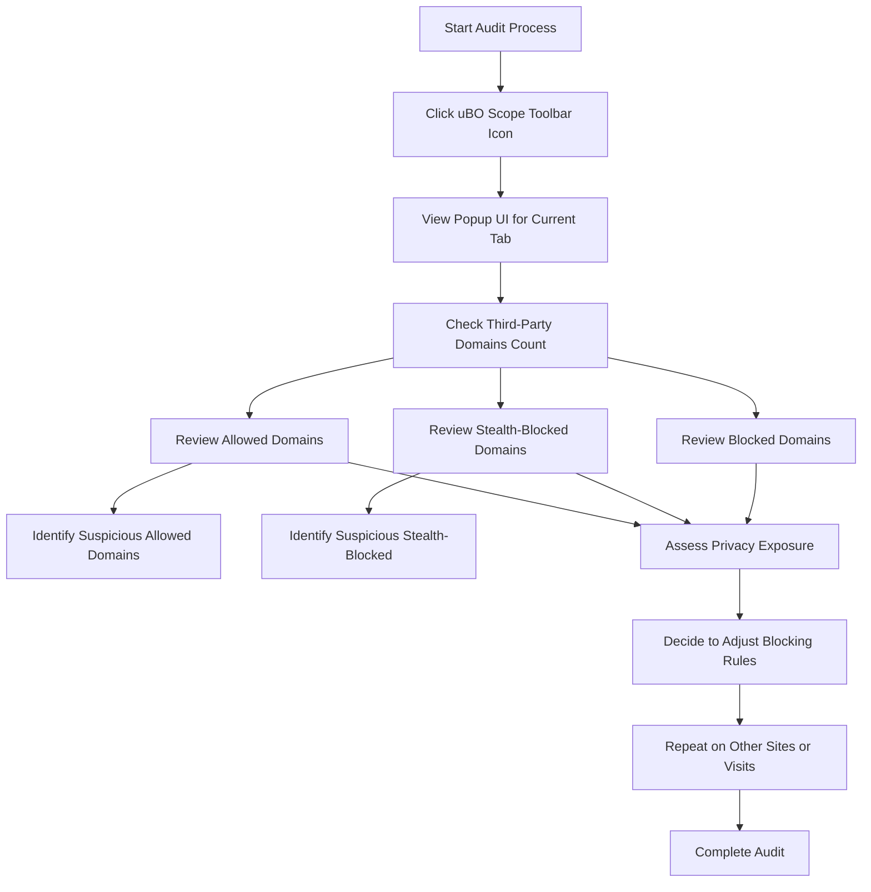

# Conducting a Third-Party Tracker Audit with uBO Scope

## Overview
This guide walks you through performing a thorough audit of third-party trackers on any website you visit using uBO Scope. It will help you understand how to identify connection attempts to third-party domains, interpret which are legitimate versus potentially suspicious, and make informed decisions to minimize invasive tracking.

By the end, you'll confidently use uBO Scope's popup UI and badge counts to reveal the network footprint of the sites you browse and better protect your privacy.

---

## Prerequisites
- uBO Scope installed and enabled in your browser. Installation instructions can be found in [Installing uBO Scope](../guides/getting-started/installation).
- Basic understanding of how the browser toolbar badge and popup UI work (see [Understanding the Popup UI](../guides/getting-started/ui-overview)).
- A website open in an active browser tab to audit.

---

## Expected Outcome
- You will identify all third-party domains your browser connects to while browsing a target website.
- You'll learn to distinguish between allowed (successful), stealth-blocked (redirected), and blocked domains.
- Understand how to interpret connection counts and spot unusual or suspicious third-parties.

---

## Time Estimate
Approximately 15-30 minutes to familiarize yourself and perform an audit on a typical website.

---

## Difficulty Level
Intermediate user with basic knowledge of browser extensions and privacy concepts.

---

## Step-by-Step Audit Instructions

### 1. Open uBO Scope's Popup UI for the Active Tab
- Click the uBO Scope icon in your browser's toolbar.
- The popup will display a header with the current site's hostname and domain.

### 2. Review the Domains Connected Summary
- Locate the summary section indicating "domains connected:" followed by a number.
  - This number represents the count of **distinct third-party domains** successfully connected to for this tab.
  - A **lower count indicates fewer third-party exposures**, which is typically preferable.

### 3. Examine the Allowed Domains Section
- This section lists domains to which your browser successfully connected resources.
- Counts next to each domain represent the number of individual connections observed.
- Common legitimate domains often include Content Delivery Networks (CDNs) like `cloudflare.net` or Google-owned domains.

### 4. Check the Stealth-Blocked Domains
- Domains in this section were redirected or stealthily blocked.
- These may represent trackers or unwanted third parties that were removed without breaking page content.
- Pay special attention to unfamiliar domains here for potential tracking attempts.

### 5. Analyze the Blocked Domains
- Domains explicitly blocked due to errors or blocking policies appear here.
- This indicates resources that were prevented from loading.

### 6. Interpret Domain Information and Make Decisions
- Identify third-party domains you are unfamiliar with or find suspicious.
- Use domain lookup or public suffix information (built into uBO Scope) to understand domain ownership.
- Consider blocking or monitoring these domains in your primary content blocker or privacy tools.

### 7. Use the Badge Count as a Privacy Metric
- Watch the toolbar badge number as you navigate pages.
- A rising count may indicate increasing third-party exposure.
- Use this insight to compare privacy impact between websites or after changing privacy settings.

---

## Real-World Example
Assume you open a news website. The uBO Scope popup shows:

- Allowed domains: `cdn.example-cdn.com` (12 connections), `analytics-tracker.com` (3 connections)
- Stealth-blocked domains: `ad.trackernetwork.com` (5 connections)
- Blocked domains: None

Interpretation:
- The CDN domain is legitimate and expected.
- Analytics tracker is actively loaded and connected.
- Ad tracker attempts were stealth blocked—potentially good privacy hygiene.

Action:
- You might decide to add `analytics-tracker.com` to a stricter block list.
- Monitor if stealth-blocked ad trackers keep appearing and adjust your filters accordingly.

---

## Best Practices & Tips
- Regularly audit high-traffic or privacy-sensitive websites to spot new trackers.
- Combine uBO Scope insights with your primary blocker rules for comprehensive coverage.
- Use domain reputation databases or manual investigation for suspicious entries.
- Revisit audits periodically, as websites and trackers evolve.
- Remember that some third-party connections (like CDNs) are essential and harmless.

---

## Common Pitfalls
- Misinterpreting the badge count as the number of blocked requests rather than allowed third-party domains.
- Overblocking essential third-party domains needed for website functionality.
- Trusting third-party ‘ad blocker test’ websites for privacy assessment instead of real-world audits with uBO Scope.

---

## Troubleshooting
- **No domains appear in popup or badge doesn’t update:**
  - Verify uBO Scope is active and enabled ([Troubleshooting Common Issues](../getting-started/troubleshooting-support/common-issues)).
  - Reload the audited page.
  - Check extension permissions to ensure it's allowed to monitor network requests.

- **Counts seem too high or inconsistent:**
  - Some websites load numerous third-party resources; use multiple audits for patterns.
  - Consider browser cache or other blockers possibly interfering.

- **Popup UI is blank or shows "NO DATA":**
  - Switch to the tab you want to audit and refresh popup.
  - Ensure you are viewing the active tab popup.

---

## Next Steps & Related Documentation
- Review [Understanding the Popup UI](../guides/getting-started/ui-overview) for detailed UI navigation.
- Explore [Interpreting Detailed Request Outcomes](../guides/advanced-and-troubleshooting/request-outcomes) for deeper insights into request statuses.
- For installation questions, see [Installing uBO Scope](../guides/getting-started/installation).
- Learn more about [Core Concepts & Terminology](../../overview/introduction-core-concepts/core-concepts-terminology) to understand domain categories.

---

## Summary Diagram: Third-Party Tracker Audit Flow

---