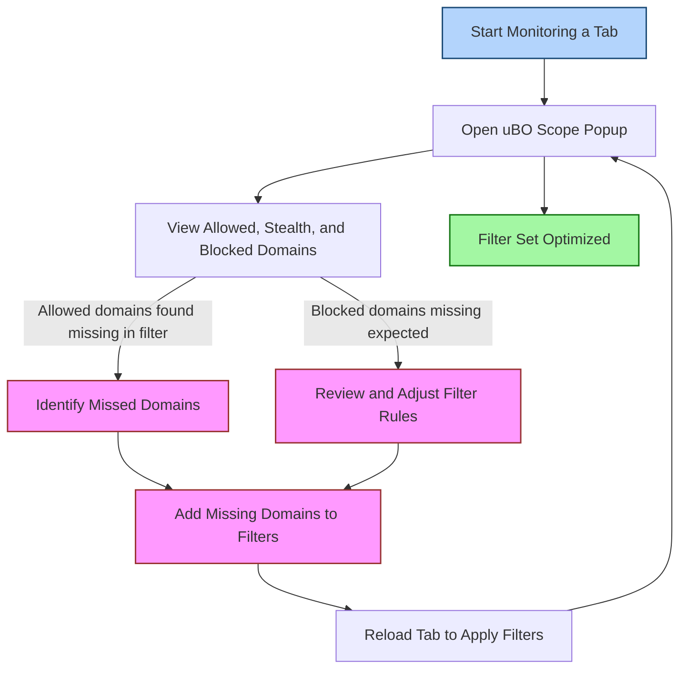

# Using uBO Scope for Filter List Maintainers

## Overview
As a filter list maintainer, your primary goal is to ensure your filter lists accurately block unwanted domains while minimizing false positives and performance overhead. uBO Scope offers you a practical, lightweight companion tool designed to reveal all network connections attempted or established by web pages across tabs and browser sessions, irrespective of which filters or blocking methods are in use.

This guide details how you can leverage uBO Scope to identify missed domains, validate that your block rules behave as intended, and optimize your filter sets using the extension’s reported data — especially on devices that limit access to standard browser network debugging tools.

---

## 1. Understanding uBO Scope’s Role for Filter List Maintainers

uBO Scope records the outcome of all network requests made by the browser, categorizing domains based on whether requests were allowed, stealth-blocked (redirected silently), or fully blocked. Importantly, it counts **distinct third-party domains contacted** rather than raw request counts, giving you a precise view of cross-domain network exposure.

- **Allowed domains:** Domains for which network requests succeeded.
- **Stealth-blocked domains:** Domains with network requests redirected without informing the source page.
- **Blocked domains:** Domains whose requests failed due to explicit blocking.

By listing these domains per active tab, uBO Scope helps you discover loopholes or gaps in your filters where unwanted domains slip through.

## 2. Prerequisites

Before using uBO Scope effectively as a filter maintainer:

- Install uBO Scope on a supported browser (Chrome 122+, Firefox 128+, or Safari 18.5+).
- Make sure uBO Scope has the necessary permissions (webRequest, activeTab, storage).
- Familiarize yourself with your filter list’s current rules and typical domains targeted.
- Understand basics of domain hierarchy using the public suffix list (PSL).

Refer to the [Prerequisites & System Requirements guide](/getting-started/setup-installation/prerequisites-requirements) for detailed compatibility and setup instructions.

## 3. Workflow: Leveraging uBO Scope Output to Improve Filters

<Steps>
<Step title="Open uBO Scope Popup for Active Tab">
Click the uBO Scope toolbar icon to open the popup UI, which loads domains contacted by the current tab.

- Verify the hostname header matches the active tab’s main domain.
- Observe the three domain outcome sections (Allowed, Stealth-Blocked, Blocked).
- Note the total distinct connected domains count under "domains connected".
</Step>

<Step title="Identify Missed Domains Not Blocked by Your Filters">
Focus on the **Allowed** domain list:

- Scan for suspicious or unrelated third-party domains.
- Consider domains commonly targeted by filter lists which appear here unexpectedly.
- Cross-check with your filter list rules to verify coverage.

This step reveals domains sneaking through your current filter set.
</Step>

<Step title="Validate Domains Marked as Blocked or Stealth-Blocked">
Review **Blocked** and **Stealth-Blocked** sections:

- Confirm that key unwanted domains appear here, proving your rules are active.
- Understand that stealth-blocked domains represent redirects or silent blocks, which may indicate advanced blocking methods.
- If expected domains are missing, revisit corresponding filter rules.
</Step>

<Step title="Gather Domain Counts and Use Them to Optimize Filter Sets">
Use the domain counts displayed alongside each domain to assess network exposure intensity:

- Higher counts indicate frequent requests and potential impact.
- Low-count domains might indicate peripheral or less critical requests.
- Prioritize additions or removals in your filters accordingly to balance blocking efficacy and performance.
</Step>

<Step title="Save Findings and Iterate Testing">
Keep notes of domains to add or remove from filter lists.

- Test filter updates by reloading the tab and reopening uBO Scope.
- Verify changes are reflected in allowed and blocked domain lists.
- Iterate this process while testing across multiple sites and devices, including those with limited dev tool access.
</Step>
</Steps>

## 4. Practical Tips and Best Practices

- **Focus on distinct domains, not raw requests.** uBO Scope’s counting helps avoid misinterpretation from multiple requests to the same domain.
- **Use the public suffix list awareness.** Domains shown are based on registered domain boundaries, avoiding confusion from subdomain noise.
- **Monitor stealth-blocked behavior carefully.** This can reveal domains blocked by redirects or DNS-based mechanisms not visible in standard blockers.
- **Prioritize domains based on request counts.** Filter rules blocking heavy-traffic unwanted domains yield better privacy benefits.
- **Test on devices with limited dev tools.** uBO Scope is invaluable where you can’t open full network inspectors, such as mobile browsers or restricted environments.

## 5. Common Pitfalls to Avoid

- **Don’t assume all blocked domains are unwanted.** Some allowed domains are legitimate CDNs or necessary services. Cross-check with your filter list’s intended scope.
- **Avoid chasing every domain.** Focus on those consistently problematic or privacy violating.
- **Beware of transient domains.** Some may appear sporadically and are less important to block.
- **Do not rely solely on synthetic "ad blocker test" pages.** Use real site visits with uBO Scope to uncover realistic scenarios.

## 6. Troubleshooting

<AccordionGroup title="Troubleshooting uBO Scope For Filter List Maintainers">
<Accordion title="Popup Shows No Data or NO DATA">
- Ensure uBO Scope is enabled and has permissions.
- Reload the tab to generate fresh network data.
- Confirm you are inspecting the correct active tab.
- Check if the browser allows webRequest access on current sites.
</Accordion>

<Accordion title="Blocked or Allowed Domains Not Updating">
- Clear session data by restarting the browser.
- Verify your filter list updates took effect.
- Disable conflicting extensions that might interfere.
</Accordion>

<Accordion title="Domain Counts Seem Inconsistent or Too Low">
- Remember uBO Scope counts distinct domains, not raw connections.
- Realize network requests outside the browser’s webRequest scope cannot be reported.
- Test entering the same site multiple times to confirm stability.
</Accordion>
</AccordionGroup>

## 7. Real-World Example

Imagine you maintain a filter list aimed to block tracking domains on news sites. You visit a popular news site, open uBO Scope's popup, and spot domains like `tracker.example.com` listed under Allowed domains with many requests. This insight drives you to add rules targeting that domain, and upon reload, `tracker.example.com` moves to Blocked.

Meanwhile, domains like `cdn.example.net` remain Allowed with high counts, confirming these are needed for proper site functionality.

This feedback loop optimizes your filter list's accuracy and effectiveness using concrete evidence from actual network behavior.

## 8. Next Steps & Related Documentation

- Review [Analyzing Website Network Connections](/guides/real-world-usage/analyzing-website-network-connections) for deeper insight into interpreting the popup UI.
- Consult [Interpreting Badge Counts](/guides/getting-started/interpreting-badge-counts) to understand overall exposure at a glance.
- Explore [Core Concepts & Terminology](/overview/architecture-and-core-concepts/core-concepts-terminology) to master key terms affecting your workflow.
- Use [Troubleshooting Common Setup Issues](/getting-started/troubleshooting-support/common-issues) for assistance resolving typical problems.

---

## Summary
This guide positioned uBO Scope not just as a network visibility tool but as an essential aid for filter list maintainers. It walks you through unlocking practical value by detecting missed domains, validating blocking effectiveness, and refining filter lists with actionable data directly from real browser activity. The stepwise approach empowered by the popup UI enables efficient filter tuning even on restrictive platforms.

---

## Appendix: Related Links

- [uBO Scope GitHub Repository](https://github.com/gorhill/uBO-Scope)
- uBO Scope [Popup UI Guide](/guides/getting-started/exploring-the-popup-ui)
- uBO Scope [Feature Quickstart](/overview/feature-overview-and-integration/feature-quickstart)
- [Public Suffix List Explanation](http://publicsuffix.org/)

---

## Visualizing the Filter Maintainer Workflow

This diagram shows the RL loop cycle for filter list maintainers using uBO Scope to incrementally improve filter coverage by examining domain connectivity in real time.
