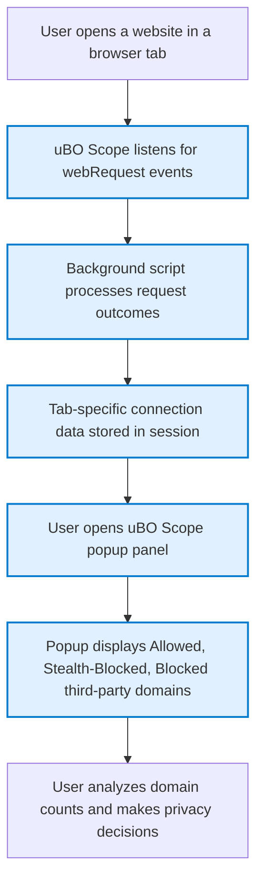

# Analyzing Third-Party Connections with uBO Scope

Unlock the full potential of your browser's privacy insights by learning how to use uBO Scope to audit and analyze the third-party servers your trusted websites connect to. This guide walks you through using the uBO Scope popup panel to differentiate between necessary connections and extraneous third-party requests that may impact your privacy or browsing experience.

---

## 1. Why Analyze Third-Party Connections?

Websites often load resources from multiple third-party servers such as content delivery networks (CDNs), analytics providers, or advertising networks. Understanding these connections is essential to:

- Identify which third parties are necessary for site functionality.
- Detect excessive or suspicious third-party calls that may leak your data.
- Make informed decisions about which connections to block or allow.

uBO Scope provides a transparent view of these connections on a per-tab basis, independent of any content blocker you use.

---

## 2. Before You Begin

### Prerequisites

- **uBO Scope installed** in your Chromium, Firefox, or Safari browser. Follow the [Installation Instructions](https://github.com/gorhill/uBO-Scope) to get started.
- You have visited or opened a tab with a website you trust and want to analyze.
- The extension's permissions for `webRequest` and tab access are granted during installation.

### What You'll Achieve

By following this guide, you will:

- Open uBO Scope's popup panel for an active tab.
- Read and interpret the list of third-party domains your browser connected to.
- Distinguish between "allowed", "blocked", and "stealth-blocked" connections.
- Gain actionable insights to tune your browsing privacy or content blocking strategies.

### Time Estimate

Approximately **5–10 minutes** to learn and perform your first analysis.

### Difficulty Level

Beginner to Intermediate; no technical setup required beyond installation.

---

## 3. Step-by-Step Walkthrough

### Step 1: Open the uBO Scope Popup on the Desired Tab

1. Navigate to the website in your browser tab that you want to analyze.
2. Click the uBO Scope extension icon near your address bar.
3. The popup panel will open showing connection information for the active tab.

**Expected Result:** The popup header displays the domain and subdomain of the site you are analyzing.

---

### Step 2: Understand the Summary of Connections

Right below the header, you will see a summary line:

```plaintext
"domains connected: [number]"
```

- This number represents the distinct third-party domains your browser attempted to connect with while loading the active page.
- A lower number generally indicates fewer third-party connections.

---

### Step 3: Explore the Three Categories of Connections

The connections are grouped into three distinct outcomes:

| Category        | Meaning                                                        | What to Look For                                  |
|-----------------|----------------------------------------------------------------|--------------------------------------------------|
| **Not Blocked (Allowed)** | Connections that succeeded without intervention. These domains served resources to the page. | Essential CDNs or services; verify if expected. |
| **Stealth-Blocked** | Connections redirected silently or otherwise intercepted by content blockers without user notification. | Could indicate stealthy tracking scripts or optimized blocking; consider if expected. |
| **Blocked**      | Connections that were actively blocked by content blockers or network rules. | Domains known or suspected of tracking, ads, or unwanted content. |

Each category displays a list of domains along with a count of requests made.

---

### Step 4: Review Domains Within Each Category

1. For each category, examine the listed domains.
2. Note the counts representing how often each domain was contacted.
3. Domains are shown in Unicode format for easy recognition.

**Tip:** Pay attention if domains appear in multiple categories; this may reflect complex behaviors such as redirects or partial blocking.

---

### Step 5: Differentiate Necessary vs. Excessive Connections

- Cross-check whether the allowed connections correspond to essential services like fonts, CDN-hosted scripts, or analytics from providers you trust.
- Investigate stealth or blocked domains to see if blocking them impacts your browsing experience.

If you find too many third-party domains listed, it may be a sign that the website has excessive external dependencies.

---

### Step 6: Use the Toolbar Badge as a Quick Gauge

- The extension icon badge shows the count of **distinct allowed third-party domains** for the current tab.
- Use the badge to quickly compare different sites or track changes after adjusting content blocking settings.

---

## 4. Practical Example

Imagine visiting `example.com` and opening uBO Scope:

- The summary reads: `domains connected: 7`
- Not Blocked section shows domains like `cdn.example.net` and `fonts.googleapis.com` with counts of 3 and 1 respectively.
- Stealth-Blocked shows `tracker.stealthyads.com` with count 4.
- Blocked section lists `ads.badnetwork.org` with count 2.

**Interpretation:**

- `cdn.example.net` and `fonts.googleapis.com` are legitimate resources.
- `tracker.stealthyads.com` is silently blocked, likely attempting to track without your knowledge.
- `ads.badnetwork.org` is actively blocked to prevent ads.

This clarity helps you decide if you want stricter blocking or whitelist certain essential services.

---

## 5. Tips and Best Practices

- **Analyze regularly:** Check third-party connections on websites you visit frequently to stay informed.
- **Compare similar sites:** Differences in third-party domains can reveal privacy risks.
- **Use domain knowledge:** Recognize trusted CDNs versus suspicious domains.
- **Watch badge counts:** Lower is better, but understand the context.
- **Beware stealth-blocked:** These represent connections that are blocked quietly and could be overlooked otherwise.

---

## 6. Common Pitfalls

- Misinterpreting high connection counts as solely negative — some sites legitimately use multiple third-party assets.
- Ignoring stealth-blocked connections because they don’t show up in normal content blocker stats.
- Assuming all blocked domains are malicious — some may be false positives affecting site features.

---

## 7. Troubleshooting

### The Popup Shows No Data or NO DATA Message

- Ensure you have navigated to a supported webpage that initiated connections.
- Check that the extension has permissions granted.
- Reload the page and open the popup again.

### Badge Count Does Not Update

- Sometimes the browser delays updating badge text; wait a few seconds or reload the tab.
- Confirm the extension is enabled and running.

### Domains Appear Unexpectedly in Stealth or Blocked Sections

- Certain privacy-focused or aggressive content blocking strategies may cause unexpected stealth or blocked entries.
- Review your content blocker rules or experiment with relaxing rules briefly.

---

## 8. Where to Go Next

- Deepen your understanding by reading the [Understanding the Popup Panel](https://example.com/guides/getting-started-workflows/interpreting-popup) guide.
- Learn about reliable evaluation methods in [Evaluating Content Blockers Reliably](https://example.com/guides/real-world-use-cases/evaluating-content-blockers).
- Explore troubleshooting common extension issues in [Troubleshooting Common Issues](https://example.com/getting-started/first-use-validation/troubleshooting-common-issues).

---

## 9. Visual Workflow Diagram



---

<u>By mastering this workflow on the Analyzing Third-Party Connections page, you gain full visibility into your browser’s network interactions with third-party servers. This empowers you to safeguard your privacy and tailor content blocking to your needs with confidence.</u>

---