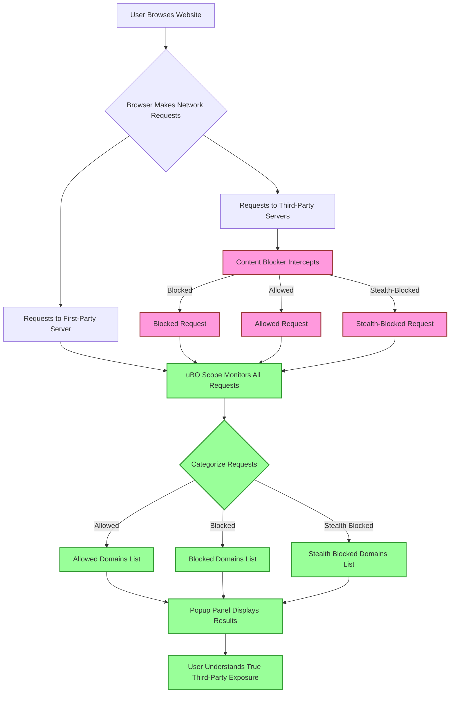

# Debunking Ad Blocker Test Myths

## Introduction

Many users rely on popular 'ad blocker test' websites to assess the effectiveness of their content blockers. However, these test sites often provide **misleading or inaccurate results** that do not reflect real-world browsing scenarios. This guide explains why these sites fail as reliable benchmarks and how **uBO Scope** offers a significantly more truthful and practical way to evaluate network request blocking.

---

## Why 'Ad Blocker Test' Sites are Misleading

### 1. Unrealistic Testing Environment

Ad blocker test pages typically generate synthetic and highly artificial network requests designed to trigger specific detection scripts or blockers. These requests:
- Are uncommon in real-world browsing
- Do not represent the diversity of actual third-party connections
- Fail to simulate normal web traffic patterns

### 2. Stealth Blocking and Detection Avoidance

Modern blockers often implement stealth techniques to avoid being detected or to prevent site breakage. These stealth methods:
- Suppress or hide blocking actions from page scripts
- May allow requests in stealth-blocked ways that are invisible to test pages
- Lead to discrepancies in test results vs. real browser behavior

### 3. Overemphasis on Block Counts

Test sites usually focus on how many requests a blocker reports it has stopped, not on what connections are effectively allowed or blocked. A higher block count:
- Does not guarantee better blocking
- Can coincide with **more** actual connections to third-party servers
- Ignores network-wide context and actual exposure

### 4. Lack of Transparency in Underlying Connection Data

The core issue with these sites is that they **do not reveal actual network connections made by your browser**. Without insight into which third-party servers are contacted or blocked, you cannot assess blocker effectiveness reliably.

<Warning>
Relying solely on 'ad blocker test' pages can give a false sense of security or lead to poor blocker choices. These tests should be **avoided** as primary evaluation tools.
</Warning>

---

## How uBO Scope Enables Accurate Assessment

### Real-Time Monitoring of Network Connections

uBO Scope uses the browser's native `webRequest` API to monitor all network requests your browser makes to third-party servers, regardless of any content blocking active. It captures:
- Allowed connections
- Blocked connections
- Stealth-blocked connections (requests that were suppressed in a concealed or indirect manner)

### Visibility into Actual Third-Party Exposure

By presenting counts and details of distinct third-party domains in its toolbar badge and popup panel, uBO Scope:
- Shows what connections truly occurred, not just what was reported blocked
- Helps you understand the privacy implications of your browsing
- Debunks misleading claims based on block counts alone

### Independent of Content Blocker Mechanisms

uBO Scope is complementary to any content blocker or DNS protection, as it tracks requests at the network level.

---

## Using uBO Scope to Evaluate Content Blockers Reliably

1. **Install uBO Scope** in your browser (Chromium, Firefox, or Safari).
2. **Visit everyday websites** you frequent rather than test pages.
3. **Open the uBO Scope popup** to review:
   - The number of distinct third-party domains connected
   - How many domains were allowed, blocked, or stealth-blocked
4. Compare these results with and without your content blocker active.
5. Use the badge count as a **real indicator of exposure**—lower counts indicate fewer third-party connections, hence better blocking.

### Example Scenario

You activate uBO Scope and browse a popular news site:

- **Without content blocker:** Badge shows 20 distinct third-party domains connected.
- **With content blocker enabled:** Badge shows 5 distinct third-party domains connected.

This means the blocker is effectively reducing your exposure to third parties from 20 to 5 domains, a clear measurement of privacy gain.

<Check>
Always prioritize **real browsing scenarios** and **network-level visibility** over synthetic tests to gauge blocker performance.
</Check>

---

## Best Practices When Evaluating Content Blocking

- **Ignore block counts reported by blockers** in isolation.
- Trust network connection visibility tools like uBO Scope to understand actual browser activity.
- Use a variety of websites to get holistic insight into third-party exposure.
- Be aware of stealth blocking as a legitimate technique that may hide activity from JavaScript but is reported by uBO Scope.

---

## Troubleshooting

| Issue | Remedy |
|-------|--------|
| uBO Scope badge shows unexpectedly high counts | Confirm all browser permissions for uBO Scope are granted; verify content blocker and DNS settings. |
| No data appears in popup panel  | Reload the page or browser tab; make sure uBO Scope is properly installed and active. |
| Discrepancy between blocker interface and uBO Scope data | Trust uBO Scope's network-level counts for actual connections. Review blocker settings for stealth modes. |

For detailed troubleshooting guidance, see [Troubleshooting Common Issues](https://example.com/getting-started/first-use-validation/troubleshooting-common-issues).

---

## Summary

uBO Scope provides a **transparent, real-world measurement of your browser’s actual third-party network connections**, making it the definitive tool to evaluate content blockers beyond misleading test sites. By focusing on true network activity, it empowers informed privacy decisions.

---

## Related Documentation

- [Installation Instructions](https://github.com/gorhill/uBO-Scope/blob/main/guides/getting-started-workflows/installation-quickstart.mdx)
- [Understanding the Popup Panel](https://example.com/guides/getting-started-workflows/interpreting-popup)
- [Analyzing Third-Party Connections](https://example.com/guides/real-world-use-cases/analyzing-third-parties)
- [Evaluating Content Blockers Reliably](https://example.com/guides/real-world-use-cases/evaluating-content-blockers)
- [Troubleshooting Common Issues](https://example.com/getting-started/first-use-validation/troubleshooting-common-issues)
- [System Architecture Overview](https://example.com/overview/core-concepts-architecture/system-architecture)

---

## Next Steps

Explore real-world browsing with uBO Scope enabled and use its popup panel to fully understand third-party exposure. Avoid relying on synthetic ad blocker test pages and instead base your privacy strategy on **actual network request visibility**.

---

## Visual Overview

---