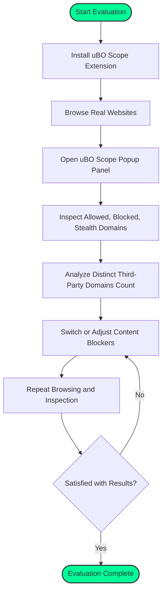

# Evaluating Content Blockers Reliably

## 1. Introduction

Many users and filter list maintainers want to assess how well content blockers prevent unwanted third-party network connections. However, blindly comparing block counts or relying on popular "ad blocker test" websites often leads to misleading conclusions. This guide empowers you to use uBO Scope effectively to reveal the **true profile of network requests** independently of any content blocker.

uBO Scope tracks every third-party remote server connection your browser attempts or successfully establishes, regardless of the content blocker's internal logic or DNS-level blocking. By focusing on *distinct third-party domains actually contacted* rather than *blocked request counts*, you gain a realistic, user-centric view of your browser's privacy exposure.

---

## 2. Why Traditional Block Count Comparisons Fail

### 2.1 The Myth of "Higher Block Count = Better"

- A high block count indicates many network requests were blocked. However, this does **not** mean fewer third-party connections were made. Sometimes, a blocker with a higher block count allows more unique third-party domains, increasing your privacy risk.
- Ultimately, the key metric is the **number of distinct third-party remote servers from which resources are allowed or fetched**. A lower count is better.

### 2.2 Limitations of "Ad Blocker Test" Websites

- Such test sites generate **artificial and unrealistic network requests** crafted to trigger blockers. They do not represent real-world web browsing.
- Content blockers often apply stealth techniques, silently handling requests to avoid webpage breakage and avoid detection. These tricks cause test sites to under-report actual blocking.
- uBO Scope observes actual browser behavior and network requests, providing honest insight into what the user experiences.

<Tip>
Avoid relying on synthetic blocker test pages. Instead, assess blockers based on **real network requests made by real websites** you visit. Use uBO Scope to monitor these requests transparently.
</Tip>

---

## 3. Using uBO Scope to Reveal True Network Request Profiles

### 3.1 What uBO Scope Tracks

- **Allowed connections**: Third-party domains from which your browser successfully fetched resources.
- **Blocked connections**: Third-party domains for which network requests failed or were actively blocked.
- **Stealth-blocked connections**: Redirected or replaced connections that extensions hide from webpages.

### 3.2 Key Metric — Distinct Third-Party Domains Contacted

- uBO Scope badge number represents the count of unique third-party domains contacted.
- This is the number that reflects your privacy exposure, not the total requests or blocked count.

### 3.3 Independent of Content Blockers

- uBO Scope works regardless of which content blocker you use or even if DNS-level blocking is in place.
- All network requests observable through the browser’s `webRequest` API are recorded.

---

## 4. Workflow: Evaluating Your Content Blocker with uBO Scope

<Steps>
<Step title="Install and Enable uBO Scope">
Follow the instructions in the [Installation Instructions](../getting-started/requirements-installation/install-instructions) guide to install uBO Scope on your browser.
</Step>
<Step title="Browse Typical Websites">
Visit websites you normally use. Avoid artificial test sites. Real browsing reveals the genuine network activity.
</Step>
<Step title="Open the uBO Scope Popup Panel">
Click the uBO Scope toolbar icon to open the popup showing the current tab’s third-party network connections.
</Step>
<Step title="Interpret the Data">
Focus on the summary count of distinct third-party domains contacted (badge number). Review the allowed, blocked, and stealth-blocked lists to understand your exposure.
</Step>
<Step title="Compare Across Different Blockers or Configurations">
Switch content blockers or toggle their settings and repeat the process.
Observe how the badge count changes—not just block counts—to assess true impact.
</Step>
</Steps>

<Note>
Keep in mind that variations may occur due to the complexity of how each blocker operates under the hood.
</Note>

---

## 5. Best Practices and Tips

- **Use real-world browsing sessions** to gather meaningful data.
- **Interpret the badge number (distinct third-party domains contacted) as your primary privacy metric.**
- **Do not equate block counts or blocked event totals with blocker quality.**
- Cross-check domain lists before and after blocker changes for more detailed analysis.
- Understand stealth-blocked domains as connections your blocker prevents silently — these are important for privacy but may not appear as explicitly blocked.

<Tip>
For filter list maintainers, uBO Scope provides an unbiased view of all network activity your filters affect, independent of the blocking mechanism.
</Tip>

---

## 6. Common Pitfalls to Avoid

- Avoid relying on third-party blocker test sites with non-realistic request patterns.
- Do not assume a blocker with fewer allowed connections but a low block count is performing worse.
- Understand that some content blockers together with DNS-based protection may fail to show accurate event counts; rely instead on uBO Scope's visible network request data.

<Warning>
Network requests initiated outside the `webRequest` API scope (e.g., certain WebSocket connections or native browser DNS resolutions not visible to extensions) are not reported by uBO Scope.
</Warning>

---

## 7. Additional Tools and Resources

- Use the [Understanding the Popup Panel](../guides/getting-started-workflows/interpreting-popup) guide to better interpret uBO Scope’s interface.
- Consult the [Analyzing Third-Party Connections](../guides/real-world-use-cases/analyzing-third-parties) guide for deeper usage scenarios.
- Refer to the [System Architecture](../overview/core-concepts-architecture/system-architecture) documentation to understand how uBO Scope observes and categorizes network requests.

---

## 8. Visualizing the Workflow

---

## 9. Summary

This guide equips you to evaluate content blockers not by superficial block counts or unreliable test sites, but by **real, measured third-party network connections** visible with uBO Scope. Using a practical workflow, you learn to discern true privacy exposure and assess blockers' effectiveness transparently.

---

*For further questions or advanced scenarios, explore the troubleshooting and real-world use cases in the documentation.*

---

## References

- [uBO Scope Installation Instructions](../getting-started/requirements-installation/install-instructions)
- [Understanding the Popup Panel](../guides/getting-started-workflows/interpreting-popup)
- [Analyzing Third-Party Connections](../guides/real-world-use-cases/analyzing-third-parties)
- [System Architecture](../overview/core-concepts-architecture/system-architecture)
- [Debunking Ad Blocker Test Myths](../guides/real-world-use-cases/debunking-testing-myths)

---