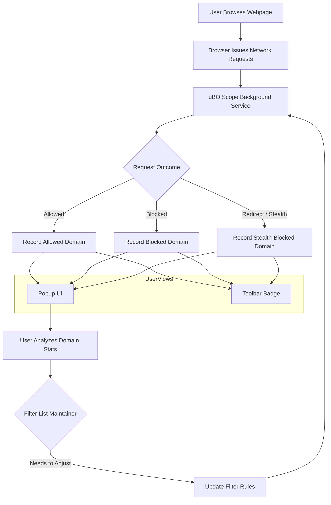

# Tips for Power Users and Filter List Maintainers

This guide is tailored for advanced users and filter list maintainers who want to extract maximum value from uBO Scope, especially when traditional browser developer tools are unavailable or limited. It provides practical advice on leveraging domain-level statistics and analyzing network request outcomes to maintain better privacy hygiene and optimize filter lists.

---

## 1. Understanding Advanced Metrics in uBO Scope

### What You Can Achieve
- Gain deep insights into third-party connections beyond simple block counts.
- Rapidly identify stealth-blocked and blocked domains that impact your filter list.
- Use domain-level aggregations to detect recurring patterns or suspicious activity.

### Why It Matters
When developer tools are inaccessible (such as on mobile or locked-down environments), the rich data uBO Scope provides via its popup and badge becomes your primary source of network request intelligence.

<Tip>
Using uBO Scope's domain-level statistics empowers you to make filter list decisions with confidence, especially on constrained devices.
</Tip>

---

## 2. How to Effectively Use Domain-Level Stats

### Strategy
uBO Scope categorizes network connections into three groups:
- **Allowed**: Domains for which connections succeeded
- **Stealth-blocked**: Domains where requests were redirected or hidden
- **Blocked**: Domains where requests failed or were explicitly blocked

This granularity allows you to:

- Detect domains that evade blocking by stealth techniques.
- Spot domains frequently blocked and confirm if added domains in your filter list are effective.
- Understand legitimate third parties (usually a low count) versus trackers or ad servers.

### Practical Steps

<Steps>
<Step title="Open the uBO Scope Popup">
Click the extension icon to reveal the breakdown of domains connected by category.
</Step>
<Step title="Analyze Domain Frequency">
Look at the "count" badges next to domains to gauge how often each domain was contacted.
</Step>
<Step title="Focus on Stealth and Blocked Sections">
These lists highlight domains causing issues or those being specifically targeted by your filters.
</Step>
<Step title="Cross-Reference Known Tracker Lists">
Use filter list resources (like EasyList) to verify whether domains are correctly categorized.
</Step>
<Step title="Adjust Filters Based on Findings">
Add new domains or rules to your filters if unexpected allowed domains appear frequently.
</Step>
<Step title="Repeat Monitoring Over Time">
Frequently revisit the popup stats to observe trends or regression in filter effectiveness.
</Step>
</Steps>

<Note>
The popup updates dynamically as you browse, so ongoing observation helps catch new connections as they appear.
</Note>

---

## 3. Use Cases When Developer Tools Are Unavailable

### Scenario: Limited Device Access
On devices like locked-down corporate environments, mobile browsers, or browsers without developer tools, uBO Scope is your window into the network:

- **Live Monitoring:** Real-time badge count and popup stats inform you instantly about third-party connections.
- **Filter List Tuning:** Quickly decide which third-party domains to block or allow without needing deep network inspection tools.
- **Stealth Detection:** Identify and reduce stealthy connections that typical tools might miss.

### Best Practices
- Regularly check the popup after browsing top sites you maintain filters for.
- Ensure your filter list updates by correlating blocked domains here with your filter rules.

---

## 4. Tips and Best Practices for Filter List Maintainers

- **Validate Domains Using Public Suffixes:** Many domains share suffixes; ensure you understand the registered domain to avoid overblocking or underblocking.
- **Watch for Legitimate Third Parties:** CDNs or service providers may be critical; avoid blocking these without careful review.
- **Leverage Domain Counts:** High contact frequency may indicate essential resources or trackers—investigate accordingly.
- **Use Stealth Lists as Alerts:** Domains in stealth-blocked may warrant filter enhancements or investigation.

<Tip>
Combine your observations in uBO Scope with external tools or filter list resources for comprehensive filter maintenance.
</Tip>

---

## 5. Common Pitfalls and How to Avoid Them

- **Misinterpreting Block Count:** Don’t equate higher block counts with better blocking; focus on distinct domains connected.
- **Ignoring Stealth Blocking:** Stealth techniques hide some blocks; uBO Scope surfaces them — don’t overlook.
- **Overblocking Legitimate Services:** Use domain analysis to prevent breaking sites by blocking essential third parties.

<Warning>
Always test filter changes in real browsing conditions and validate with uBO Scope data before deploying widely.
</Warning>

---

## 6. Troubleshooting

| Problem                            | Solution                                                 |
|----------------------------------|----------------------------------------------------------|
| Badge count not updating          | Refresh the page or restart the browser to reset data.  |
| Missing domains in the popup      | Ensure uBO Scope has the necessary permissions enabled. |
| Unexpected domains allowed        | Investigate domain frequency; add rules if needed.       |
| Confusing stealth domain behavior | Consult stealth-blocked list regularly to uncover hidden redirects or blocks. |

---

## 7. Next Steps & Additional Resources

- Explore the [Comparing Content Blockers Accurately](https://docs.uboscope/guides/real-world-use-cases/comparing-blockers) guide to understand filter efficacy.
- Use the [Understanding the Badge and Popup Data](https://docs.uboscope/guides/interpreting-results/badge-meanings) page to deepen interpretation skills.
- Combine with the [Installation and Setup](https://docs.uboscope/guides/getting-started/installation-setup) documentation to ensure your environment is ideal.

---

## 8. Contributors and Further Development
uBO Scope is maintained with a focus on stability and utility for advanced users. Future iterations may enhance detail availability in the popup, especially targeting filter list maintainers’ feedback.

---

## 9. Reference Diagram: uBO Scope Data Flow for Filter Maintenance

This flow represents how uBO Scope captures network request outcomes, exposes them in the user interface, and closes the loop for filter tuning.

---

<Check>
Your expertise in navigating this data will empower your filter maintenance and privacy protection activities with uBO Scope.
</Check>
