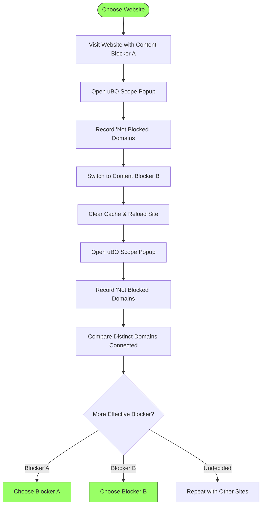

# Verifying Content Blocker Effectiveness

## Overview
This guide helps you confidently evaluate and verify the true effectiveness of content blockers using uBO Scope’s unique measurement approach. Rather than relying on raw block counts, which can be misleading, this workflow guides you to assess which third-party remote servers are *actually* still contacted (unblocked) by your browser while using various content blockers. This evidence-based approach empowers you to make informed decisions about which blocker provides superior privacy.

---

## Prerequisites

- uBO Scope extension installed and active in your supported browser (Chromium, Firefox, or Safari).
- Familiarity with opening the uBO Scope popup panel and understanding its layout (see the [Exploring the Popup Panel guide](../essential-workflows/exploring-the-popup.md)).
- At least two different content blockers installed for comparison, or different configurations of the same blocker.
- Basic understanding of third-party vs first-party domains (refer to [Core Concepts & Terminology](../../overview/core-architecture-concepts/core-concepts-terminology.md)).

## Expected Outcome

By following this workflow, you will:

- Identify and list distinct third-party domains contacted when browsing a site under different content blockers.
- Differentiate between domains that are allowed (unblocked), stealth-blocked, or fully blocked.
- Gain insights into how many and which remote servers remain accessible, clarifying which content blocker is more effective.
- Learn why toolbar badge block counts alone are unreliable indicators for blocker effectiveness.

## Estimated Time

10–20 minutes per content blocker test, depending on the number of sites and complexity of scenarios.

---

## Step-by-Step Instructions

### 1. Choose Representative Websites

Start with websites you commonly visit or sites known to have multiple third-party connections (e.g., news websites, social media pages).

### 2. Open uBO Scope Popup

- Visit the chosen website in your browser.
- Click the uBO Scope toolbar icon to open the popup panel.
- Observe the data under the sections:
  - **Not Blocked**: Listed domains whose resources were successfully fetched.
  - **Stealth-Blocked**: Domains where requests were silently prevented without obvious failures.
  - **Blocked**: Domains where requests visibly failed or were explicitly blocked.

### 3. Record the Number of Distinct Connected Third-Party Domains

- Note the count shown in the summary at the top ("domains connected"), which corresponds to the number of unique third-party domains contacted.
- Review the domain lists under the three outcome categories for details of which remote servers are contacted or blocked.

### 4. Switch Content Blocker or Configuration

- Disable the current content blocker or switch to the alternative blocker you want to test.
- Clear your browser cache or perform a hard reload of the page to avoid cached network requests.
- Repeat Steps 2 and 3.

### 5. Compare Results

- Focus on the total number of *unblocked* distinct domains instead of relying on block counts.
- A **lower count of unblocked domains** indicates stronger effectiveness in blocking unwanted content.
- Observe which specific domains remain unblocked - a content blocker that leaves fewer third-party domains connected offers better privacy protection.

### 6. Understand the Meaning Behind Counts and Lists

- Avoid assuming that a higher blocked count means better blocking; a blocker causing more blocks may allow more distinct domains to load.
- Stealth-blocked domains reflect requests prevented in ways hidden from the webpage, representing subtle but effective blocking.
- Pay attention to legitimate CDNs or essential services that usually appear in the "Not Blocked" list.

### 7. Repeat for Various Sites

- Test a variety of websites to verify consistent blocker performance.
- Use results to gather empirical data on which content blocker suits your privacy needs best.

---

## Practical Example

Assume you want to compare your current blocker with a new one:

1. Visit https://example-news-site.com with Content Blocker A enabled.
2. Open uBO Scope popup, see 8 domains under "Not Blocked" and 3 domains "Blocked".
3. Switch to Content Blocker B (disable A, enable B).
4. Reload the site, open uBO Scope popup, now see 5 domains "Not Blocked" and 6 domains "Blocked".
5. Despite Blocker A showing more blocked items visually, Blocker B actually prevents more distinct 3rd-party connections — it is the more effective blocker in this context.

---

## Best Practices & Tips

- **Clear cache and do a hard reload** to ensure fresh requests are measured accurately.
- Use **incognito or private browsing modes** to avoid interference from extensions or cached data.
- Consider **whitelisting** trusted domains if some legitimate third parties are required for site functionality.
- Understand that **not all blocked domains are malicious**; some are essential services like CDNs.
- Use uBO Scope regularly to audit changes in content blocker rules or websites.

---

## Troubleshooting

<AccordionGroup title="Common Issues When Verifying Content Blocker Effectiveness">
<Accordion title="Popup Shows No Data or 'NO DATA'">
- Make sure you have visited a website recently that attempted network connections.
- Refresh the page and re-open the popup.
- Confirm that uBO Scope has necessary permissions, especially the "webRequest" API.
- Check if the extension is active and hasn’t been disabled by your browser.
</Accordion>
<Accordion title="Counts Seem Inconsistent After Switching Blockers">
- Ensure you fully reload the webpage when switching content blockers.
- Clear caches to prevent old requests from interfering.
- Some blockers perform stealth-blocking, so domains may not always appear in expected categories.
- Wait a few seconds after reload for uBO Scope to process all requests.
</Accordion>
<Accordion title="Blocked Count Higher But More Domains Unblocked">
- Remember blocked counts indicate *requests*, not distinct domains.
- Focus comparisons on "Not Blocked" domain counts to see actual exposure.
- Consult the [Understanding the Toolbar Badge](../essential-workflows/understanding-the-badge.md) guide for a deeper explanation.
</Accordion>
</AccordionGroup>

---

## Understanding Why Total Block Count Can Be Misleading

The uBO Scope tool collects data from the browser’s network events, tracking each unique third-party domain requested, categorized as allowed, stealth-blocked, or blocked. Here's why total number of *blocks* on a badge or report should never be your sole criterion:

- **Higher block counts might mean the content blocker lets more total domains load**, counterintuitively leading to more exposure.
- Some content blockers use **stealth blocking**, which avoids detection by sites but may not increase block counts.
- Block counts measure *individual requests*; multiple requests to the same domain don’t increase exposure count but inflate block numbers.
- Effective content blocking equals reducing *unique distinct third-party domains contacted*, not just blocking many requests.

uBO Scope’s approach of showing actual unblocked distinct third-party domains offers a much clearer, evidence-based metric of effectiveness.

---

## What Should You Do Next?

- Continue exploring different sites and configurations, building a clear, empirical picture of content blockers' behavior.
- For help understanding the detailed popup data and domain categories, see the [Exploring the Popup Panel](../essential-workflows/exploring-the-popup.md) documentation.
- Familiarize yourself with the [Understanding the Toolbar Badge](../essential-workflows/understanding-the-badge.md) to interpret the badge information correctly.
- If you want to learn more about common myths and unreliable test sites, consult the [Debunking Blocking Myths and Bad Test Sites](../real-world-use-cases/debunking-blocking-myths.md) guide.

---

## Visual Workflow

---

## Additional Resources

- [Understanding the Toolbar Badge](../essential-workflows/understanding-the-badge.md): Deep dive into badge meaning.
- [Exploring the Popup Panel](../essential-workflows/exploring-the-popup.md): Guide to analyzing popup domain lists.
- [Debunking Blocking Myths and Bad Test Sites](../real-world-use-cases/debunking-blocking-myths.md): Avoid common content blocker misconceptions.
- [System Requirements & Prerequisites](../../getting-started/setup-installation/prerequisites-requirements.md): Ensure correct setup.

---

Maintaining an evidence-based approach by focusing on actual network connections, as revealed through uBO Scope, equips you to cut through noise and myths, making smarter content blocker choices with confidence.