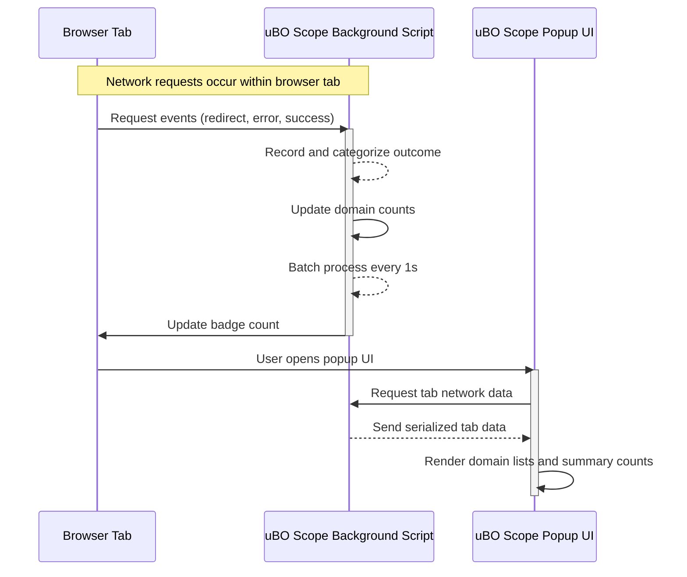

# Troubleshooting and Common Issues

This guide addresses the most frequent problems you may encounter when using uBO Scope, especially focusing on scenarios where network connections are not reported, toolbar badges appear incorrect, or popup data seems inconsistent. By following actionable steps and understanding the behavior of uBO Scope across various browser environments, you will ensure accurate connection reporting and effective troubleshooting.

---

## 1. Understanding uBO Scope's Data Reporting Workflow

uBO Scope uses the browser's `webRequest` API to observe network requests and categorize them per tab. The background script tracks allowed, stealth-blocked, and blocked domains, updating the toolbar badge and popup UI accordingly.

### Key Points for Troubleshooting:
- Extension relies on browser API support; if the browser blocks or limits `webRequest`, data won’t be reported.
- Network requests outside the `webRequest` API coverage (e.g., DNS-level blocking, internal browser requests) aren’t visible.
- Badge counts represent *distinct allowed third-party domains* connected by the active tab.

## 2. Common Issues and How to Fix Them

### 2.1 No Network Requests Are Shown for a Tab

If the popup shows 'NO DATA' or zero domains unexpectedly:

- **Verify active tab selection:** uBO Scope shows data only for the currently active tab in the current window.
- **Reload the web page:** The extension begins tracking requests after page load; refreshing triggers new data collection.
- **Check browser permissions:** Confirm uBO Scope has permissions for the URLs you visit, especially if you browse non-HTTP(s) schemes.
- **Confirm `webRequest` API availability:** Some browsers or configurations may restrict this API, preventing data capture.

**Action Steps:**
1. Click the extension icon on a known HTTP or HTTPS page.
2. Refresh the page.
3. Open the popup immediately after page load; wait briefly if necessary to allow badge updates.

### 2.2 Badge Count Is Unexpectedly High or Low

The badge on the toolbar reflects the count of distinct allowed third-party domains.

- A **high badge count** means many third-party connections were allowed, not necessarily blocked.
- A **low or zero badge** could indicate no third-party connections or the extension not tracking properly.
- Badge counts exclude stealth-blocked and blocked domains.

**Troubleshooting Tips:**
- Understand that badge count is an indicator of *allowed* third-party connectivity, not block counts.
- Confirm by opening the popup and reviewing allowed domains.
- Watch for stealth-blocked domains which are hidden by covert blocking mechanisms; these do not increment the badge.

### 2.3 Inconsistent or Missing Popup Data

If the popup shows incomplete or absent data:

- Confirm uBO Scope's background service worker or background script is active.
- The extension caches session data; closing the tab or browser will clear sessionStorage, potentially removing old data.
- Browser differences may affect timing; wait a moment after opening the popup for data to load.

**Fixes:**
- Reload the affected webpage/tab.
- Restart the browser to reinitialize extension background.
- Check for browser updates or known issues affecting extensions.

### 2.4 Network Requests Not Categorized Correctly

Sometimes domain categorization (allowed, stealth-blocked, or blocked) may not align with user expectations.

- This behavior reflects the actual network request outcomes captured via the `webRequest` API.
- Stealth-blocked domains are those affected by redirects or errors where blocking was attempted covertly.
- Domains with errors may also appear under blocked.

**Advice:**
- Review domain lists carefully.
- Remember that uBO Scope reports *outcomes*, not internal filter logic.

## 3. Platform-Specific Considerations

### Chromium
- Uses service worker mode for background processing.
- Ensure that service workers are not suspended or blocked by other extensions.
- The badge updates may be delayed if the service worker is inactive.

### Firefox
- Background script uses persistent dynamic module.
- Minimum Firefox version 128.0 is required; older versions may not support necessary APIs fully.
- Occasional extension restart may be required to clear stale data.

### Safari
- Requires Safari 18.5 or later.
- Permissions for network monitoring must be explicitly granted.
- Background scripts run as modules; extension reload may be needed if behavior is erratic.

## 4. Step-by-Step Troubleshooting Workflow

<Steps>
<Step title="Check Extension Icon Visibility">
Make sure the uBO Scope icon appears on your browser’s toolbar. If missing, verify the extension is installed and enabled.
</Step>
<Step title="Verify Permissions and Host Access">
Check that uBO Scope has permission to access websites you visit, especially HTTPS and WebSocket URLs. Permissions issues prevent monitoring.
</Step>
<Step title="Reload the Web Page">
Network activity tracking starts fresh after a page load. Refresh the page if no data appears.
</Step>
<Step title="Open the uBO Scope Popup Immediately After Load">
Click the toolbar icon to open the popup and observe the connection reporting for the active tab.
</Step>
<Step title="Restart Browser">
If issues persist, restart the browser to reset extension background scripts and session data.
</Step>
<Step title="Check for Conflicting Extensions">
Other privacy or network monitoring extensions might interfere with uBO Scope’s functionality.
</Step>
<Step title="Review Browser Version Compatibility">
Ensure you meet minimum browser version requirements (Chromium ≥122, Firefox ≥128, Safari ≥18.5).
</Step>
</Steps>

## 5. Best Practices to Ensure Accurate Reporting

- Use uBO Scope primarily on HTTP and HTTPS websites to maximize network request visibility.
- Avoid concurrently running multiple content blockers or privacy tools that heavily interfere at network level.
- Remember badge count reflects allowed third-party connections, not blocked or stealth-blocked counts.
- Regularly update your browser and extensions to maintain compatibility.

## 6. Tips for Investigating Specific Anomalies

- **Missing Connections:** Confirm if the site uses WebSocket or other protocols supported by uBO Scope.
- **Unexpected Domain Names:** Some domains may use Punycode encoding; the popup converts these to Unicode for readability.
- **Popup Doesn’t Update:** Wait a few seconds or reopen the popup; the background process batches data updates every second.

## 7. Resetting uBO Scope Session Data

If data appears corrupted or inconsistent, you can manually clear sessionStorage and reload:

1. Open your browser’s extension management page.
2. Remove uBO Scope extension.
3. Reinstall from the official store or source.

## 8. Additional Resources

For further assistance, consult:
- [Installing uBO Scope](../../getting-started/installation-and-setup/installing-ubo-scope)
- [First-Time Configuration](../../getting-started/installation-and-setup/extension-configuration)
- [Your First Successful Run](../../getting-started/first-use-and-validation/using-the-extension-for-the-first-time)
- [Feature Quick Tour](../../overview/quick-tour-integration/feature-overview)
- [Overall System Architecture](../../overview/core-concepts-arch/system-architecture)
- Official GitHub Repository: [https://github.com/gorhill/uBO-Scope](https://github.com/gorhill/uBO-Scope)

---

## Appendix: Under the Hood - Network Request Processing Flow

This sequence shows how uBO Scope processes network requests to generate the data seen in the popup and badge:

This highlights the batch-update nature of data processing and the asynchronous communication between components.

---