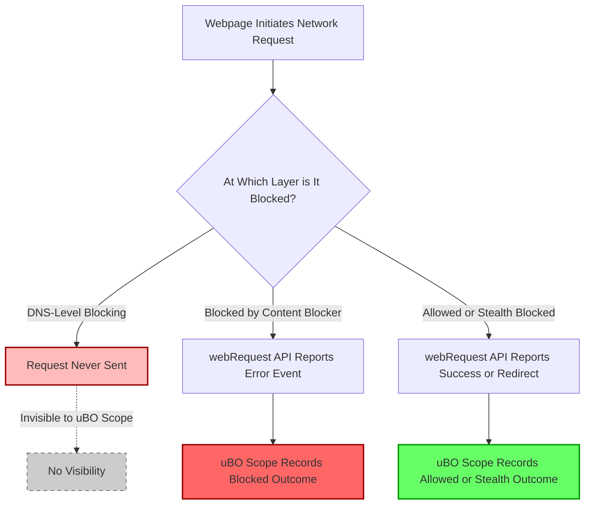

# Understanding Visibility Limits and Browser API Constraints

## Overview

This page explains the fundamental boundaries of uBO Scope's visibility into network requests based on browser API capabilities. It clarifies what kinds of requests uBO Scope can and cannot detect due to browser `webRequest` API constraints, DNS-level blocking behaviors, and privacy modes. Additionally, it provides practical tips for users to verify that the extension is operating correctly and how to interpret invisible or missing connection data.

---

## 1. What uBO Scope Can Detect

uBO Scope relies exclusively on the browser's `webRequest` API to observe and report network connections initiated by web pages. This means:

- **Visibility of HTTP(S) and WebSocket Requests:** uBO Scope monitors network requests made using standard protocols such as `http`, `https`, `ws`, and `wss`, including redirects, errors, and successful responses.
- **Third-Party Connection Tracking:** It records connections to third-party domains independent of the content blocking policies in effect.
- **Passive Monitoring:** The extension does not modify or block requests but passively observes the outcomes reported by the browser.

### How It Works in Practice

- For every active browser tab, uBO Scope aggregates the network request data using the `webRequest` API event listeners.
- Requests that the browser reports through this API appear in uBO Scope’s popup interface and contribute to the toolbar badge counts.

## 2. What uBO Scope Cannot Detect

Despite its comprehensive approach, uBO Scope’s visibility is fundamentally limited by what the browser’s `webRequest` API exposes. The following scenarios lead to invisible or unreported requests:

### 2.1 DNS-Level Blocking

- If a DNS server or system-wide firewall blocks a connection *before* the browser attempts to send a network request, the `webRequest` API does not receive any event.
- Consequently, those blocked requests do **not** appear in uBO Scope.

<Tip>
DNS-level or network-level blocking happens outside of the browser's control, so uBO Scope cannot see or report on these hidden blocks.
</Tip>

### 2.2 Browser Privacy Modes and API Restrictions

- Private or incognito browsing sessions may result in limited or altered `webRequest` API behavior.
- Certain browser privacy features or security policies can suppress/report fewer events or anonymize information, further reducing visibility.

<Tip>
When using private mode, some network requests may not be visible in uBO Scope. It is recommended to test in a normal browsing session to understand full behavior.
</Tip>

### 2.3 Network Requests Not Using `webRequest` API

- Requests made outside the `webRequest` API context — e.g., some speculative preloads or internal browser features — are not reported.
- Service worker fetches or other browser-initiated background requests may not be visible depending on platform or browser implementation.

### 2.4 Other API or Platform Limitations

- Some browsers or versions may limit the `webRequest` API capabilities (see [Prerequisites & System Requirements](/getting-started/installation-basics/prerequisites-system-requirements) for supported platforms).
- For example, older browser versions or certain platforms may not fully support all `webRequest` API events that uBO Scope relies upon.

## 3. Practical Tips for Verifying Extension Operation

To ensure uBO Scope is working correctly and to identify visibility gaps, follow these practical steps:

### Step 1: Confirm Installation and Activation

- Verify the extension is installed from an official source (see [Installing uBO Scope](/getting-started/installation-basics/installing-ubo-scope)).
- Confirm the toolbar badge is visible and the popup opens with data.

### Step 2: Visit a Known Network-Heavy Website

- Open a webpage known to load multiple third-party resources (e.g., news sites, social media).
- Check the extension badge count and popup panel to confirm domains are listed.

### Step 3: Test with DNS Blocking Enabled

- Enable a DNS-level blocker or system firewall that blocks some domains.
- Note that requests blocked here will not show in uBO Scope; the extension will not report those missing requests.

### Step 4: Use Developer Tools for Cross-Checking

- Open your browser’s Developer Tools > Network tab.
- Compare visible network requests with the domains listed in uBO Scope.
- If some requests appear in DevTools but not in uBO Scope, this may indicate API visibility limitations.

### Step 5: Try Private Browsing Mode

- Test switching to a private/incognito window.
- Observe if uBO Scope reflects fewer or no requests, indicating privacy mode API constraints.

## 4. Understanding Visibility Constraints

The following diagram summarizes typical request visibility and blind spots in uBO Scope:

## 5. Best Practices and Recommendations

- Understand that uBO Scope's reports correspond directly to what your browser informs it via the `webRequest` API.
- Use uBO Scope alongside other network inspection tools (like browser DevTools) for deeper validation.
- When evaluating content blockers or privacy settings, remember that some blocking happens invisibly outside of uBO Scope’s monitoring scope.
- Pay attention to changes in the badge count and popup domain lists to gain insight into privacy-affecting network activity within the API's reach.

## 6. Troubleshooting Common Visibility Issues

### Issue: Popup Shows "NO DATA" or Empty Sections

- Ensure the browser tab is active and loaded.
- Verify extension permissions and that the browser supports the required `webRequest` API events.
- Refresh the tab or restart the browser.

### Issue: Badge Count is Zero but You Expect Connections

- Confirm that DNS blocking or system firewall is not silently blocking requests.
- Check if browsing in a private/incognito window might limit visibility.

### Issue: Some Third-Party Requests Are Missing

- Remember requests that never leave the DNS resolver or are handled by browser internals might not be reported.

## 7. Next Steps and Related Documentation

- [Viewing & Interpreting Connection Data](/getting-started/first-steps-validation/viewing-and-interpreting-connection-data) to learn how to read uBO Scope’s popup panel.
- [Interpreting Blocked, Stealth, and Allowed Outcomes](/guides/core-workflows/interpreting-blocked-stealth-allowed) for understanding result categories.
- [Prerequisites & System Requirements](/getting-started/installation-basics/prerequisites-system-requirements) to ensure your platform supports all necessary APIs.
- [Quick Troubleshooting Scenarios](/getting-started/first-steps-validation/quick-troubleshooting) for resolving common startup issues.

---

## Summary

uBO Scope depends on the browser’s `webRequest` API to report network request outcomes and is constrained by the inherent visibility limits of this API. Network activity blocked before the browser network stack runs—such as DNS-level blocking—or limited by browser privacy features will not appear in uBO Scope’s reports. Users are encouraged to validate extension operation using network-heavy websites and browser tools, and to combine uBO Scope data with other methods for comprehensive privacy analysis.

---