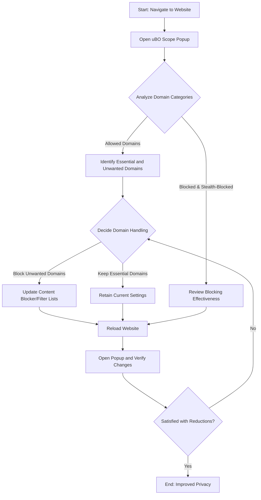

# Auditing and Reducing Third-Party Connections

## Overview
This guide empowers you to leverage uBO Scope's connection data to identify and minimize third-party remote servers contacted by the websites you visit. By understanding and acting on this information, you can tighten your privacy, optimize content blocker configurations, and make informed browsing choices.

## Prerequisites
- **uBO Scope Installed:** Ensure the extension is installed on your supported browser—Chrome (122+), Firefox (128+), or Safari (18.5+).
- **Basic Familiarity With uBO Scope UI:** You should know how to open the popup panel and interpret its domain connection categories.
- **Active Browsing Session:** Have one or more active tabs open with webpages loaded whose network requests you intend to analyze.

## Expected Outcome
After following this guide, you will be able to:
- Quickly audit third-party connections made by any loaded webpage.
- Categorize connections into allowed, blocked, and stealth-blocked.
- Use uBO Scope insights to reduce unnecessary third-party network exposure.
- Inform configuration adjustments to your content blocker or filter lists.

## Time Estimate
Approximately 10-15 minutes for initial auditing and applying basic adjustments.

---

## Step-by-Step Workflow

### 1. Open the uBO Scope Popup Panel
- Click the uBO Scope extension icon next to your browser's address bar.
- The popup panel will load with a summary of the current active tab's third-party network connection data.

### 2. Interpret Connection Categories

The popup panel divides domains into three outcome groups:
- **Not Blocked (Allowed):** Domains from which resources were successfully fetched. These connections represent active third-party servers involved in content delivery.
- **Stealth-Blocked:** Domains associated with redirect requests or connections that were stealthily blocked without explicit error messages. These often indicate subtle or indirect blocking effects.
- **Blocked:** Domains that failed to connect due to blocking events, reported as network errors.

Focus on the **Allowed** list to understand which third-party domains actively serve resources.

### 3. Analyze the Distinct Domain Count
- The badge on the uBO Scope icon shows the count of **distinct third-party domains** contacted.
- A **lower badge number** indicates fewer remote servers contacted, which typically implies better privacy protection.

### 4. Cross-Check Domains Against Expected Legitimacy
- Look for known legitimate third-party domains such as CDNs (e.g., `cdn.cloudflare.net`) or essential service providers.
- Identify unexpected or suspicious domains signaling potential overexposure.

### 5. Adjust Content Blocker or Filter Lists

Based on your findings:
- Add unwanted domains to your content blocker's custom filter lists.
- Consider enabling stricter filtering rules or adjusting existing lists to reduce connections.

### 6. Revisit the Webpage and Refresh uBO Scope Data
- Reload the webpage after changes to observe the impact.
- Open the popup again to confirm the reduction in third-party domains and updated badge count.

### 7. Repeat Iteratively for Different Sites
- Audit a variety of websites regularly to catch evolving third-party dependencies.
- Use uBO Scope data to refine blocker rules over time.

---

## Practical Tips

- **Start with High-Impact Domains:** Target domains with the highest resource count or those unfamiliar to you.
- **Beware of False Positives:** Some third-party services are essential for site functionality. Avoid blocking critical domains indiscriminately.
- **Use Stealth-Blocked Info for Deeper Insight:** Stealth blocks reveal subtle blocking behaviors which might escape standard UI attention.
- **Monitor Badge Count Trends:** Consistent decreases over time indicate successful third-party minimization.

---

## Example Scenario

Imagine visiting a news website and seeing the uBO Scope badge count show "8". Opening the popup lists domains like `examplecdn.com` and `trackingserver.net` under allowed. Recognizing `trackingserver.net` as unwanted:

1. You add a blocking rule for `trackingserver.net` in your content blocker.
2. Refresh the news page.
3. The badge count drops to "7".
4. The popup confirms `trackingserver.net` no longer appears.

This workflow enhances privacy by trimming unwanted external connections.

---

## Common Pitfalls and Troubleshooting

<AccordionGroup title="Common Issues and Solutions">
<Accordion title="Popup Shows No Data or 'NO DATA'">
- Ensure the tab is actively loaded with a webpage (not a blank or internal page).
- Confirm uBO Scope has the required webRequest permissions.
- Reload the page to trigger network request observation.
</Accordion>
<Accordion title="Badge Count Does Not Update">
- Badge updates when network requests complete or tab navigation occurs.
- Reload the tab or switch tabs to prompt a badge refresh.
- Verify your content blocker settings are not interfering with uBO Scope.
</Accordion>
<Accordion title="Unwanted Domains Persist After Blocking">
- Your content blocker might require specific rules or syntax to block the domain.
- Check for alternate subdomains or aliases.
- Clear browser and extension caches as needed.
</Accordion>
</AccordionGroup>

---

## Best Practices

- Regularly audit high-traffic sites you use daily for changes in third-party connections.
- Combine uBO Scope insights with your main content blocker to balance blocking effectiveness and site usability.
- Use domain counts as a privacy health metric rather than raw block counts.
- Document blocking rules that successfully reduce connections without breaking sites.

---

## Next Steps & Further Reading

- Explore the [Using the Popup Panel: Reading Connection Summaries](/guides/getting-started/understanding-the-popup-panel) guide to deepen your understanding of the UI.
- Learn how to interpret the toolbar badge with the [Understanding the Toolbar Badge & Count](/guides/getting-started/connection-badge-interpreting) guide.
- For privacy-centered practices, see [Debunking Misleading Ad Block Metrics and Tests](/guides/use-cases-and-patterns/debunking-common-ad-block-myths).
- Advance to [Advanced Insights for Filter List Maintainers](/guides/use-cases-and-patterns/filter-list-maintainer-tips) for strategic filtering techniques.

---

_For the latest updates and source code, visit the official [uBO Scope GitHub repository](https://github.com/gorhill/uBO-Scope)._

---

## Summary Diagram of User Workflow

This workflow guides you from inspection to action and verification, fostering continuous improvement in managing third-party connections.
