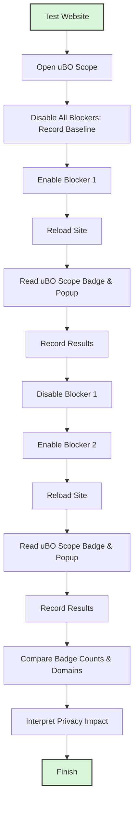

# Comparing Content Blockers With uBO Scope

## Overview
This guide shows you how to use uBO Scope as an impartial benchmark for evaluating the effectiveness of different content blockers in reducing third-party network connections. By testing a website with various blockers enabled and comparing the badge counts and popup results, you will learn how to interpret what a lower number means for your privacy and why this metric matters more than block counts alone.

---

## Prerequisites
- uBO Scope is installed and activated in your browser. If not, refer to [Installing and Activating uBO Scope](../getting-started-usage/installing-activating-extension).
- At least one content blocker extension installed and enabled (e.g., uBlock Origin, AdGuard, Privacy Badger).
- Basic familiarity with the uBO Scope toolbar badge and popup panel. See [Interpreting the Badge and Popup Panel](../getting-started-usage/interpreting-badge-popup) for details.

---

## Expected Outcomes
- You will be able to systematically test and compare the third-party network connections with different content blockers.
- Understand how to read uBO Scope’s badge counts and domain listings to assess privacy impacts realistically.
- Gain practical knowledge on what a lower badge count signifies and how to avoid common misconceptions regarding block counts.

---

## Time Estimate
Approximately 15-30 minutes, depending on the number of content blockers tested and the complexity of the websites.

---

## Difficulty Level
Intermediate — requires installation of multiple blockers and some hands-on testing.

---

## Step-by-Step Instructions

<Steps>
<Step title="Open uBO Scope and Your Test Website">
1. Ensure uBO Scope is running in your browser.
2. Open a new browser tab and navigate to the website you want to test.
3. Observe the uBO Scope toolbar icon badge displaying the number of distinct third-party connections allowed.

*Expected result:* Badge shows a number representing third-party domains contacted.
</Step>

<Step title="Record Baseline Without Any Content Blocker Enabled">
1. Disable all content blockers (except uBO Scope, which only monitors).
2. Reload the test website.
3. Open the uBO Scope popup panel by clicking its toolbar icon.
4. Review the total 'domains connected' count and the lists of domains segmented into 'allowed', 'stealth-blocked', and 'blocked'.

*Expected result:* Highest number of third-party domains displayed, representing unfiltered connections.
</Step>

<Step title="Enable a Content Blocker and Retest">
1. Enable one content blocker extension.
2. Reload the same test website in the tab.
3. Observe the new badge count from uBO Scope.
4. Click the uBO Scope icon to view the updated popup domain lists.

*Decision point:*
- If the badge count decreases, the blocker successfully reduced third-party connections.
- If the badge count stays the same or increases, the blocker may be less effective or configured differently.

*Expected result:* Lower or different badge count reflecting the blocker's impact.
</Step>

<Step title="Repeat Tests With Other Blockers or Configurations">
1. Disable the previous blocker.
2. Enable a different content blocker or adjust settings.
3. Reload the website and observe badge and popup changes.
4. Compare badge counts and domain lists across blockers.

*Expected result:* Each blocker shows distinct third-party connections with variations in counts.
</Step>

<Step title="Interpret Results Meaningfully">
1. Remember: a lower badge count indicates fewer distinct third-party remote servers connected, enhancing privacy.
2. Look beyond block counts shown by blockers themselves — uBO Scope reports actual third-party domains contacted.
3. Use the domain breakdown in the popup to identify which third parties are allowed, stealth-blocked, or blocked.

*Best practice:* Focus on distinct domains rather than raw block counts for a realistic privacy assessment.
</Step>
</Steps>

---

## Real-World Example
Suppose you want to compare uBlock Origin and AdGuard:

1. Disable all blockers and visit example.com; uBO Scope badge shows 15 third-party domains.
2. Enable uBlock Origin and reload example.com; badge drops to 8.
3. Enable AdGuard instead and reload; badge drops to 10.

Interpretation: uBlock Origin reduces distinct third-party connections more on this site than AdGuard, indicating potentially better privacy protection in this scenario.

Check the popup panel for the domain breakdown.

---

## Practical Tips & Best Practices
- Always test on real-world websites rather than artificial 'ad blocker test' pages, which may give misleading results.
- Use the uBO Scope popup's lists to spot any unexpected third-party domains allowed.
- Consider varying site states (e.g., logged-in vs logged-out) to see how third-party connections vary.
- When testing, allow time for all network requests to be captured before reading the badge and popup.

---

## Common Pitfalls to Avoid
- Confusing a higher block count (reported by blockers) with better blocking. The key metric is how many distinct third-party domains are actually contacted.
- Relying on 'ad blocker test' websites for benchmarking content blockers; these do not accurately simulate typical browsing.
- Ignoring stealth blocking, which may hide some connections from sites but still count as third-party connections.

---

## Troubleshooting

<AccordionGroup title="Troubleshooting uBO Scope in Content Blocker Comparison">
<Accordion title="Badge Count Not Updating When Disabling/Enabling Blockers">
- Ensure you reload the test website tab after toggling blockers.
- Confirm that uBO Scope has the required permissions (webRequest, activeTab, storage).
- Try closing and reopening the popup panel to refresh data.
</Accordion>

<Accordion title="Popup Shows 'NO DATA' or Empty Lists">
- Make sure you select the correct active tab in the popup.
- Verify that uBO Scope is correctly installed and running.
- Check browser console for errors by right-clicking the popup and selecting 'Inspect'.
</Accordion>

<Accordion title="Unexpectedly High Third-Party Counts">
- Some legitimate CDNs or services are third parties and will increase counts.
- Consider the context of the tested website to decide if the number is reasonable.
- Review the allowed domains list in the popup to identify surprises.
</Accordion>
</AccordionGroup>

---

## Understanding What a Lower Badge Count Means for Privacy
The badge count reports how many unique third-party domains were connected to during page load and browsing in a tab. Lower counts mean fewer third-party domains accessed, reducing your exposure to trackers, advertisers, and data collectors.

Unlike some blockers that might report higher block counts but still allow many allowed connections, uBO Scope provides a reliable and independent view of the real privacy impact by counting distinct connected domains.

<u>Remember:</u> Not all third-party connections are harmful; legitimate services such as CDN providers often appear as third parties. However, a content blocker that effectively limits unnecessary third-party connections will usually help improve your privacy overall.

---

## Next Steps & Related Guides
- After completing these comparisons, learn more about interpreting detailed results in [Interpreting the Badge and Popup Panel](../getting-started-usage/interpreting-badge-popup).
- For deeper understanding of why uBO Scope’s metrics matter, see [Why Visibility Into Connections Matters](../../overview/intro-value-prop/why-it-matters).
- To validate filter list changes or diagnose blocker issues, explore [Validating Filter List Changes and Diagnosing Issues](../use-cases-best-practices/validating-list-changes).
- Review [Debunking Block Count Myths](../use-cases-best-practices/debunking-block-count-myths) for common misconceptions about blocker statistics.

---

## Additional Resources
- uBO Scope GitHub Repository: [https://github.com/gorhill/uBO-Scope](https://github.com/gorhill/uBO-Scope)
- Installation and Setup Instructions: [Installation on Supported Browsers](../../getting-started/installation-and-setup/installation-on-supported-browsers)
- Making Your First Run: [Making Your First Run](../../getting-started/first-steps-and-validation/making-your-first-run)

---

## Summary Diagram: Content Blocker Comparison Workflow

