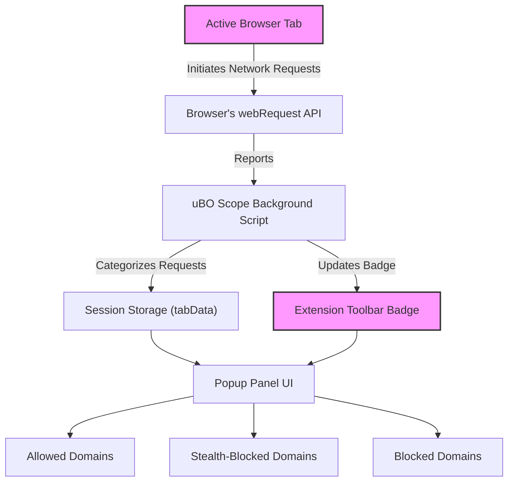

# Analyzing Network Connections with uBO Scope

Discover how to leverage uBO Scope's powerful insights to understand exactly which third-party servers a webpage tries to connect to, distinguish whether those requests succeed or are blocked, and identify stealth blocking techniques. This guide walks you through practical real-world scenarios using the extension's popup panel and badge, enabling you to evaluate network privacy at a granular level.

---

## 1. Understanding the Purpose of This Guide

uBO Scope's core value lies in revealing all network connections initiated by the browser per tab, regardless of any content blocker used. This page helps you:

- Identify and list third-party domains contacted by the active webpage.
- Differentiate between connections that were allowed, stealth-blocked, or outright blocked.
- Spot stealth blocking techniques where resources appear loaded but are actually redirected or suppressed invisibly.

By the end, you will confidently analyze network activities to assess privacy exposure and the effectiveness of blocking.

---

## 2. Prerequisites

Before you begin, ensure the following are in place:

- uBO Scope installed and active on a supported browser (Chrome 122+, Firefox 128+, Safari 18.5+).
- Basic familiarity with uBO Scope’s interface, notably the popup panel and the toolbar badge.
- A live webpage open in your browser tab to analyze.

If you haven’t installed or set up the extension yet, please refer to the [Installing uBO Scope guide](https://github.com/gorhill/uBO-Scope/blob/main/guides/getting-started/install-extension.mdx).

---

## 3. Outcome You Will Achieve

After completing the steps below, you will be able to:

- Open and read the uBO Scope popup panel for any tab.
- Interpret the domain connection categories shown: allowed, stealth-blocked, and blocked.
- Use the badge count as a quick metric of third-party connections.
- Recognize stealth blocking behavior in network requests.

---

## 4. Time Required

This guide typically takes about 5-10 minutes to follow, depending on your familiarity with the extension.

---

## 5. Step-by-Step Instructions

### Step 1: Open the uBO Scope Popup Panel

- Click the uBO Scope toolbar icon for the active browser tab.
- The popup panel will open displaying the hostname, summary, and three distinct sections: **not blocked**, **stealth-blocked**, and **blocked** domains.

**What you should see:**
- The page’s domain at the top.
- The number of distinct third-party domains connected, shown in the summary.
- Lists of domains grouped by their request outcomes.

### Step 2: Interpret Domain Connection Categories

- **Not blocked:** These are third-party domains from which your browser successfully fetched resources.
- **Stealth-blocked:** These domains indicate requests that were redirected or altered to hide blocking. They appear connected but are actually suppressed.
- **Blocked:** Domains where connection attempts were explicitly blocked by content blockers or network errors.

### Step 3: Analyze Real-World Scenarios

- Visit a popular website with known third-party scripts (e.g., news site, social media).
- Open the popup panel and observe which domains appear under each category.
- For example, legitimate Content Delivery Networks (CDNs) or analytics providers typically appear in the **not blocked** list.
- Ad/tracking servers may appear on **blocked** or **stealth-blocked** depending on your browser’s content blockers.

### Step 4: Use the Toolbar Badge as a Quick Indicator

- The badge number reflects the count of unique third-party domains from which connections were **allowed**.
- A lower badge count typically means fewer third-party connections and better privacy.
- Click the icon anytime to cross-check the badge with the popup details.

**Note:** A high block count doesn’t necessarily equate to better privacy—what matters is the number of allowed third-party servers.

### Step 5: Spotting Stealth Blocking

- If domains appear in the **stealth-blocked** section, this suggests blocking done via redirects or disguised methods.
- Such requests can evade normal detection on test sites or standard blocker UIs.
- Use uBO Scope to reveal these stealth behaviors that might otherwise be hidden.

### Step 6: Confirm and Refresh as Needed

- Reload the webpage to see updated connections.
- Verify the popup updates correspondingly.
- Switch to other tabs and repeat the analysis.

---

## 6. Practical Tips & Best Practices

- Always check both badge count and popup panel for a complete picture.
- Use real, active websites to analyze actual network behaviors—not synthetic test pages.
- Keep your content blockers enabled to see how uBO Scope reports their effects.
- Regularly consult the **stealth-blocked** section; stealth blocking is common but less visible.
- Familiarize yourself with common third-party domains such as major CDN providers to differentiate them from trackers.

---

## 7. Common Pitfalls

- **No data shown:** This usually means uBO Scope wasn’t able to capture network requests, possibly due to installation issues or browser compatibility. Refer to [Troubleshooting Setup Issues](https://github.com/gorhill/uBO-Scope/blob/main/getting-started/first-steps-usage/troubleshooting-setup.mdx).
- **Misinterpreting Badge Number:** Avoid equating a high block count with better blocking. Focus on allowed third-party count.
- **Assuming All Third Parties Are Bad:** Some third-party servers are essential or malware-free. Use contextual knowledge.

---

## 8. Verification

- Upon completion, if the badge shows a positive number, the popup panel should list third-party domains under **not blocked**.
- Confirm blocked domains appear under the **blocked** section.
- If stealth blocking is active, appropriate domains show in the **stealth-blocked** section.

---

## 9. Examples

Suppose you visit "example.com" and open uBO Scope:

- *Allowed:* `cdn.examplecdn.com` (CDN), `fonts.examplefont.com` (font provider).
- *Stealth-blocked:* `trackers.adcompany.com` (redirected requests).
- *Blocked:* `ads.badtracker.com` (explicitly blocked).

You see the badge count: 2 (indicating two allowed third-party domains).

This tells you that although some trackers were blocked, a few third-party services were successfully connected.

---

## 10. Troubleshooting & Tips

<AccordionGroup title="Troubleshooting and Tips">
<Accordion title="No connections appear in popup or badge is missing">
- Confirm uBO Scope is installed and enabled.
- Check browser version compatibility.
- Ensure you have granted necessary permissions.
- Reload the browser tab after installation.
- Visit a website with third-party content to capture connections.
</Accordion>

<Accordion title="Stealth-blocked domains show unexpectedly">
- This indicates advanced blocking techniques.
- Stealth blocking is not evident without uBO Scope.
- Check your content blockers’ settings to understand stealth modes.
- You can verify by disabling blockers temporarily and observing changes.
</Accordion>

<Accordion title="Badge count inconsistent with expected privacy">
- Remember badge shows the number of allowed third-party domains only.
- The block count is not shown on the badge.
- A lower badge count usually means fewer third-party connections.
- Revisit content blocker configuration if unexpected results appear.
</Accordion>

<Accordion title="Reloading doesn't update popup data">
- Wait a few seconds after reload; uBO Scope collects data asynchronously.
- Close and reopen the popup panel.
- If persistent, restart the browser.
- Report issues with reproduction steps if problem recurs.
</Accordion>
</AccordionGroup>

---

## 11. Next Steps

- Explore [Understanding the Popup & Badge](https://github.com/gorhill/uBO-Scope/blob/main/getting-started/first-steps-usage/interpreting-the-popup.mdx) to deepen your knowledge of UI elements.
- Learn about [Evaluating Content Blockers with uBO Scope](https://github.com/gorhill/uBO-Scope/blob/main/guides/using-insights/evaluating-blockers.mdx) to compare blocker effectiveness.
- If you encounter unusual results, see [Troubleshooting and Interpreting Unusual Results](https://github.com/gorhill/uBO-Scope/blob/main/guides/using-insights/troubleshooting-results.mdx).

---

## Acknowledgments

This guide is based on the core functionality of uBO Scope's popup panel which categorizes domains by request outcomes and the toolbar badge which reports allowed third-party connections, as detailed in the extension's manifest and background scripts.

---

## References

- uBO Scope GitHub Repository: [https://github.com/gorhill/uBO-Scope](https://github.com/gorhill/uBO-Scope)
- Installation Guide: [Installing uBO Scope](https://github.com/gorhill/uBO-Scope/blob/main/guides/getting-started/install-extension.mdx)
- Understanding Badge and Popup: [Interpreting the Popup & Badge](https://github.com/gorhill/uBO-Scope/blob/main/getting-started/first-steps-usage/interpreting-the-popup.mdx)
- Troubleshooting Setup: [Troubleshooting Setup Issues](https://github.com/gorhill/uBO-Scope/blob/main/getting-started/first-steps-usage/troubleshooting-setup.mdx)

---

# Diagram: Network Connection Flow in uBO Scope Popup

The diagram illustrates how background processing collects network request data per tab, categorizes outcomes, updates session data and badge, and presents detailed domain lists in the popup panel.
