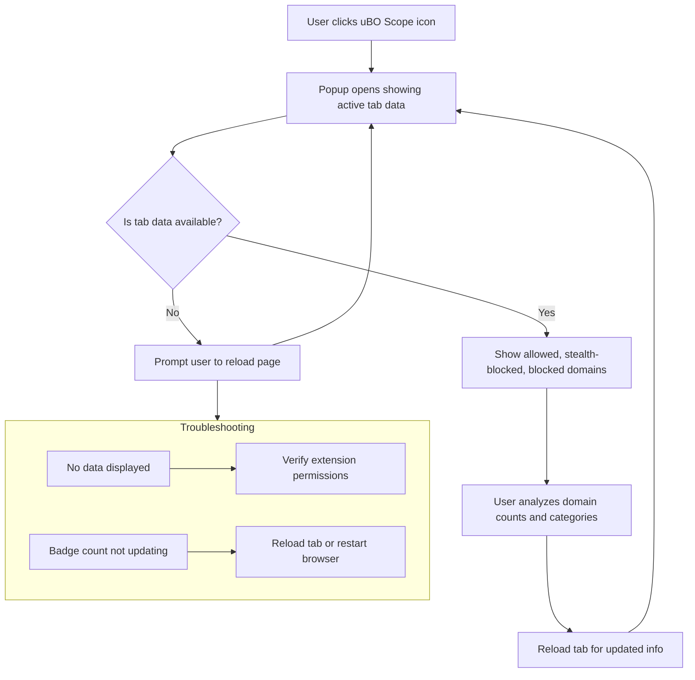

# Analyzing Remote Connections on Active Tabs

## Overview
This guide provides clear, actionable steps to use uBO Scope to monitor and analyze the network connections initiated by active browser tabs. You will learn how to identify third-party domains involved in webpage loading, understand the categories of connections shown in the popup interface, and gain practical tips to interpret why certain domains appear as allowed, stealth-blocked, or blocked.

**Prerequisites:**
- uBO Scope installed and configured according to the [Installation & Setup](https://github.com/gorhill/uBO-Scope/blob/main/getting-started/installation-setup/installing-ubo-scope.mdx) documentation.
- Basic familiarity with browsing tabs and opening browser extension popups.

**Expected Outcome:**
- You will be able to open uBO Scope's popup for any active tab.
- Interpret the domain connection data with confidence.
- Leverage the insights to assess your browsing network activity and troubleshoot privacy concerns.

**Time Estimate:** Approximately 5-10 minutes for first use and analysis.

**Difficulty Level:** Beginner to Intermediate

---

## Step-by-Step Instructions

### 1. Open uBO Scope Popup for the Active Tab

- Click the uBO Scope icon in your browser toolbar. The popup window appears, displaying network connection data for the currently active tab.

- If the popup shows 'NO DATA', reload the webpage or ensure uBO Scope has the necessary permissions to monitor network requests.

### 2. Understand the Summary Section

- At the top, the popup shows the hostname and domain of the active tab.
- The **domains connected** count represents the number of unique third-party domains with network connections.

### 3. Review Domain Lists by Outcome Categories

The popup categorizes domains into three distinct lists:

- **Not blocked (allowed):** Domains from which network requests succeeded and were not blocked.
- **Stealth-blocked:** Domains to which redirections occurred or stealth-blocking mechanisms were applied (requests redirected silently).
- **Blocked:** Domains for which network requests failed or were explicitly blocked.

Each domain entry is accompanied by a count indicating the number of connections observed to that domain.

### 4. Interpreting Domain Names and Counts

- Domains are shown in their Unicode form for clarity (e.g., internationalized domains).
- The counts help identify heavy third-party network usage, such as frequent CDN calls or ad-related connections.

### 5. Identify Third-Party Domains Quickly

- Domains that do not share the same base domain as the active tab are third-party.
- High counts on third-party domains could indicate trackers, analytics, or content delivery providers.

### 6. Use Practical Tips to Analyze Network Activity

- Compare the allowed vs. blocked domains to understand what your content blocker permits.
- Use the stealth-blocked list to notice domains that are redirected or partially blocked invisibly.
- Investigate unfamiliar domains by searching online to determine their reputation or role.

### 7. Reload Webpage to Refresh Data

- To get updated connection information, reload the webpage.
- The badge count on the toolbar icon will update to reflect the number of unique allowed third-party domains.

### 8. Troubleshooting Common Issues

- **Popup shows no data:** Verify uBO Scope permissions, especially "activeTab" and "webRequest".
- **Badge count doesn't update:** Reload the tab or restart the browser.
- **Count seems unexpectedly high:** Some content delivery or advertising domains naturally have multiple subdomains; focus on domain-level counts.

---

## Examples

### Real-World Scenario: Monitoring a News Website

You open a news website and click the uBO Scope icon:

- The popup shows the tab domain as `example-news.com`.
- **Allowed domains:** `cdn.example-news.com` (20 connections), `analytics.example.com` (5 connections), `ads.trackercdn.com` (3 connections).
- **Stealth-blocked:** `redir.adserver.com` (2 connections), indicating redirection.
- **Blocked:** `tracker.badadnetwork.com` (4 connections), showing successful blocking.

This reveals the site's use of multiple third-party services and your content blocker's effectiveness.

---

## Troubleshooting & Tips

- **Tip:** Regularly check the popup after clearing browser cache for fresh insight.
- **Tip:** Use the popup in tandem with the badge count for quick heuristic analysis.
- **Tip:** A lower badge count generally means fewer distinct third-party servers were contacted.

<Warning>
Remember that some legitimate third-party domains such as CDN providers or analytics are usually low in number but essential for website functionality.
</Warning>

<Note>
Stealth-blocked domains indicate requests that were redirected or modified invisibly and might affect tracking or content loading subtly.
</Note>

---

## Next Steps & Related Documentation

- Learn to interpret the toolbar [badge count](https://github.com/gorhill/uBO-Scope/blob/main/guides/using-ubo-scope/interpreting-badge.mdx).
- Explore advanced [network request details](https://github.com/gorhill/uBO-Scope/blob/main/guides/advanced-guides/accessing-request-details.mdx).
- Troubleshoot with [common issues guide](https://github.com/gorhill/uBO-Scope/blob/main/guides/advanced-guides/troubleshooting-common-issues.mdx).
- For first-time users, follow the [getting started guide](https://github.com/gorhill/uBO-Scope/blob/main/getting-started/first-run-experience/your-first-observation.mdx).

---

## Summary Diagram

---

## Additional Resources

- Public Suffix List used for domain parsing maintained at [publicsuffix.org](https://publicsuffix.org/list/).
- Source repository and license: [uBO-Scope GitHub](https://github.com/gorhill/uBO-Scope)

---

This guide empowers you to effectively monitor and understand the network activity of your browser tabs using uBO Scope, turning raw data into meaningful insight about third-party connections and privacy exposure.