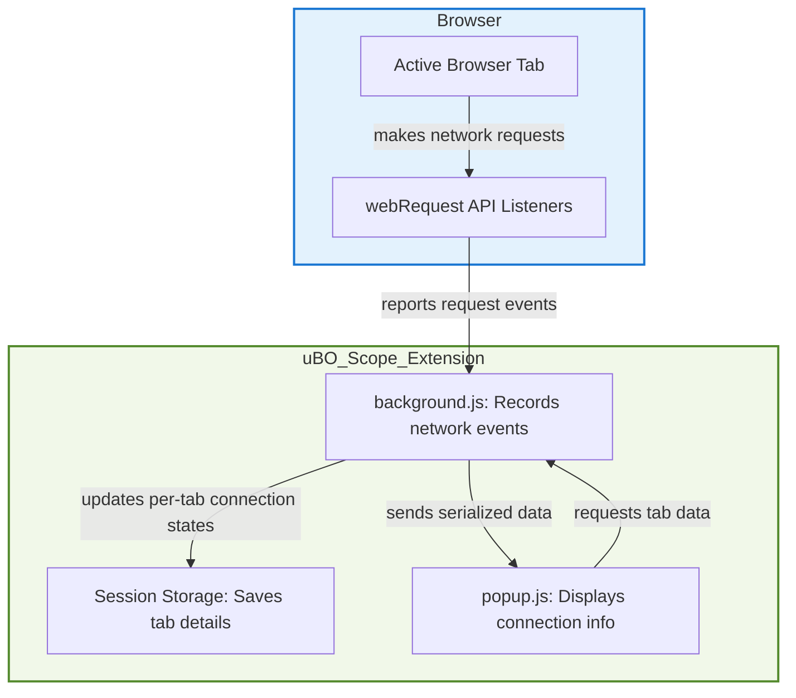

# Debunking Content Blocker Myths

Use **uBO Scope** to critically assess claims from ad blocker tests and online comparisons. This guide helps you understand why block counts alone are misleading and how to use real network connection data to reveal the true effectiveness of your content blocker.

---

## Why Block Counts Can Be Misleading

Many online comparisons rely on the block count shown by content blockers as the sole measure of effectiveness. This is a dangerous oversimplification.

- A **higher block count** does not necessarily mean better blocking. In fact, it may indicate that your browser is fetching resources from **more distinct third-party servers**, meaning the content blocker allows more connections overall.
- Conversely, a **lower block count** often corresponds to **fewer active third-party connections**, which is usually more desirable for privacy and performance.

<u>**What matters is the number of distinct third-party remote servers your browser actually connects to, not the raw count of blocked requests.**</u>

<u>uBO Scope directly measures these connection attempts, giving you clarity beyond superficial block statistics.</u>

## Why Use uBO Scope Over Ad Blocker Test Webpages

Many "ad blocker test" webpages simulate artificial network conditions to try to detect ad blockers or measure their blocking reliability. However, these tests are flawed and should be approached with skepticism:

- They often use **unrealistic network request patterns** that do not reflect behavior on real-world websites.
- Content blockers may use stealth techniques to avoid breaking webpages or detection, which these tests do not accommodate.
- Such webpages cannot fully view or report on network activity filtered by browser APIs or other blocking mechanisms learned by extensions.

<u>uBO Scope works by leveraging the browser’s native `webRequest` API to report genuine network connection attempts, capturing all activity visible to the browser.</u>

## How to Use uBO Scope to Assess Content Blockers

Follow this step-by-step approach to uncover the true activity behind content blocking claims.

<Steps>
<Step title="Install uBO Scope">
1. Install the uBO Scope extension from your browser’s official store for Chromium, Firefox, or Safari.
2. Confirm it has proper permissions: activeTab, webRequest, and storage.
</Step>
<Step title="Browse a Real Website">
1. Open a typical website that you trust and believe is affected by content blockers.
2. Wait for the page to fully load so all network requests are captured.
</Step>
<Step title="Open uBO Scope Popup">
1. Click the uBO Scope icon next to your browser's address bar.
2. The popup displays categorized domains under “not blocked”, “stealth-blocked”, and “blocked”.
</Step>
<Step title="Interpret the Badge and Popup Data">
1. The toolbar badge shows the number of distinct allowed third-party domains currently connected.
2. Review domains under each category in the popup.
3. Identify legitimate third-party services like Content Delivery Networks (CDNs) vs. unexpected or suspicious servers.
</Step>
<Step title="Compare with Content Blocker Reports">
1. Cross-reference the block counts shown by your content blocker with the distinct allowed domains shown by uBO Scope.
2. Notice if higher block counts coincide with **more unique allowed domains**, which may indicate less effective blocking despite the block count.
</Step>
</Steps>

## Practical Examples

| Scenario | Description | What uBO Scope Reveals |
| --- | --- | --- |
| A Blocker with High Block Count | Claims to block thousands of requests | uBO Scope shows many allowed third-party domains indicating many connections still occur |
| A Blocker with Low Block Count | Blocks fewer requests | uBO Scope shows fewer allowed third-party domains, signalling stronger blocking |
| "Stealth Blocking" | Blocker redirects or cancels requests silently | uBO Scope categorizes these under stealth-blocked domains |

## Best Practices When Using uBO Scope

- Focus on the **number of distinct third-party domains connected** rather than request counts.
- Recognize that some third parties, like major CDNs, are necessary and usually legitimate.
- Use uBO Scope alongside other privacy and security tools to get a comprehensive view.
- Understand the categories shown:
  - **Not Blocked:** Connections allowed to proceed.
  - **Stealth-Blocked:** Connections redirected or silently canceled.
  - **Blocked:** Connections explicitly blocked and failed.

## Common Pitfalls to Avoid

- Do not trust block counts alone to judge content blocker performance.
- Avoid relying on ad blocker test webpages as they do not represent real-world browsing.
- Don’t overlook the significance of stealth-blocked connections as they represent hidden filtering activity.
- Remember uBO Scope can only report network requests visible through the browser's `webRequest` API; some network activities outside this scope may not be shown.

## Troubleshooting

- **No data in popup:** Confirm permissions are granted and uBO Scope is active on the tab.
- **Unexpectedly high badge counts:** Check for websites with many third-party services; compare with known CDN domains.
- **Inconsistent data:** Disable other conflicting extensions temporarily to validate results.

## Visual Data Flow of How uBO Scope Reveals Connection Data

## Next Steps

Once you understand these myths and how to critically evaluate content blockers with uBO Scope:

- Explore [Interpreting Network Activity and the Badge Counter](../using-ubo-scope/interpreting-network-activity) to deepen your understanding of network outcomes.
- Visit [Exploring the Popup Interface](../using-validating/exploring-popup) to get hands-on with the extension UI.
- Check [Troubleshooting and Understanding Limitations](../using-ubo-scope/troubleshooting-and-limitations) if you encounter any issues.

---

For the source code and latest updates, visit the official GitHub repository: [uBO Scope on GitHub](https://github.com/gorhill/uBO-Scope)

---

<Tip>
Remember, the goal is to see beyond superficial numbers and use uBO Scope to reveal the real network connections your browser is making. Use this insight to choose and configure your content blocker wisely.
</Tip>