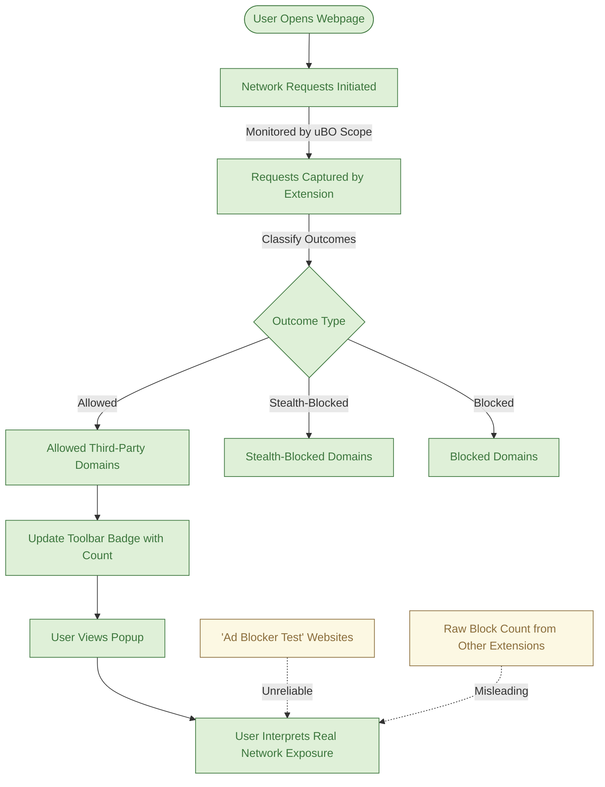

# Using uBO Scope to Debunk Content Blocker Myths

## Overview
This guide empowers you to use uBO Scope to differentiate genuine network blocking efficiency from misleading metrics commonly associated with content blockers. By walking through practical steps, you will learn why toolbar badge block counts and popular 'ad blocker test' webpages often present unreliable or confusing results.

Understanding these pitfalls will help you make informed decisions about your content blocker’s true impact on your web traffic and privacy.

---

## What This Guide Will Help You Accomplish
- Confirm real block effectiveness beyond just raw block counters
- Identify unreliable data sources such as advertising test websites
- Interpret uBO Scope’s toolbar badge and popup data to assess actual network exposure

---

## Prerequisites
- uBO Scope installed in your browser (Chrome 122+, Firefox 128+, Safari 18.5+)
- A basic familiarity with browsing to websites and observing the extension’s toolbar badge
- Access to the uBO Scope popup interface (click the toolbar icon)

> For installation instructions, see [Installing uBO Scope](https://github.com/gorhill/uBO-Scope/blob/main/guides/getting-started/installing-extension.mdx).

---

## Expected Outcome
By completing this workflow, you will:
- Understand how the badge number relates to distinct third-party connections allowed
- Gain confidence in interpreting real network activity instead of proxy metrics
- Be able to dismiss flawed claims based solely on block counts or test website results

---

## Step-by-Step Instructions

### 1. Observe the Toolbar Badge on Various Websites
- Browse to a popular website (e.g., news site or e-commerce).
- Look at the uBO Scope toolbar badge; note the number displayed.
- Remember: This count represents the number of distinct third-party remote servers for which a connection was made (i.e., "allowed").

<Check>
An increasing badge count indicates more third-party domains were contacted by the page.
</Check>

### 2. Open uBO Scope’s Popup Interface
- Click the uBO Scope toolbar icon.
- The popup displays three categorized lists:
  - **Not blocked**: third-party domains successfully connected
  - **Stealth-blocked**: domains whose connections were invisibly blocked or redirected
  - **Blocked**: domains explicitly blocked
- Note the domains listed under each category and their connection counts.

### 3. Compare Block Counts versus Real Exposure
- Realize that a high block count badge on other blockers does *not* mean fewer connections.
- Use uBO Scope to see how many unique third-party domains actually connected (the badge count).
- Recognize scenarios where a blocker with many blocked requests might still allow connections to a higher number of domains.

### 4. Avoid Relying on 'Ad Blocker Test' Websites
- Visit typical 'ad blocker test' sites if you want, but use uBO Scope to verify connections.
- See that such sites produce artificial resources and unreliable measurements.
- Understand these websites do not reflect real-world browsing and often fail to detect stealth blocking measures.

<Warning>
Don’t trust "ad blocker test" webpages as reliable indicators of blocking performance.
They often produce unrealistic traffic patterns and cannot observe stealthy behaviors.
</Warning>

### 5. Use uBO Scope for Honest, Transparent Metrics
- Trust the popup interface domain lists and toolbar badge as your real indicators of network exposure.
- Use this information to evaluate the effectiveness of your content blocker against actual network connections rather than superficial counts.

---

## Practical Example: Debunking a High Block Count Myth
1. Enable two different blockers (or use different settings) for the same website.
2. Observe the block counts reported by each blocker’s badge.
3. Open uBO Scope during each blocking scenario.
4. Note the number of distinct third-party domains connected (not blocked).
5. You may find a blocker showing higher block count allows connections to more domains, thus exposing more third-party traffic.

This concrete data clarifies why block counts alone are a misleading performance metric.

---

## Troubleshooting & Tips

### Common Issues
- **Badge doesn’t update or shows no data:**
  - Ensure uBO Scope is correctly installed and has permissions for webRequest.
  - Verify you are on an active tab with network requests.
  - See [Quick Validation & Troubleshooting](https://github.com/gorhill/uBO-Scope/blob/main/getting-started/first-run-experience/quick-validation-and-troubleshooting.mdx).

- **Popup shows empty domain lists:**
  - Reload the page or switch tabs to trigger fresh data collection.
  - Confirm content blockers aren’t interfering with uBO Scope functionality.

### Best Practices
- Always review the **allowed** domains to measure what is actually connecting, not just what is blocked.
- Look at stealth-blocked domains for requests filtered without visual indication.
- Use uBO Scope alongside your usual content blocker; it complements rather than replaces it.

### Performance Considerations
- uBO Scope processes network requests asynchronously with minimal delay.
- Frequent navigation or multiple tabs may cause badge updates to momentarily lag.

### Alternative Approaches
- Use uBO Scope’s detailed domain lists for filter list maintenance.
- Combine with advanced guides on [Accessing Request Details](https://github.com/gorhill/uBO-Scope/blob/main/guides/advanced-guides/accessing-request-details.mdx) for deeper analysis.

---

## Next Steps & Related Content
- Explore [Understanding and Interpreting the Badge Count](https://github.com/gorhill/uBO-Scope/blob/main/guides/using-ubo-scope/interpreting-badge.mdx) to deepen your knowledge of the badge’s meaning.
- Visit [Analyzing Remote Connections on Active Tabs](https://github.com/gorhill/uBO-Scope/blob/main/guides/using-ubo-scope/analyzing-tab-activity.mdx) for a hands-on approach to per-tab network activity.
- Consult [Product Positioning & Mythbusting](https://github.com/gorhill/uBO-Scope/blob/main/overview/product-intro-value/product-positioning-mythbusting.mdx) for conceptual background on common misconceptions.
- For installation and setup, see [Installing uBO Scope](https://github.com/gorhill/uBO-Scope/blob/main/guides/getting-started/installing-extension.mdx).

---

## Summary Diagram: How uBO Scope Reveals Real Blocking Efficiency

---