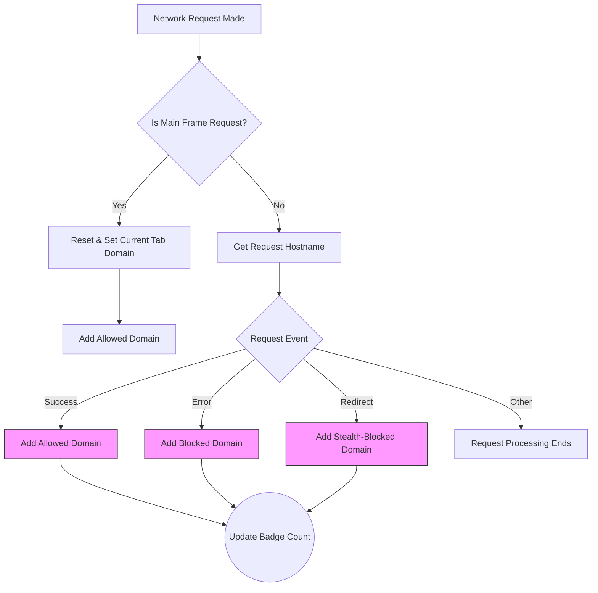

# Interpreting Network Activity and the Badge Counter

## Overview

This guide helps you master the interpretation of network activities reported by uBO Scope, focusing specifically on the distinctions between **allowed**, **blocked**, and **stealth connections**. You'll learn how uBO Scope calculates the toolbar badge number, what is meant by **distinct third-party remote servers**, and practical tips for identifying common legitimate third-party domains such as CDNs.

Understanding these concepts is essential to making informed judgments about your privacy and content blocker effectiveness while browsing.

---

## Prerequisites

- You must have uBO Scope installed and running in your Chromium, Firefox, or Safari browser.
- Familiarity with basic web browsing and domains.
- It helps to have your typical browsing session to observe real network activities.

---

## What You Will Learn

- The meaning of the **allowed**, **blocked**, and **stealth-blocked** categories
- How uBO Scope counts **distinct third-party remote servers** and why it matters
- How the badge counter reflects your privacy exposure
- Tips to recognize legitimate services like CDNs and common third parties
- How to avoid common misinterpretations of block counts

---

## Interpreting Network Outcomes

### Domain Connection Categories

uBO Scope classifies domain connections for each active browser tab into three distinct categories:

| Category          | What It Means                                             | User Impact                                   |
|-------------------|-----------------------------------------------------------|----------------------------------------------|
| **Allowed**       | Remote domains your browser connected to successfully.     | These connections were not blocked and data was fetched successfully.
| **Blocked**       | Domains where connection attempts failed or were rejected. | These connections were blocked or failed due to content blockers or network issues.
| **Stealth-Blocked** | Redirected requests that were silently blocked or obscured. | This shows connections that were redirected or interfered with stealthily.

The popup interface sections "not blocked", "blocked", and "stealth-blocked" directly correspond to these categories.

### What Counts as a Domain?

- uBO Scope considers distinct domains based on the *registered domain* leveraging the Public Suffix List.
- Subdomains under the same registered domain count as part of the single registered domain.
- This approach aggregates all connections to subdomains (e.g., `cdn.example.com` and `static.example.com`) into `example.com`.

### Distinguishing First-Party vs Third-Party

- The extension focuses prominently on **third-party** remote servers — domains different from the active page's domain.
- Connections to the active page’s own domain are considered first-party and are generally not the primary focus for privacy impact.

---

## Understanding the Badge Counter

### What Does the Badge Number Represent?

- The badge count on the toolbar icon shows the **number of distinct third-party domains with successful (allowed) connections**.
- This count reflects how many different third-party entities your browser fetched resources from during the current tab session.
- A **lower badge count** indicates fewer third-party remote servers accessed, typically suggesting greater privacy.

### Clarifications and Common Misconceptions

- The badge **does not count blocked domains**, only those to which connections were actually made.
- A high block count in your content blocker does **not** necessarily mean better blocking; you may be connecting to more third-party servers overall.
- uBO Scope debunks the myth that block count alone is a reliable measure of content blocker effectiveness. Instead, focus on distinct remote servers reached.

---

## Practical Tips for Interpreting Data

### Spotting Common Legitimate Third Parties

Many websites use Content Delivery Networks (CDNs) or well-known service providers to improve performance. Common examples include:

- Domains ending in `.cdnnet`, `.akamai.net`, `.cloudflare.net`, `.googleusercontent.com`
- Official domains of large cloud providers (Amazon AWS, Microsoft Azure, Google Cloud)
- Well-known analytics or service domains that are generally considered safe

These legitimate third parties usually represent minimal privacy risk but contribute to the badge count.

### How to Evaluate Your Badge Count

- Check if your badge count spikes excessively on certain websites; unexpectedly high counts can indicate many third-party trackers or poorly configured content blockers.
- Cross-reference allowed domains shown in the popup to identify suspicious or unknown servers.
- Regularly reviewing stealth-blocked and blocked domains can shed light on potential privacy interventions performed silently.

---

## Step-by-Step: Using uBO Scope to Assess Network Activity

<Steps>
<Step title="Open uBO Scope Popup">
Click the uBO Scope icon in your browser toolbar to open the popup interface. This interface shows network connection summaries for the active tab.
</Step>
<Step title="Review the Domain Outcome Sections">
Observe the three sections labeled "not blocked", "stealth-blocked", and "blocked". These list domains grouped by the outcome of their connection attempts.
</Step>
<Step title="Interpret the Badge Count">
Note the badge count number on the toolbar icon. Remember, this number is the count of **distinct allowed third-party domains**.
</Step>
<Step title="Look for Legitimate CDNs">
Scan the allowed domains to look for well-known CDNs or cloud providers. These are usually safe and explain part of the badge count.
</Step>
<Step title="Identify Suspicious Domains">
Check for unknown or unusual domains in the allowed or stealth-blocked lists. These may indicate tracking or potentially unwanted connections.
</Step>
<Step title="Use Insights for Privacy Decisions">
Use the information gathered to adjust your content blockers or browsing habits. For example, adding custom filters or avoiding sites with excessive unauthorized third-party requests.
</Step>
</Steps>

---

## Troubleshooting Common Issues

<AccordionGroup title="Troubleshooting Network Activity Interpretation">
<Accordion title="Badge Count is Missing or Blank">
- Ensure uBO Scope has all required permissions (activeTab, webRequest, storage).
- Verify you have accessed a website that triggers network activity (avoid blank tabs).
- Refresh the tab or restart the browser extension if data is not appearing.
</Accordion>
<Accordion title="Unable to See Detailed Domain Sections">
- Popups may briefly show "NO DATA" before loading.
- Ensure you have active network requests on the tab; some pages may not request external resources.
- Try navigating to a different website to trigger domain detection.
</Accordion>
<Accordion title="Unexpectedly High Badge Counts">
- Review the allowed domains for unfamiliar or suspicious domains.
- Consider that some sites embed resources from many third-party providers.
- Confirm if you have multiple content blockers that may interfere; uBO Scope works independently but overlapping rules can cause complexity.
</Accordion>
<Accordion title="Stealth-Blocked Connections Seem Confusing">
- These are connection attempts that were redirected or silently blocked.
- May be caused by DNS-based blocking or stealthy filter rules.
- Comparing stealth-blocked with allowed can reveal what connections are avoided invisibly.
</Accordion>
</AccordionGroup>

---

## Best Practices

- Regularly monitor the popup to stay informed about your network connections.
- Combine uBO Scope insights with reputable content blockers for best privacy.
- Use uBO Scope to validate changes in filter lists or content blocker settings.
- Avoid relying on block count badges alone; focus on distinct third-party access.

---

## Additional Resources

- [Exploring the Popup Interface](https://docs.uboscope.org/guides/getting-started/first-look-popup)
- [Debunking Content Blocker Myths](https://docs.uboscope.org/guides/using-ubo-scope/debunking-adblock-myths)
- [Troubleshooting and Understanding Limitations](https://docs.uboscope.org/guides/using-ubo-scope/troubleshooting-and-limitations)
- [Key Terminology and Concepts](https://docs.uboscope.org/overview/core-concepts-architecture/key-terminology)
- Official GitHub Repository: [https://github.com/gorhill/uBO-Scope](https://github.com/gorhill/uBO-Scope)

---

## Diagram: Simplified Network Connection Outcome Flow

---

## Summary

uBO Scope monitors and categorizes network connections for each browser tab into allowed, blocked, and stealth-blocked, highlighting distinct third-party domains accessed. The toolbar badge reflects the count of unique allowed third-party servers, providing a privacy insight metric beyond mere block counts. This guide empowers users to interpret these indicators accurately, recognize legitimate third parties like CDNs, and avoid common misconceptions.

