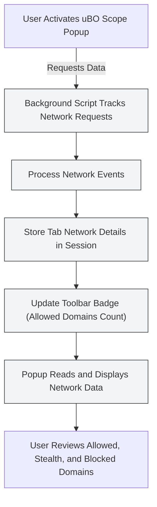

# Troubleshooting and Understanding Limitations

This guide helps you quickly identify and fix common issues you might encounter with uBO Scope, while also clarifying the extension’s inherent limitations. Understanding these points ensures you maximize the accuracy and usefulness of the network connection data uBO Scope reports.

---

## 1. Diagnosing Missing or Incomplete Network Data

### Why might uBO Scope show no data or fewer connections than expected?

- **No active tab or no monitored network activity:** uBO Scope tracks network requests for active tabs only. If you open the popup on a blank tab or a restricted page (e.g., `chrome://`), it won’t display connection data.
- **Insufficient permissions:** The extension requires permissions like `webRequest` and `activeTab` to monitor network activity. Missing these permissions blocks monitoring.
- **Browser compatibility and version:** Make sure you’re using a supported browser version (Chromium 122+, Firefox 128+, Safari 18.5+).
- **Service worker evictions (Chromium):** As the extension uses service workers, temporary eviction may delay network event reporting.

### How to verify and fix missing data

1. **Confirm permissions:** Check that uBO Scope has been granted required permissions during installation or first launch.
2. **Reload the webpage:** After granting permissions, reload the tab to generate fresh network activity.
3. **Use a typical HTTP/HTTPS website:** Some internal or special pages do not generate detectable network connections.
4. **Wait briefly:** uBO Scope batches network events; changes can take up to a few seconds to reflect.
5. **Restart your browser:** This can clear transient extension state issues.

<Warning>
Ensure uBO Scope is not disabled or restricted by other privacy tools or browser policies that block extensions from accessing network requests.
</Warning>

---

## 2. Understanding Badge Count Discrepancies

### Why might the badge count be higher or lower than expected?

- **Badge counts distinct *allowed* third-party domains, not total requests:** Many blocked or stealth-blocked requests do not increase the badge.
- **Duplicate domains counted only once:** Multiple requests to the same allowed domain count as one.
- **Stealth and blocked connections are not included in badge count:** The badge reflects the number of distinct allowed third-party domains only.

### Troubleshooting unexpected badge numbers

- Compare active tab’s popup display of allowed vs. blocked and stealth-blocked domains.
- If numbers are skewed, verify you don’t have additional network filters or proxies altering requests invisible to the extension.

<Tip>
A lower badge count generally indicates better blocking effectiveness, but always cross-check with actual popup domain lists for context.
</Tip>

---

## 3. Common Popup Interface Issues

### Symptoms to watch for:

- Popup shows "NO DATA" or does not update dynamically when switching tabs.
- Error messages or blank sections instead of domain lists.

### Solutions:

1. **Reload tab and open new popup:** Refreshing may reinitialize monitoring.
2. **Clear extension session data:** Some states may become stale. You can reset by disabling and re-enabling the extension.
3. **Ensure browser is up to date:** Compatibility issues sometimes cause interface glitches.
4. **Check console logs:** Open the browser console to view any error logged by the extension.

---

## 4. Limitations of uBO Scope's Network Monitoring

It's critical to understand what uBO Scope can and cannot detect to set realistic expectations and interpret results accurately.

### What uBO Scope can detect:

- All network requests the browser reports through its `webRequest` API.
- Both HTTP(S) and WebSocket requests initiated by web pages.
- Outcomes of requests categorized as allowed, stealth-blocked (redirected), or blocked (errored).

### What uBO Scope cannot detect:

- Network activity outside the browser's `webRequest` API scope (e.g., OS-level DNS requests, VPN-encrypted traffic outside browser control).
- Network requests made before extension initialization or after service worker eviction until restart.
- Requests blocked upstream from the browser or by DNS-level filtering that do not trigger browser events.

<Note>
Some network request monitoring limitations stem from browser APIs themselves, which uBO Scope cannot overcome.
</Note>

---

## 5. Practical Troubleshooting Workflow

<Steps>
<Step title="Verify Browser and Extension Setup">
Confirm you use a supported browser version, and the extension is installed with full permissions.
</Step>
<Step title="Test Real Website Network Activity">
Open a typical website (e.g., a news or retail site) and check the popup for domain connection categorizations.
</Step>
<Step title="Check Permissions and Reload">
Ensure permissions such as “webRequest” and “activeTab” are granted. Reload the tab to trigger new data collection.
</Step>
<Step title="Observe Badge and Popup Data">
Compare the badge count and popup’s allowed/blocked domain lists. Look for sudden zero or abnormally high values.
</Step>
<Step title="Reset Extension State If Needed">
Disable and re-enable the extension to clear persistent state. Restart browser if problems persist.
</Step>
<Step title="Consult Console Logs">
Inspect developer console for runtime errors or warnings from uBO Scope.
</Step>
</Steps>

---

## 6. Best Practices for Reliable Usage

- **Use well-established websites for testing:** Avoid synthetic ad-blocker test pages that create contrived connections.
- **Allow time for data collection:** Network requests accumulate over seconds; premature evaluation can mislead.
- **Combine with other privacy tools knowledge:** Understand how uBO Scope complements but does not replace full privacy protection.
- **Regularly update your browser and extension:** This ensures access to latest browser APIs enabling full visibility.

---

## 7. Additional Resources

- [Quick Validation Checklist](https://github.com/gorhill/uBO-Scope#quick-validation) guides effective monitoring verification.
- [Interpreting Network Activity and the Badge Counter](guides/using-ubo-scope/interpreting-network-activity) elucidates domain categorizations.
- [Popup Interface Exploration](getting-started/using-validating/exploring-popup) for UI navigation and insights.
- [First Launch and Permissions](getting-started/install-configure/first-launch) clarifies critical permission setups.

---

By following this guide, you will confidently diagnose common problems, understand inevitable monitoring limits, and get the most out of uBO Scope’s network transparency.

---

## Example Scenario: Diagnosing "No Data" in Popup

You installed uBO Scope but the popup shows "NO DATA" after loading your favorite site.

1. Confirm you are on an HTTP or HTTPS page (not `about:blank` or browser internal page).
2. Check extension permissions (especially `webRequest` and `activeTab`) are granted.
3. Reload the page to trigger fresh network monitoring.
4. Open the popup again and wait a few seconds.
5. If still no data, disable then re-enable the extension, restart browser, and try again.
6. If issues persist, open browser console and check for errors logged by `uBO-Scope`.

This approach restores monitoring functionality in nearly all cases.

---

## Summary Diagram: Basic uBO Scope Monitoring Flow

This flow represents how uBO Scope captures, processes, stores, and displays network connection outcomes to keep you informed.

---

## Troubleshooting Checklist

<AccordionGroup title="Common Issues and Solutions">
<Accordion title="No Data Shown in Popup">
- Check permissions granted.
- Reload the active tab.
- Avoid internal browser pages.
- Restart browser if needed.
</Accordion>
<Accordion title="Popup Shows Incorrect Badge Count">
- Understand badge counts only allowed third-party domains.
- Confirm extension is running alongside other blockers.
- Clear cached session data by toggling extension.
</Accordion>
<Accordion title="Popup Interface Errors or Blank Sections">
- Reload popup.
- Restart browser.
- Check developer console for errors.
</Accordion>
<Accordion title="Unexpected Network Requests Not Displayed">
- Requests made outside browser’s `webRequest` API are invisible.
- Requests before extension starts or after service worker eviction may be missed.
- DNS- or VPN-level blocking is not captured.
</Accordion>
</AccordionGroup>

---

For additional help, refer to the full documentation or raise issues via the [GitHub repository](https://github.com/gorhill/uBO-Scope).

---

# End of Troubleshooting and Understanding Limitations Guide
