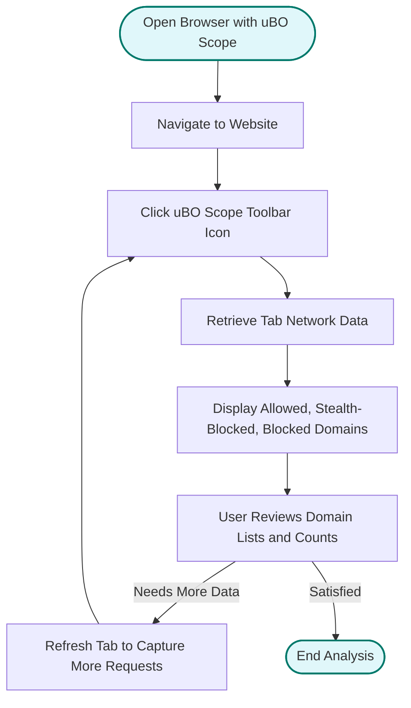

# Analyzing Connections Made by Websites

## Workflow Overview

### Task Description
This guide walks you through the practical steps of using uBO Scope to analyze the network connections a website attempts to make. You will learn how to open a site, examine which third-party servers the website contacts, and understand the status of these connections. The goal is to help you identify potentially unwanted connections, distinguish between legitimate content delivery networks (CDNs), and detect tracking domains.

### Prerequisites
- uBO Scope extension installed and enabled in your browser (Chrome, Firefox, or Safari).
- Browsing session with active tabs to analyze network requests.
- Basic familiarity with browsing and opening the extension popup.

### Expected Outcome
By following this guide, you will be able to:
- Open a website and view detailed reports of its network connections.
- Interpret domain connectivity outcomes such as allowed, stealth-blocked, or blocked.
- Assess which domains might pose privacy concerns versus legitimate service providers.

### Time Estimate
Approximately 5 to 10 minutes to analyze a site’s connections and understand the outcomes.

### Difficulty Level
Beginner to Intermediate.

---

## Step-by-Step Instructions

### 1. Open the Website to Analyze
- Launch your browser with uBO Scope installed.
- Navigate to the website you want to investigate.

### 2. Access the uBO Scope Popup Panel
- Click the uBO Scope toolbar icon in your browser.
- The popup panel will open and display telemetry relevant to the active tab.

### 3. Understand the Panel Header
- At the top, you see the **tab hostname** and the associated **registered domain**.
- The hostname may show subdomains or paths relative to the main registered domain, aiding identification.

### 4. Review the Summary Section
- The **domains connected** count reflects the number of distinct third-party domains the page is interacting with.
- A lower count generally means fewer remote servers contacted, often indicating less exposure to third parties.

### 5. Inspect Connection Categories
The popup divides third-party domains into three outcome categories:

#### Allowed
- Domains from which network requests succeeded without obstruction.
- Typically includes first-party domains and legitimate CDNs.

#### Stealth-Blocked
- Domains where connections were redirected stealthily to avoid detection by the page.
- This often indicates content blocking in a way that tries not to break webpage functionality.

#### Blocked
- Domains where network requests were actively blocked and failed.
- These often represent trackers, ad servers, or unwanted third parties.

### 6. Analyze Domain Lists
- Each category displays a list of domains with the number of requests made.
- Look for suspicious or unknown domains in Allowed or Stealth-Blocked sections.
- Compare with known CDNs and service providers to identify legitimate connections.

### 7. Interpret Results for Privacy Assessment
- The badge count on the toolbar icon shows the total distinct allowed third-party domains.
- Review the lists to understand your privacy exposure.
- Use these insights to adjust your content blocker or browsing behavior accordingly.

### 8. Refresh the Website if Needed
- If you open the popup and see "NO DATA" or no domains, refresh the tab to start capturing requests.

### 9. Navigate Between Tabs
- Open uBO Scope for different tabs by clicking the icon while on the tab you want to inspect.

### 10. Troubleshooting Common Issues
- If the popup does not update, ensure the extension has appropriate permissions and the browser supports webRequest API for your platform.
- Restart the browser or extension if data fails to load.

---

## Examples & Scenarios

### Example: Analyzing a News Website
1. Open example-news-site.com in your browser.
2. Click the uBO Scope icon.
3. Notice the domain is example-news-site.com, with a badge count showing the number of distinct external domains contacted.
4. In Allowed, you see example-news-site.com and cdn.examplecdn.net (a legitimate CDN).
5. Stealth-Blocked lists tracker.adsprovider.com, indicating the extension stealth-blocked tracking requests.
6. Blocked lists tracker.otherads.com, showing direct blocking of ad server connections.
7. You conclude the site contacts several third-party domains; some are blocked, others allowed or stealth-blocked.

### Best Practice
- Regularly check the domains in Allowed to ensure no unexpected trackers slip through.
- Cross-reference domains with known lists or do some research about unknown domains.

---

## Troubleshooting & Tips

### Common Issues
- **No data shown in popup:** Reload the active tab to initiate request capture.
- **Badge count does not update:** Confirm permissions for webRequest are granted in your browser.
- **Unexpected high allowed domains:** Some websites use many third-party services; consider evaluating each domain critically.

### Best Practices
- Use uBO Scope alongside a content blocker for optimal privacy.
- Focus on distinct domain counts instead of raw blocked request counts for privacy evaluation.
- Use the popup regularly to get immediate insights into your browsing session's network activity.

### Performance Considerations
- uBO Scope does not impact your browsing speed; it passively monitors network requests.

### Alternative Approaches
- Use browser developer tools for deeper HTTP request inspection complementary to uBO Scope's overview.

---

## Next Steps & Related Content

### What's Next
- Explore [Understanding Badge Counts and Domain Lists](/guides/workflows/interpreting-badge-counts) to learn more about the badge and domain categorization.
- Dive into [Making Sense of the uBO Scope Popup Panel](/guides/getting-started/first-look-popup) for detailed popup UI guidance.
- Consult [Troubleshooting Common Issues](/getting-started/troubleshooting/common-issues) if you encounter problems.

### Related Guides
- [Installing and Setting Up uBO Scope](/guides/getting-started/install-setup)
- [Avoiding Common Misinterpretations](/guides/best-practices/avoiding-misinterpretations)

### Advanced Topics
- Advanced debugging and filtering techniques for power users.

### Resources
- GitHub Repository: [https://github.com/gorhill/uBO-Scope](https://github.com/gorhill/uBO-Scope)

---

### User Interaction Flow Diagram

---

<Check>
Always keep uBO Scope updated to benefit from the latest features and fixes.
</Check>

<Note>
The extension reports only network requests visible through the webRequest API; some DNS-level blocks or network requests outside browser context may not appear.
</Note>