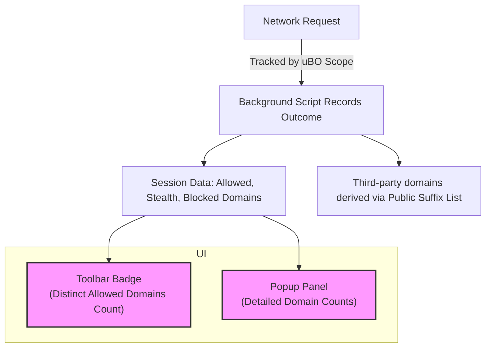

# Interpreting the Toolbar Badge & Popup Panel

Unlock the true meaning behind the numbers you see on uBO Scope's toolbar badge and gain deeper insights from the popup panel. This guide demystifies how domain counts are calculated and explains the significance of the categories 'allowed', 'blocked', and 'stealth-blocked' connections. You'll learn to move past misleading block counts and focus on actionable network data that empowers your privacy and content blocking strategies.

---

## 1. Understanding the Toolbar Badge

### What the Badge Number Represents

The number shown on uBO Scope's toolbar badge reflects the **count of distinct third-party domains** from which network connections were successfully allowed (not blocked) on the active tab. This count is not about the number of requests but unique remote domains contacted.

✅ **Key Insight:** A **lower badge count is preferable**, indicating fewer third-party connections.

### Why Third-Party Domains?

Third-party domains are domains different from the main site you are visiting. Tracking third-party domains helps highlight the potential extent of external data exchange, which is critical for privacy-aware users.

### What The Badge Does *Not* Represent

- It is **not** a block count or number of blocked network requests.
- It does **not** count all requests but only unique domains from allowed connections.

---

## 2. Breakdown of Connection Categories in the Popup Panel

When you click the toolbar icon, the popup panel shows detailed counts grouped by connection outcome:

| Category         | Description                                                                    | What It Indicates                                      |
|------------------|--------------------------------------------------------------------------------|-------------------------------------------------------|
| **Not blocked (Allowed)** | Domains where connections succeeded and resources loaded normally.               | Active external connections supporting page content. |
| **Stealth-blocked**        | Domains where network requests were blocked silently or via redirects.
 Often used by content blockers to avoid detection.              | Connections that content blockers prevented subtly.  |
| **Blocked**                | Domains where requests failed or were explicitly blocked by the browser or extension. | Directly blocked network connections.                 |

### Why It Matters

- Counting **allowed domains** shows what remote servers the webpage actually connected to.
- **Stealth-blocked** domains reveal blocking that is harder to detect and may surface hidden trackers.
- **Blocked** domains clarify straightforward blocking results.

---

## 3. Interpreting Domain Counts and Nuances

### Domain vs Hostname

- Domains are the effective second-level domain plus the public suffix (e.g., `example.com`).
- Hostnames might include subdomains (e.g., `cdn.example.com`).

uBO Scope groups data by domains to give you a clearer, higher-level view rather than overwhelming you with every subdomain.

### Incremental Counting

Each connection to a hostname increments both the hostname and its domain counts, but the toolbar badge count reflects only the **number of distinct allowed domains**.

### Why Does the Count Change During Browsing?

- Navigating to new pages or sites resets counts specific to the current tab’s active domain.
- Background network requests, redirects, and stealth blocking can dynamically affect counts.

---

## 4. Practical Tips for Using the Badge and Popup

- Use the **badge number as a quick privacy indicator**: fewer allowed third-party domains often means better precaution.
- Click the badge to **drill down into which domains are connected, stealth-blocked, or blocked**.
- Look for unexpected domains in the popup to detect hidden trackers or surreptitious connections.
- Remember, a higher **blocked count doesn't necessarily mean better protection** if it correlates with more allowed domains.

---

## 5. Step-by-Step: Verifying and Interpreting Data

<Steps>
<Step title="Check the Toolbar Badge">
Look at the badge icon on your browser toolbar for uBO Scope. Note the number displayed; this is how many unique third-party domains have been connected to on the active tab.
</Step>
<Step title="Open the Popup Panel">
Click the badge icon to open the popup panel.
</Step>
<Step title="Identify the Main Domain">
See the top header showing the current tab’s domain and hostname. This confirms you are viewing data for the correct site.
</Step>
<Step title="Review Allowed Domains">
Look under the “not blocked” section. These are third-party domains your browser connected to successfully.
</Step>
<Step title="Examine Stealth-Blocked and Blocked Sections">
Compare these areas to understand which requests were silently blocked or blocked outright.
</Step>
<Step title="Cross-Reference Domains">
If suspicious or unknown domains appear, consider investigating them further or adjusting your content blockers.
</Step>
</Steps>

---

## 6. Common Pitfalls & Troubleshooting

### Misinterpreting Badge Numbers as Block Counts

The badge does not show blocking effectiveness by counting blocks. Do **not** rely on the badge alone to evaluate blocker quality.

### Invisible Stealth Blocking

Stealth-blocked requests are intentionally hidden from standard network tools. Use uBO Scope’s popup to reveal these subtle blocks.

### Empty Badge or No Data Shown

- Ensure uBO Scope is activated and has the necessary permissions (see First Launch Configuration).
- The badge resets when no tab data is available or on pages not fully loaded.
- Validate successful activation first if data fails to appear.

---

## 7. Summary Diagram: Data Flow from Requests to Badge & Popup

---

## 8. Next Steps & Related Resources

- Dive into [Monitoring Network Connections Per Tab](https://docs.example.com/guides/workflows/monitor-network) for comprehensive network insights.
- Learn how to [Validate Successful Activation](https://docs.example.com/getting-started/basics-installation/validate-activation) to ensure your extension collects data.
- Explore [Troubleshooting Installation & Usage Issues](https://docs.example.com/getting-started/basics-installation/troubleshooting-common-issues) for resolving common blockers.

---

By mastering the toolbar badge and popup panel data, you gain a powerful window into web page network behavior, helping you make informed decisions to enhance privacy and security effectively.