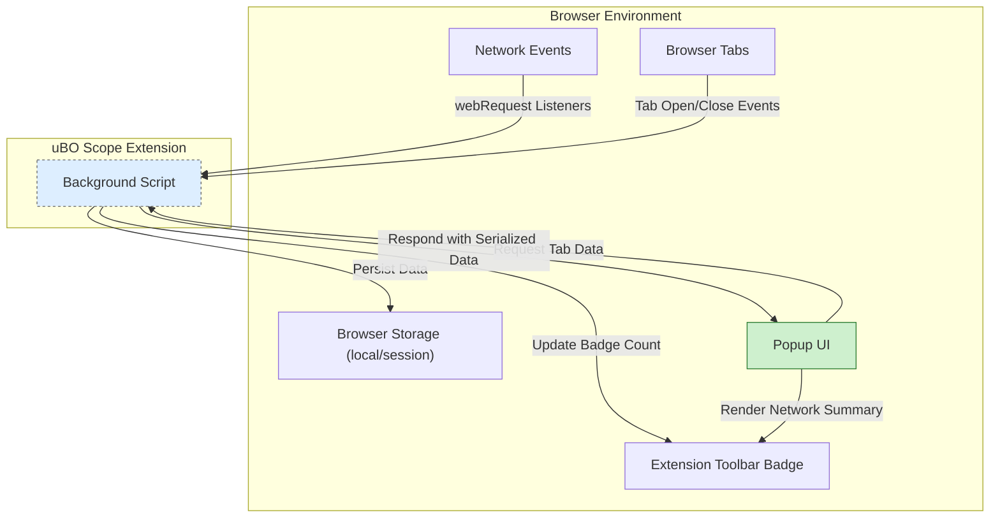

# Architecture & Data Flow

## Unlocking How uBO Scope Works: A High-Level View

uBO Scope is designed to be a crystal-clear window into the network connections your browser makes. This page breaks down how its core components collaborate to capture, process, and display network data, empowering you with real-time, detailed insight right from the browser extension interface.

### What You'll Learn Here
- How the background script quietly monitors and aggregates your network activity.
- The role of the popup UI in presenting clear, per-tab network connection summaries.
- How messaging flows create seamless, up-to-the-second updates.
- How uBO Scope integrates securely and efficiently with the browser.

---

## Core Components Explained

### Background Script: The Persistent Network Watcher

At the heart of uBO Scope’s data collection lies the background script. It is a continuous, behind-the-scenes agent tasked with listening to browser network events via the `webRequest` API. Here’s what it does:
- **Monitors Requests:** Captures every network request made by each open tab, including details about successes, redirects, and errors.
- **Classifies Data:** Distinguishes outcomes into three categories — allowed (connections that succeeded), blocked, and stealth-blocked (redirected or hidden).
- **Session Management:** Maintains an up-to-date record of network activity per tab, enabling accurate and isolated tracking.
- **Persistence:** Saves session data to browser storage, so the insights survive browser restarts until tabs close.

This logic ensures you get a faithful representation of all remote server connections, unaffected by browser caching or transient issues.

### Popup UI: Your Interactive Network Dashboard

The popup interface is what you see when clicking the uBO Scope icon. It dynamically displays:
- **Per-Tab Connection Summary:** Total count of distinct third-party domains contacted.
- **Detailed Domain Lists:** Separate sections showing allowed, stealth-blocked, and blocked domains, complete with counts per domain.
- **Human-Readable Formats:** Domain names rendered with full Unicode conversion, making internationalized domains easy to read.

This UI focuses entirely on delivering actionable insights, allowing you to instantly grasp where your browser’s connections are going.

### Messaging Flow: Real-Time Synchronization

To keep the popup data fresh and relevant, a messaging system connects the popup UI and the background script:
- When the popup opens, it sends a message requesting the current network data for the active tab.
- The background script responds promptly with serialized tab details.
- The popup deserializes this data and renders it smoothly.

This communication ensures that network insights reflect the latest tab state without delay or stale information.

### Browser Integration & Interaction Boundaries

uBO Scope interacts with standard browser extension APIs to:
- Gain access to network events (via `webRequest` with proper host and permissions).
- Manage storage for session persistence (`storage.local` and `storage.session`).
- Update toolbar badges reflecting distinct allowed domains per tab.
- Display results through the popup mechanism linked to the extension icon.

Importantly, uBO Scope respects strict boundaries:
- It operates entirely within the extension context, without direct webpage interference.
- All network monitoring is reactive to browser-reported events, ensuring compatibility and security.

---

## Detailed Data Flow Diagram

The following Mermaid.js diagram visualizes the relationships and flow between uBO Scope’s key components and the browser environment.

---

## Practical Insights: Why This Architecture Matters

- **Real-Time Accuracy:** Background script monitors network traffic instantly, so your network data in the popup never lags.
- **Tab Isolation:** Data tracked separately per tab means you see exactly what each tab connects to, avoiding confusion.
- **Persistent Context:** Session data retention allows you to analyze ongoing browsing sessions, even if you briefly close the popup.
- **Low Impact:** Efficient event handling and data serialization minimize memory and runtime costs inside the extension.

---

## Tips for Users

- Opening the popup refreshes the data by fetching from the background script. For best results, open the popup after navigating or interacting with the web page.
- The toolbar badge number reflects the count of uniquely contacted third-party domains for the active tab—a succinct privacy metric.
- Closing tabs automatically clears their stored data, keeping your extension lean.

---

## Troubleshooting Common Scenarios

<AccordionGroup title="Common Issues & Solutions">

<Accordion title="Popup Shows 'NO DATA' or Empty">
If the popup panel does not display any network connections:
- Ensure uBO Scope has the proper permissions and background script is running.
- The active tab may not have initiated any network requests yet.
- Reload the tab or navigate to a new page to generate network activity.
</Accordion>

<Accordion title="Toolbar Badge Does Not Update">
- Network events are throttled and processed periodically to optimize performance; short delays are expected.
- Confirm the active tab is tracked—background script only tracks loaded tabs.
- Verify browser compatibility, especially on browsers limiting `webRequest` API support.
</Accordion>

</AccordionGroup>

---

## Next Steps

Ready to see uBO Scope in action?
- Visit the [Your First uBO Scope Session](/guides/getting-started/your-first-session) guide to start analyzing network connections live.
- Explore [How Network Monitoring Works](/overview-tab/architecture-concepts-group/how-network-monitoring-works) for deeper insights into data capture.
- Check out [Interpreting the Popup Panel](/guides/analyzing-connections/interpreting-popup-stats) to understand the metrics you see.

---

For a foundational overview of uBO Scope’s purpose and audience, see [What is uBO Scope?](/overview-tab/product-intro-group/what-is-ubo-scope) and [Who Should Use uBO Scope?](/overview-tab/product-intro-group/target-audience).

---