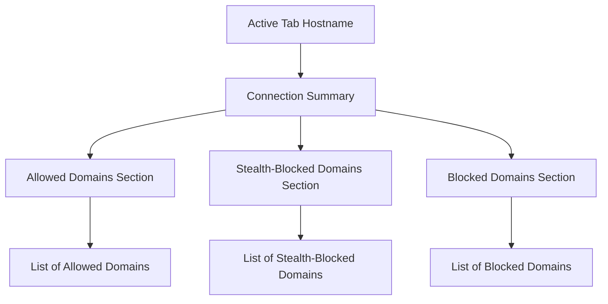

# What is uBO Scope?

## Discover the Invisible Connections Your Browser Makes

uBO Scope is a powerful browser extension designed to reveal every connection your browser attempts or completes with remote servers while you navigate the web. By providing detailed transparency into these network activities, it empowers you to understand exactly which third-party domains are involved in your browsing experience.

### Why uBO Scope Matters

While typical content blockers focus on filtering unwanted content, uBO Scope specializes in measuring and exposing all network requests regardless of blocking decisions. This means you gain unparalleled insight into which domains your browser talks to, whether the requests are allowed, blocked, or stealth-blocked behind the scenes.

### What uBO Scope Does for You

- **Visualizes network connections** made by the current browser tab in real time.
- **Distinguishes request outcomes** into categories like allowed, blocked, and stealth-blocked.
- **Presents data comprehensively** in an easy-to-understand popup interface.
- **Operates independently** from other content blockers to provide unique visibility.
- **Supports modern browsers** with minimal setup.

---

## Understanding uBO Scope: Your Network's Watchdog

At its core, uBO Scope functions as a companion tool complementing blockers like uBlock Origin by focusing on observing and reporting rather than filtering. It tracks all remote server connections initiated during browsing and organizes them for quick assessment. This helps you answer key questions:

> "Which remote servers is this page interacting with?"
>
> "Which connections were blocked and which passed through?"
>
> "Are requests being silently prevented (stealth-blocked)?"

By answering these, uBO Scope equips you to improve your privacy diagnosis, audit third-party resource loading, and gain confidence over your browser’s network behavior.

### How uBO Scope Builds Transparency

The extension hooks into your browser’s networking layer to collect data on web requests initiated by the page you are actively viewing. It categorizes each domain request based on whether:

- The connection was **allowed** (no intervention occurred).
- The connection was **blocked** outright.
- The connection was **stealth-blocked**, meaning it was prevented in a way that might evade typical blockers' detection.

This triage of network outcomes not only assures full visibility but also reveals subtle blocking techniques.

### Unique Selling Points

- **Independent Measurement**: Unlike other tools tied to content filters, uBO Scope provides a fresh perspective independent of filtering policies.
- **User-Centric Reporting**: Information is presented through a clean popup with intuitive grouping by request outcome.
- **Unicode-Aware Domain Display**: It converts punycode domains back to their original Unicode form for clarity.

### Simple User Experience

Designed to be approachable for all users, uBO Scope’s popup interface shows

- The hostname and domain of the currently active tab.
- The total number of distinct connected domains.
- Three groups listing domains under 'not blocked,' 'stealth-blocked,' and 'blocked' categories.

This presentation immediately highlights the network footprint of the page you are visiting.

---

## Getting Started with uBO Scope

To see uBO Scope in action, just click its icon in the browser toolbar while on any webpage. The popup will load and display:

- **Hostname**: The address of the current page.
- **Summary**: Total domains connected.
- **Detailed lists**: Separate sections showing domains that were allowed, stealth-blocked, or blocked.

From here, you can quickly assess the degree and nature of remote server interactions for the active tab.

### Practical Example

Imagine opening uBO Scope on a news website. You will instantly see:

- A list of advertising or tracking domains that were blocked.
- Essential domains allowed for core content like images or scripts.
- A stealth-blocking section identifying domains blocked in less obvious ways.

This immediate visibility guides you in making privacy or troubleshooting decisions.

---

## Tips for Users

- Keep uBO Scope icon accessible in your toolbar for quick network checks.
- Use it alongside content blockers to audit their effectiveness.
- Pay special attention to stealth-blocked domains—they could indicate more subtle resource control.
- Refer to related guides on interpreting badge counts and diagnosing stealth blocking for deeper insights.

---

## Next Steps

After grasping what uBO Scope is and why it’s essential for network transparency, explore these documentation pages to deepen your understanding and make the most of uBO Scope:

- [Who is uBO Scope for?](./target-audience-use-cases) — Discover user profiles and typical use cases.
- [Core Concepts & Terminology](./core-concepts-terminology) — Learn key terms and principles.
- [Using the Popup: Viewing and Interpreting Network Connections](../../guides/getting-started-essentials/understand-popup) — Get detailed guidance on reading the popup.

Unlock complete visibility into your browsing network with uBO Scope — your companion for understanding remote connections at a glance.

---

## Visual Overview of Popup Elements

This simple user interface design focuses on clarity, empowering you to navigate and interpret complex network data effortlessly.
