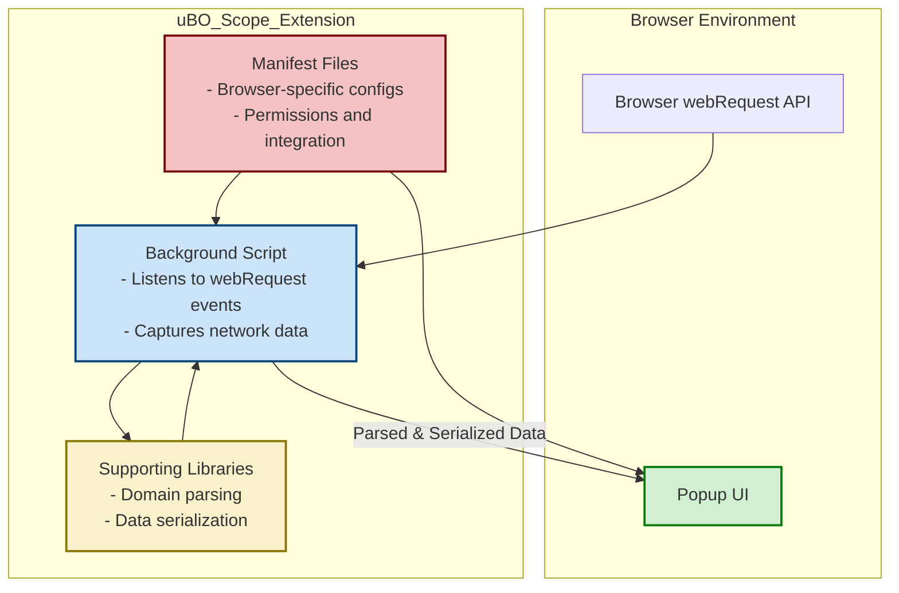

# Architecture Diagram

## Visual Overview of uBO Scope's Core Architecture

This page presents a clear, visual representation of the fundamental architecture behind uBO Scope. By following this diagram, you will gain a comprehensive understanding of how uBO Scope captures, processes, and displays network request data in your browser, ensuring a seamless and insightful user experience.

## Understanding the Flow: From Network Requests to User Insights

At the heart of uBO Scope lies a background script that continuously monitors network activity. This script leverages the browser's `webRequest` API to detect all network connections initiated by web pages, whether they succeed, are blocked, or stealth-blocked by content blockers in use.

The collected data is then processed and transmitted to the popup UI, where users find real-time, per-tab connection information. Additional supporting libraries parse domain information and serialize data efficiently, enhancing the clarity and performance of the extension across multiple browsers.

## Why This Matters to You

If you've ever wondered exactly which remote servers your browser is contacting while browsing, this architecture shows exactly how uBO Scope reveals that transparency. It does this without interfering with your current content blockers, offering an unbiased, comprehensive view of all network connection attempts.

This enables you to make informed decisions on your privacy, understand potential third-party exposure, and debunk common misconceptions regarding content blocking effectiveness.

## Key Components in the Architecture

- **Background Script**: The core engine that listens to network requests via the `webRequest` API, capturing all connection data.
- **Popup UI**: The interface that presents the aggregated and categorized network insights to users for each browser tab.
- **Supporting Libraries**: Utilities for domain parsing and data serialization that streamline data processing.
- **Manifest Files**: Browser-specific configurations (for Chromium, Firefox, Safari) that define permissions, background scripts, and popup integrations.

## How It Fits Together

The architecture is designed around a clean flow ensuring data integrity and user clarity:

1. The browser initiates or encounters network requests from web pages.
2. The **background script** intercepts these requests, capturing details such as request URLs and blocking outcomes.
3. Using supporting libraries, domain information is parsed and prepared for efficient data transmission.
4. The processed data is sent to the **popup UI**, keeping its information up to date.
5. Users interact with the popup to view categorized lists of allowed, blocked, and stealth-blocked connections.
6. Manifest files ensure compatibility and correct permissions across supported browsers.

This design guarantees that uBO Scope remains lightweight, responsive, and compatible with common content blockers and browser environments.

## Architecture Diagram

## Practical Tips

- When inspecting network connections, remember that uBO Scope shows connection attempts regardless of any blocking — giving you a full picture beyond what you might see in content blocker block counters.
- The architecture supports all major browsers through dedicated manifest files, ensuring smooth cross-browser operation.
- If you encounter any discrepancies in displayed network data, verify that your browser version and permissions allow background scripts to monitor `webRequest` events.

## Common Pitfalls

- The extension relies on the browser's `webRequest` API; if certain network requests are made outside this API's scope, they won't appear in uBO Scope.
- Background script may behave differently on different browsers due to their API implementation and manifest nuances; always check supported browser documentation.

## Next Steps

Explore related pages to deepen your understanding:
- [Extension Architecture Overview](/overview/architecture-and-concepts/extension-architecture-overview)
- [Core Terminology and Concepts](/overview/architecture-and-concepts/core-terminology)
- [Supported Browsers & Prerequisites](/getting-started/installing-ubo-scope/supported-browsers-and-requirements)

These will provide expanded insights on how the architecture operates in practice, essential terminology, and installation details.

---

For source code, manifests, and detailed integration, visit the project's GitHub repository: [https://github.com/gorhill/uBO-Scope](https://github.com/gorhill/uBO-Scope).

---