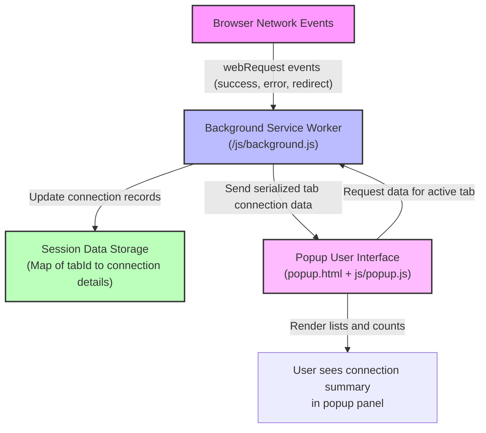

# Component Flow Diagram

## Visualizing uBO Scope's Internal Data Flow

Understanding the interaction between the browser, the background monitoring service, and the popup user interface is essential to appreciate how uBO Scope transparently surfaces information about network connections. This page offers a clear visualization and explanation of how network events originating from your browser flow through uBO Scope's internal components to present actionable data in the extension's popup panel.

---

## How uBO Scope Works: From Network Events to User Interface

At the core, uBO Scope listens to your browser’s network activity in real time. It captures crucial network events about each outgoing connection, processes and stores them in the background, then updates the popup panel you interact with. Here’s an overview of the journey:

- **Browser Network Events:** Your web browser observes all network requests initiated by web pages. These include requests for scripts, images, stylesheets, or websockets.
- **Background Service Worker:** uBO Scope runs a background service worker script (`background.js`) that receives these network events. It processes the raw network data, categorizing each connection as allowed, stealth-blocked, or blocked.
- **Session Data Management:** The background script keeps a session map linking each browser tab to detailed connection statistics, continually updating this data based on network request outcomes.
- **Popup Interface:** When you click the uBO Scope toolbar icon, the popup panel fetches relevant data for the active tab from the background script. This data includes counts and lists of third-party domains contacted, broken down by their connection status.
- **User Display:** The popup renders this information in a structured, easy-to-read format, allowing you to quickly assess the privacy landscape of the current tab.

This flow ensures that uBO Scope always offers fresh, accurate insights into remote connections while maintaining a lightweight footprint within your browser.

---

## Detailed Component Flow Illustration

---

## User Journey in Observing Network Connections

1. **Browsing as Normal:** As you load webpages, the browser generates network requests to various servers.
2. **Extension Listening:** uBO Scope’s background service worker intercepts these request outcomes via browser webRequest APIs.
3. **Connection Categorization:** Each request is classified based on whether it succeeded (allowed), was stealth-blocked (redirected), or outright blocked (error).
4. **Data Aggregation:** This information is aggregated per tab, tracking distinct hostnames and domains contacted.
5. **Popup Interaction:** Click the uBO Scope toolbar icon to open the popup panel.
6. **Visual Insight:** The popup displays a real-time snapshot of connection counts and domain lists segmented by allowed, stealth, and blocked outcomes.

When coupled with the popup panel's clear organization, you gain complete transparency into which remote servers webpages connect to and how content blockers impact those connections.

---

## Practical Tips & Best Practices

- **Keep the Popup Open for Live Updates:** uBO Scope updates the popup with fresh data correlated to the active tab. Switching tabs refreshes this data automatically.
- **Understand Connection Statuses:**
  - *Allowed* means the connection occurred without interference.
  - *Stealth-blocked* often indicates a redirected request that the content blocker handled subtly.
  - *Blocked* means the connection was prevented due to an error or deliberate blocking.
- **Badge Utility:** The extension icon badge increments dynamically with the number of unique allowed third-party domains; lower numbers signify fewer connections.
- **Tab Removal Awareness:** When you close browser tabs, uBO Scope automatically cleans up data related to those tabs to maintain accuracy.

---

## Common Pitfalls and Troubleshooting

- **No Data in Popup:** If the popup shows 'NO DATA' or zero domains, ensure you are on an active browsing tab with network activity and that the extension has been granted necessary permissions.
- **Delayed Updates:** Network events are batched and processed every second to optimize performance. Expect slight delays in popup updates.
- **Unsupported Browsers or Versions:** uBO Scope works on Chromium, Firefox, and Safari with minimum specified browser versions. Confirm compatibility if issues arise.

---

## Related Documentation

- [System Architecture Overview](/overview/architecture-and-concepts/system-architecture) for understanding the broader architectural context.
- [Popup Panel and Badge Explained](/overview/feature-overview-usage/popover-and-badge) for in-depth guidance on interpreting displayed data.
- [What is uBO Scope?](/overview/introduction-and-value/what-is-ubo-scope) for core product purpose and value.

---

## Explore the Source Code

To dive into the specific implementations of this flow, review the following key source files in the repository:

- Background script handling network events: `js/background.js`
- Popup UI rendering logic: `js/popup.js`
- Manifest file declaring permissions and scripts: `platform/chromium/manifest.json` (or respective browser folder)

You can browse the full codebase here: [GitHub Repository](https://github.com/gorhill/uBO-Scope)

---