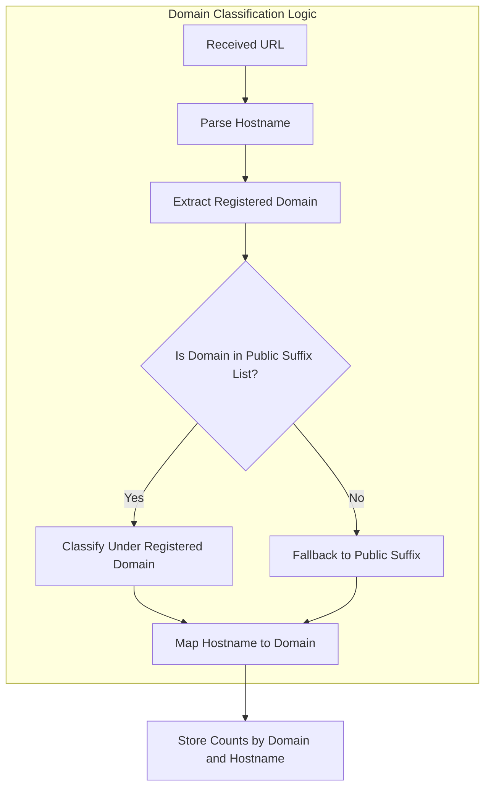

# Core Concepts & Terminology

uBO Scope is designed to shine a light on the network connections initiated by webpages, giving users clear insights into how third-party resources interact within the browser. This page covers the fundamental concepts and terminology critical to understanding the extension's data presentation and how it classifies and reports connection outcomes.

---

## Third-Party Connection

A **third-party connection** occurs when a webpage loads or attempts to load resources from a domain other than the primary domain of the page you are visiting. For example, if you visit `example.com` but the page requests content from `tracker.com`, that constitutes a third-party connection.

Understanding and monitoring these connections is essential for users concerned with privacy and security because third-party domains often collect or track user data.

## Domain Classification: Allowed, Blocked, and Stealth Blocked

uBO Scope classifies third-party connections into three key categories to help you instantly grasp which connections were permitted and which were prevented.

- **Allowed Domains:** These domains have successfully loaded resources as part of the page load. They represent actual, active third-party connections.

- **Blocked Domains:** These domains represent third-party connection attempts that were explicitly prevented by content blocking mechanisms. When a request to a domain fails due to blocking (e.g., by uBlock Origin or other content blockers acting upon `webRequest` results), it's categorized as blocked.

- **Stealth Blocked Domains:** This category includes connections that the extension detects as stealth-blocked, meaning the browser or content blocker has prevented these requests in a manner making them invisible or hidden to the page or scripts, often to prevent detection or page breakage. These stealth blocks are not direct errors but imply the request was intercepted without explicit failure notification.

### How uBO Scope Interprets Outcomes

The extension listens closely to the browser's `webRequest` events, tracking all network requests initiated by the active tab. For each third-party request, uBO Scope records the event's outcome:

- **Success (allowed):** The request completed successfully.
- **Error (blocked):** The request did not complete, likely due to blocking.
- **Redirect (stealth blocked):** The request was redirected in a way that indicates stealth blocking.

These events are combined and reported back in real time to give a clear, truthful picture of network activity.

## Domain Classification Logic

To aggregate connections meaningfully, uBO Scope classifies each hostname into its respective registered domain. It uses the Public Suffix List, an industry-standard catalog of domain suffix rules, to accurately extract the "registrable domain" (e.g., `example.com` from `sub.domain.example.com`). This classification ensures that multiple subdomains belonging to the same main entity are grouped together for clearer reporting.

For example:

- The hostname `assets.tracker.example.com` and `cdn.tracker.example.com` both map to the domain `example.com`.

This domain-centric grouping helps users quickly identify which third parties are interacting with the webpage without being overwhelmed by granular hostname details.

### How Domain Counts Are Reported

uBO Scope reports counts of connections at two levels:

- **Hostnames:** Counts of connections broken down by the exact fully qualified domain names (e.g., `tracker.example.com`).
- **Domains:** Aggregated counts grouped by the registered domain, summarizing all subdomains under one entity.

The extension surfaces these counts in its popup UI and badge text, enabling you to monitor how many distinct third-party domains have been contacted by the page.

---

## Practical Example: Understanding Connection Outcomes

Imagine visiting a news site that loads ads, analytics, and fonts from different third-party providers. Here’s how uBO Scope classifies the connections:

| Outcome        | Domain Example          | Description                                      |
|----------------|------------------------|--------------------------------------------------|
| Allowed        | `fonts.googleapis.com` | Fonts loaded successfully for display purposes. |
| Stealth Blocked| `ads.tracker.com`      | Ad server connections intercepted stealthily.   |
| Blocked        | `analytics.badtracker.com` | Analytics server requests prevented completely. |

The popup UI will clearly list these domains under their respective categories, helping you make sense of what network activity actually passed through versus what was blocked or stealth blocked.

---

## Best Practices for Interpretation

- **Recognize Stealth Blocking:** Stealth blocking often avoids causing page errors but still stops unwanted communication. Understanding this nuance allows you to correctly assess the effectiveness of blocking.

- **Look at Domain Counts for Privacy Impact:** Higher allowed domain counts often imply more third-party data exposure; lower counts generally indicate better privacy protection.

- **Check Outcomes per Site:** Use uBO Scope in real-world browsing scenarios to get an accurate picture beyond theoretical or test pages.

---

## Troubleshooting Common Questions

<AccordionGroup title="Common Questions about Core Concepts">
<Accordion title="Why does the badge count sometimes differ from numbers on blocker test pages?">
Blocker test pages often simulate unusual or fabricated requests that don't reflect real browsing behavior. uBO Scope counts real third-party connections observed during your browsing session, providing accurate, local insight rather than synthetic test results.
</Accordion>
<Accordion title="What does 'stealth blocked' really mean?">
Stealth blocked indicates requests that were prevented without generating a direct failure error visible to the page. This method helps blockers avoid disrupting page behavior or revealing their activity.
</Accordion>
<Accordion title="Can uBO Scope detect every network request my browser makes?">
uBO Scope can only report on network requests visible through the browser's `webRequest` API. Some requests initiated outside these APIs or through different browser components may not be observed.
</Accordion>
</AccordionGroup>

---

## Summary

By mastering the terminology and classification logic described here, you will better understand how uBO Scope tracks and reports third-party network activity. This foundational knowledge enables more informed privacy decisions and empowers you to interpret the extension's UI with confidence.

For deeper insights, explore the related pages on system architecture and interpreting connection outcomes.

---

## See Also

- [System Architecture](/overview/architecture-and-concepts/system-architecture): Learn how uBO Scope's components work together to track network requests.
- [Interpreting Blocked, Stealth, and Allowed Outcomes](/guides/advanced-use-cases/interpreting-connection-outcomes): Detailed guidance on connection result categories and what they imply.
- [Analyzing Third-Party Connections on a Website](/guides/core-workflows/analyzing-connections): Practical walkthroughs of inspecting connection data.

---

## Appendix: Domain Classification Flow

This flow ensures consistent grouping of hostnames under practical domain entities, enabling meaningful summary counts.

---

<Tip>
Understanding these core concepts is essential to gain real value from uBO Scope’s insights. They form the backbone of how network activity is presented, enabling you to make stronger privacy decisions and evaluate content blocking effectiveness in your browser.
</Tip>
