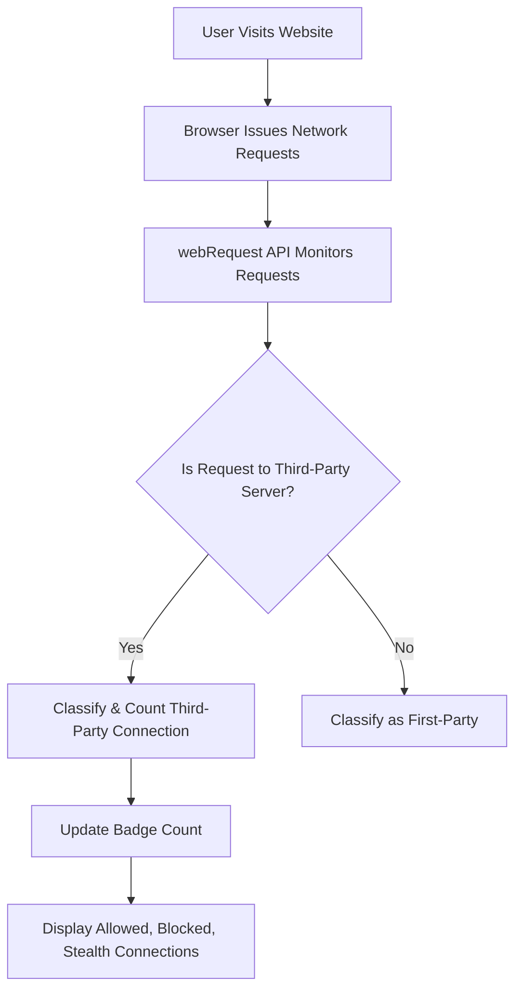

# Core Concepts & Terminology

## Establishing a Common Vocabulary for uBO Scope

Understanding the key concepts behind uBO Scope is essential to effectively interpret its reports and use its features. This page introduces and defines the fundamental terms you will encounter: **third-party server**, **badge count**, **allowed and blocked connections**, and the browser's **webRequest API**. By sharing this vocabulary, uBO Scope ensures both users and developers navigate the extension’s results with clarity and confidence.

---

## What Is a Third-Party Server?

When you visit any website, your browser loads resources not only from the website’s own domain but also from other domains—these are known as third-party servers. Typical examples include content delivery networks (CDNs), analytics platforms, advertising servers, or any external service embedded in the page.

### Why Does This Matter?

Third-party connections have significant privacy and security implications. uBO Scope tracks and reports all these third-party connections so you can see exactly how many distinct external servers your browser interacts with while viewing a page.

#### Key Points:
- **Third-party servers** are domains different from the primary website domain.
- They may deliver legitimate resources (like fonts or scripts) or potentially undesired tracking requests.
- uBO Scope helps you distinguish these connections for transparency and control.


## Understanding the Badge Count

The uBO Scope toolbar icon displays a numeric badge count—this number represents the total **distinct third-party remote servers** that the browser has connected to during the current tab session.

### Why Does the Badge Matter?

A lower badge count usually means fewer third-party connections, which often aligns with better privacy and less tracking.

#### Important Clarifications:
- The badge **does not count individual requests**, only unique remote server domains.
- It reflects all connections regardless of your content blocker’s state or strategy.
- Fewer third-party connections shown by uBO Scope mean more effective limiting of external resources.


## Allowed vs. Blocked Connections

uBO Scope categorizes all network requests into three outcomes:

- **Allowed Connections:** Network requests that succeeded or were permitted by your browser and content blockers.
- **Blocked Connections:** Network requests that were explicitly prevented or failed due to content blocking or network errors.
- **Stealth Connections:** Requests that were redirected or blocked in ways designed to remain hidden from webpages.

These classifications help you audit how your content blockers and browser policies affect your browsing.

### How uBO Scope Uses These Outcomes

- **Allowed connections** are counted and displayed as resources actually loaded.
- **Blocked connections** indicate attempts to connect which were denied.
- **Stealth connections** reveal requests silently handled by blockers, helping you understand subtle blocking behaviors.


## The Browser’s webRequest API Explained

At the heart of uBO Scope’s monitoring is the browser’s **webRequest API**. This is a set of programming hooks provided by modern browsers that allows extensions to observe, analyze, and sometimes modify network requests made by webpages.

### What Does This Mean for You?

- uBO Scope listens to **webRequest events** to detect every network request attempted by the browser for each open tab.
- It tracks the URL, request type, and outcome (success, redirect, error) of these requests in real-time.
- This API is what enables uBO Scope to present an accurate and comprehensive overview of your network interactions.

#### Important Details:
- Not all network requests are visible through the webRequest API—for example, requests made outside the browser context or by some native components may not be reported.
- uBO Scope’s accuracy depends on your browser exposing complete network data via this API.


---

## How These Concepts Fit Together in Your User Flow

Consider the following common scenario when you visit a webpage:

1. The browser starts loading the main page, initiating network requests.
2. uBO Scope listens through the **webRequest API** and records every network request tied to this tab.
3. Each request is classified as **allowed**, **blocked**, or **stealth** based on the outcome observed.
4. uBO Scope identifies which ones target **third-party servers** (domains different from the primary page).
5. The toolbar icon updates its **badge count** to reflect the number of distinct allowed third-party remote servers.
6. You open the uBO Scope popup to see detailed stats about all allowed, blocked, and stealth connections.

This flow gives you immediate, actionable insight into your actual network exposure and the effectiveness of your blockers.


---

## Practical Tips and Best Practices

- **Remember:** A lower badge count is generally better, indicating fewer third-party connections.
- Use the distinctions between allowed, blocked, and stealth to investigate any unexpected network activity.
- For developers and maintainers, understanding these terms supports troubleshooting and improving content blocker configurations.
- If you notice a high number of third-party connections, consider reviewing your filter lists or blockers.
- Check your browser’s compatibility and permissions to ensure the **webRequest API** fully captures network data (see related prerequisites documentation).


---

## Troubleshooting Common Confusions

<AccordionGroup title="Common Queries about Core Concepts">
<Accordion title="Why does my badge count jump even with a blocker enabled?">
The badge shows distinct third-party servers your browser connects to. Some allowed connections may stem from content that your blocker lets through (like necessary CDN resources). Also, stealth or redirected requests might influence counts in subtle ways.
</Accordion>
<Accordion title="How accurate is uBO Scope if the browser limits webRequest API data?">
uBO Scope relies entirely on data exposed by the browser’s webRequest API. Some browsers or settings may restrict this visibility, causing incomplete reporting. Ensure the extension has appropriate permissions and your browser version supports comprehensive webRequest monitoring.
</Accordion>
<Accordion title="What is considered a 'third-party' domain exactly?">
Any domain that is different from the main website's domain currently loaded in the tab. uBO Scope uses a public suffix list to accurately determine domain boundaries and avoid counting subdomains of the same organization as third parties.
</Accordion>
</AccordionGroup>


---

## Summary

By mastering these core terms, you empower yourself to interpret uBO Scope’s data effectively and make informed decisions about your privacy and browsing security. These concepts form the foundation upon which all features and reports in uBO Scope are built.


---

_For the full user journey, consider visiting other overview pages such as [What is uBO Scope?](/overview/product-introduction/what-is-ubo-scope) for broader product context, or [Key Features at a Glance](/overview/feature-overview/main-features) to see how these concepts translate into actionable capabilities._


---

## Additional Resources

- [webRequest API documentation (MDN)](https://developer.mozilla.org/en-US/docs/Mozilla/Add-ons/WebExtensions/API/webRequest)
- [Public Suffix List](https://publicsuffix.org/)—used by uBO Scope to properly classify domains
- [Understanding Third-Party Tracking](https://www.eff.org/pages/third-party-tracking)


---


---

#### Code Snippet: Determining Third-Party Domains

Here is a simplified example model of how uBO Scope determines if a hostname belongs to a third-party domain using the public suffix list:

```javascript
function isThirdParty(mainDomain, requestHostname) {
    const requestDomain = getDomainFromHostname(requestHostname); // uses public suffix list
    return requestDomain !== mainDomain;
}

// Usage example
const mainDomain = 'example.com';
const requestHostname = 'cdn.example.com';

console.log(isThirdParty(mainDomain, requestHostname)); // Output: false

const thirdPartyHostname = 'analytics.externalsite.net';
console.log(isThirdParty(mainDomain, thirdPartyHostname)); // Output: true
```

This logic helps uBO Scope classify every network request as originating from the first-party or a third-party server.


---

#### Diagram: Core Concepts Relationship



This workflow captures how the core concepts interact in a typical user session.
