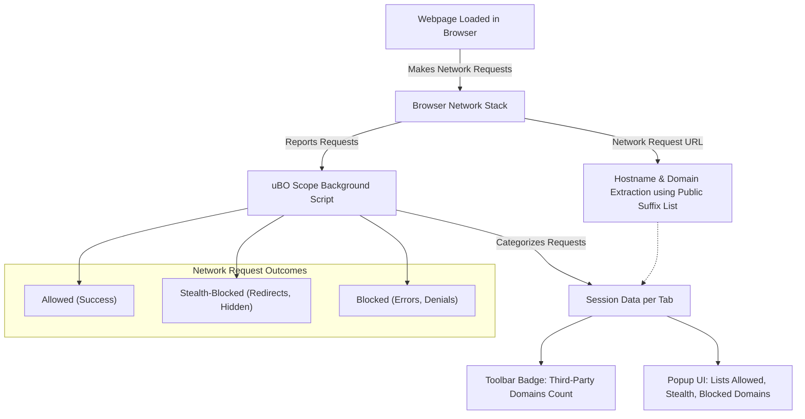

# Key Concepts & Terminology

Understanding the foundational terms and concepts behind uBO Scope is essential for accurately interpreting the data it presents. This page dives into the core ideas such as third-party remote servers, network requests, session data, and badge counts, clarifying how each is represented within the extension’s UI and reports.

---

## Why These Concepts Matter

Imagine browsing your favorite website and wondering exactly what external servers it’s contacting behind the scenes. uBO Scope surfaces this critical transparency by revealing all network connections — whether allowed, stealth-blocked, or outright blocked — empowering you to understand and control your web privacy.

This terminology reference helps you decode the information you see in the uBO Scope popup and badge counts, ensuring that you can confidently assess the network activity on any page.

---

## Third-Party Remote Servers

- **Definition:** A third-party remote server is any server contacted by a webpage that is not part of the main website you are visiting.

- **Why It Matters:** These are often used to deliver ads, analytics, or other resources, but can also present privacy concerns. uBO Scope counts and categorizes these servers to show you exactly how many distinct third parties your browser connects to.

- **How It Appears in uBO Scope:** The toolbar badge count indicates the number of distinct third-party domains contacted successfully during the current session for the active tab. Lower counts generally imply fewer third-party connections.

---

## Network Requests and Their Outcomes

uBO Scope monitors every network request initiated by web pages and classifies them based on the outcome:

- **Allowed (Not Blocked):** Requests that completed successfully, meaning resources were fetched from the remote server.

- **Blocked:** Requests that were prevented due to content blocking, either by uBO or other blocking mechanisms, including DNS-based blocking.

- **Stealth-Blocked:** Requests that were redirected internally or dropped in a way that is hidden from the webpage or usual blockers, but captured and reported by uBO Scope.

These categories are reflected in the extension popup, separated into distinct sections labeled “not blocked,” “blocked,” and “stealth-blocked,” each listing the domains and the count of requests for each.

---

## Session Data

- **What It Is:** uBO Scope organizes collected data per browsing session, keeping track of network activity for each open tab.

- **How It Works:** The extension records details like tab-specific domains, hostnames, and the classification of connection outcomes (allowed, stealth, blocked).

- **Impact on User Experience:** This per-tab session organization ensures that you can view a focused report on network connections for the currently active tab, presented in its popup interface.

- **Persistence:** Session data is maintained temporarily during active browsing sessions and cleared when tabs are closed, ensuring relevant and up-to-date monitoring.

---

## Understanding Domains, Hostnames, and the Public Suffix List

- **Hostname:** The full domain name extracted from the request URL (e.g., `ads.example.com`).

- **Domain:** The registrable domain name derived by removing subdomains, based on the Public Suffix List (PSL). For example, from `ads.example.com` the domain would be `example.com`.

- **Public Suffix List:** This globally maintained list defines domain suffixes under which Internet users can register domains. uBO Scope uses this list to accurately identify the base domain for grouping and counting network requests.

- **Why It’s Important:** Correct domain extraction avoids misleading counts caused by subdomains or services with nested domains.

---

## Badge Counts Explained

The badge number on the uBO Scope toolbar icon shows the number of distinct third-party domains contacted by the currently active tab.

- A count of zero, or no badge, means no third-party connections detected or all were blocked.

- Higher numbers indicate connections to multiple distinct third parties, which inform you about potential privacy surface.

- This count updates continuously during browsing, enabling real-time insight.

---

## Interpreting the Popup UI

The popup interface divides domains into three outcome categories, with each listing the domains and how many requests were made:

- ### Not Blocked
  Domains where requests were successful and resources loaded.

- ### Stealth-Blocked
  Domains for requests that were internally redirected or dropped stealthily.

- ### Blocked
  Domains for requests expressly blocked by content blocking.

Each domain entry includes a count badge indicating how many requests were observed for that domain.

---

## Practical Scenario: Reading Your Network Connections

Imagine loading a news website. You open uBO Scope’s popup:

- You see `allowed` domains such as the main news domain and mainstream CDNs.

- `Stealth-blocked` domains might include trackers that the site tries to load but your content blocker redirects silently.

- `Blocked` domains might be ad servers or known trackers prevented from loading.

This view immediately helps you profile the privacy and security posture of the website you’re visiting.

---

## Best Practices & Tips

- Refer to this terminology page when you want to fully understand what each number and category means.

- Remember that some legitimate third-party servers are necessary parts of web infrastructure (e.g., CDN providers). Not all third parties equate risk.

- The badge count signifies distinct third-party domains connected, not total request volume.

- Use the session data reports per tab to detect unusual or unexpected third-party connections.

---

## Common Pitfalls to Avoid

- **Misinterpreting Block Counts:** Higher block counts do not mean better blocking; they could indicate the content blocker allows more third-party servers overall.

- **Confusing Hostnames with Domains:** Don’t mistake subdomains for entirely separate entities; rely on domain parsing via the Public Suffix List as uBO Scope does.

- **Ignoring Stealth Connections:** These can be hidden from usual blockers and are critical to detect for true transparency.

- **Expecting Persistent Data:** Session data is refreshed per browsing session and cleared when tabs close.

---

## Summary

This page equips you with a clear vocabulary and contextual understanding, positioning you to read and interpret the network connection data exposed by uBO Scope confidently and correctly.

For practical next steps, visit the [Quick Feature Overview](/overview/quick-tour-and-audience/feature-tour) or dive into [Viewing Your First Domain Connections](/getting_started/first_use_and_troubleshooting/viewing_your_first_domain_connections).

---

## Related Resources

- [What is uBO Scope?](/overview/introduction-and-value/product-overview)
- [System Architecture](/overview/architecture-and-concepts/system-architecture)
- [Reading the Popup: What Do the Numbers Mean?](/guides/analyzing-traffic/interpreting-popup)
- Official Public Suffix List: https://publicsuffix.org/

---

## Visual Overview of Core Concepts

This diagram illustrates how uBO Scope centrally captures network requests, analyzes outcomes, and surfaces distinct third-party domains for user insight.
