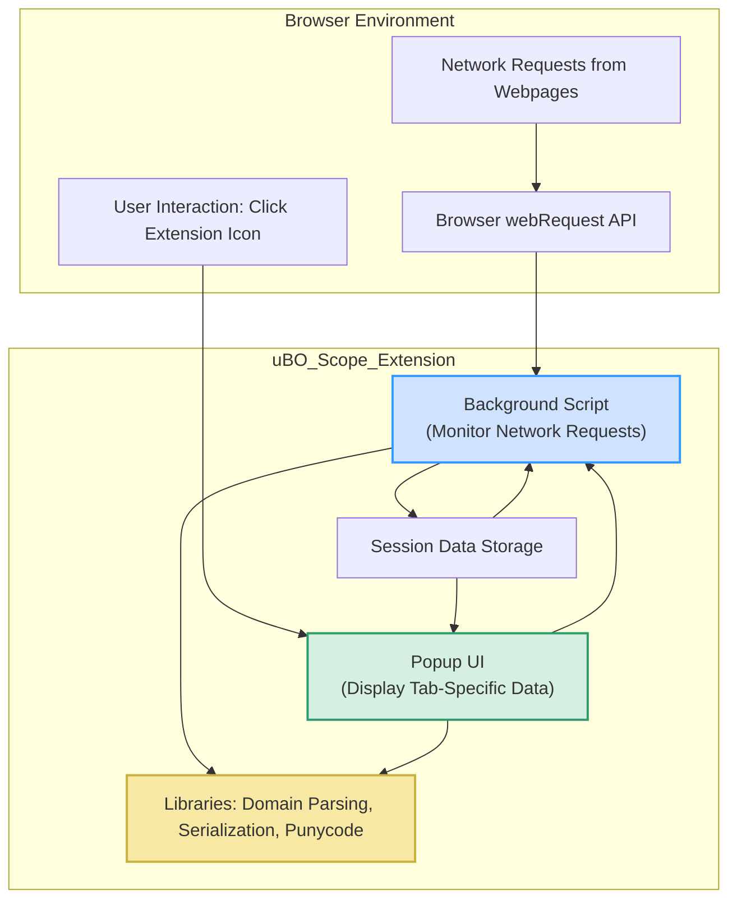

# Extension Architecture Overview

## Introduction

uBO Scope is architected to provide seamless, real-time monitoring of all network connections initiated by webpages within your browser. At its core, the extension intertwines three primary components:

- A **background script** that acts as the sentinel for all network requests, using the browser's `webRequest` API.
- A **popup UI** that offers a per-tab visualization of connection data, empowering users with actionable insights.
- A set of **supporting libraries** responsible for parsing domains accurately and serializing data efficiently across the extension.

This architecture ensures a user-focused flow—from capturing raw network activity at the browser level to presenting clear, digestible summaries tailored to each browser tab.

## Core Components

### Background Script: The Network Watcher

The background script, implemented as a service worker in modern manifest v3 contexts, is the heart of uBO Scope’s architecture. It continuously listens to browser network events, capturing all connection attempts and their outcomes. Key functionalities include:

- **Listening on Network Events:** Utilizing the `webRequest` API, it intercepts network requests before redirects, errors, and responses occur.
- **Tracking Connection Outcomes:** It classifies connections into allowed, stealth-blocked (redirected but unseen), and blocked categories.
- **Mapping Data per Browser Tab:** Each tab's network activity is tracked independently, accumulating data about distinct domains and hostnames contacted.
- **Maintaining Persistent Session Data:** Using browser storage APIs, the script persists session data to avoid loss of monitoring context when tabs close or the extension is reloaded.

This component is designed to function across various browser platforms, harmonizing differences via conditional logic and well-abstracted APIs.

### Popup UI: Visualization and User Interaction

The popup interface delivers the extension's insight in an understandable, actionable format:

- **Tab-Specific Insights:** Upon invocation, the popup queries the background script for the current tab's connection data.
- **Data Rendering:** It organizes and displays distinct third-party domains under categories: not blocked, stealth-blocked, and blocked.
- **User-Friendly Presentation:** Leveraging domain parsing and Unicode handling, domain names are displayed clearly, including punycode decoding for internationalized domains.

Behind the scenes, the popup relies on modular JavaScript files to fetch, deserialize, and render the data dynamically when the user clicks the extension’s icon.

### Supporting Libraries

Several specialized libraries strengthen the extension’s capabilities:

- **Domain Parsing Library (`publicsuffixlist.js`):** Enables accurate extraction of registrable domains from hostnames, allowing precise categorization of connections.
- **Punycode Conversion (`punycode.es6.js`):** Ensures proper representation of internationalized domain names for readability.
- **Serialization Library (`s14e-serializer.js`):** Optimizes data transfer between background and popup components by efficiently serializing session data.

These libraries abstract complex domain logic to present user-centric, accurately parsed domain information.

## Information Flow

The architecture ensures smooth propagation of network data to users via the following flow:

1. **Event Capture:** The background script hooks into the browser’s `webRequest` events for all URL patterns matching the manifest’s host permissions.
2. **Data Aggregation:** Requests are analyzed for their outcome (successful, blocked, redirected, etc.) and recorded per tab.
3. **Session Persistence:** Current network activity data is serialized and saved asynchronously to local storage.
4. **User Query:** When a user opens the popup UI, it sends a message requesting the current tab’s data.
5. **Data Rendering:** The popup deserializes the data and displays domain counts categorized by their outcome.

This user-intent-driven data flow aligns perfectly with the extension's primary goal: to provide insight on remote server connections per tab.

## Cross-Browser Support Via Manifests

uBO Scope supports Chromium-based, Firefox, and Safari browsers by maintaining discrete manifest files tailored to each platform's requirements:

- **Manifest Content:** Each platform’s manifest defines common behaviors such as extension icons, popup HTML, permissions, background scripts, and minimum supported browser versions.
- **Permissions:** `webRequest`, `storage`, and `activeTab` permissions enable monitoring and data persistence across all supported browsers.
- **Background Script Configuration:** While Chromium uses a service worker for the background script, Firefox and Safari rely on background script entries aligning with their platform conventions.
- **Host Permissions:** Broad URL patterns (`http://*/*`, `https://*/*`, and websocket schemes for Chromium and Firefox) ensure comprehensive network event tracking.

This manifest-based approach enables unified extension behavior while respecting platform-specific capabilities and constraints.

## Illustrative Diagram



## Practical Scenario Example

Imagine you visit a new website and want to understand what third-party servers the site is communicating with:

- The background script listens and records all network requests initiated by the page.
- It categorizes connections clearly: which were successful (allowed), blocked, or silently redirected (stealth-blocked).
- When you click the uBO Scope icon, the popup shows the number of distinct domains your browser connected to, listing them under these categories.
- This insight helps you verify if the site is reaching out to unexpected third parties or if your content blocker is effectively limiting connections.

## Best Practices and Tips

- **Keep the extension updated** to benefit from improvements in domain parsing and UI rendering.
- **Combine with content blockers** but do not rely on block counts alone. Use uBO Scope for transparent insight into actual remote connections.
- **Understand domain granularity:** The extension normalizes domains correctly; users see distinct domains instead of just URLs.
- **Use on supported browsers:** Check the Supported Browsers & Prerequisites documentation to ensure compatibility.

## Troubleshooting Common Pitfalls

- If the popup shows no data, ensure your browser's `webRequest` API is fully functional and permissions are granted.
- If counts seem unexpectedly high, consider sites using multiple CDNs or legitimate third parties.
- Remember that network activity outside the browser (e.g., system-level DNS filtering) might not be captured.

## Next Steps

To start using uBO Scope effectively:

- Review the **Supported Browsers & Prerequisites** to confirm your environment compatibility.
- Follow the **Installing uBO Scope** guide in the Getting Started section.
- Read through **Interpreting Network Insights** to understand the popup interface deeply.


---

_Source code and configuration files related to this architecture overview can be found in the GitHub repository: [uBO-Scope on GitHub](https://github.com/gorhill/uBO-Scope)_


---

For a high-level understanding of how uBO Scope differs from typical content blockers and detailed feature summaries, refer to related architecture and concept pages in the documentation.

---

### Code Snippet: Example Background Listener Setup
```javascript
// Register listeners for network events
browser.webRequest.onBeforeRedirect.addListener(details => {
    queueNetworkRequest(details, 'redirect');
}, { urls: manifest.host_permissions });

browser.webRequest.onErrorOccurred.addListener(details => {
    queueNetworkRequest(details, 'error');
}, { urls: manifest.host_permissions });

browser.webRequest.onResponseStarted.addListener(details => {
    queueNetworkRequest(details, 'success');
}, { urls: manifest.host_permissions });

function queueNetworkRequest(details, event) {
    details.event = event;
    networkRequestJournal.push(details);
    if (networkRequestJournalTimer !== undefined) return;
    networkRequestJournalTimer = setTimeout(() => {
        networkRequestJournalTimer = undefined;
        processNetworkRequestJournal();
    }, 1000);
}
```

This snippet exemplifies the extension's listening mechanism that underpins real-time data collection.

---

# Summary
This architecture is carefully designed to provide a reliable, cross-browser compatible solution for monitoring and reporting remote server connections initiated by web pages. The clear separation of background network monitoring, data serialization and storage, and popup-based user interaction ensures both efficiency and usability. Supporting libraries refine domain parsing and data presentation, while explicit manifests guarantee smooth deployment across Chromium, Firefox, and Safari browsers.

---