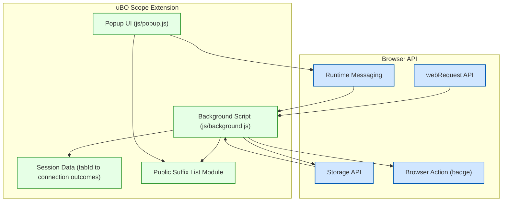

# How uBO Scope Works (Architecture Diagram)

## Overview

Understanding how uBO Scope operates under the hood provides valuable insight into its transparent reporting of network requests. This page visually breaks down the extension into its major functional components, illustrating how browser APIs, background processing, session management, and the user interface collaborate to reveal connection details in real time.

Through this architecture, users gain clarity on how uBO Scope captures, processes, and presents data about every attempted and successful connection to remote servers during their browsing activity.

---

## Core Components and Their Roles

### 1. Background Script

At the heart of uBO Scope’s monitoring capabilities lies the background script (“background.js”). It acts as the central observer: listening to browser webRequest events such as redirects, errors, and successful responses.

- It tracks each network request’s details, like the URL, request type, and tab association.
- It maintains session data mapping tab IDs to detailed connection outcomes.
- It processes batches of network events asynchronously, ensuring efficient data management.
- It updates the toolbar icon badge with the count of unique third-party domains connected.

### 2. Session Data Management

Session data is critical to persist and correlate network outcomes within each browser tab.

- Using storage APIs (`session.storage`), session state is read, updated, and saved by the background script.
- The session maps tab IDs to complex structures that record allowed, stealth-blocked, and blocked domain sets.

### 3. Public Suffix List Module

To accurately identify registrable domains from hostnames, uBO Scope integrates a Public Suffix List (PSL) library.

- Provides domain parsing logic to group hosts by their effective second-level domain.
- Ensures meaningful aggregation of network connections beyond raw hostnames.

### 4. Popup UI

The popup component offers a summarized view of collected data for the current active tab.

- It queries the background script asynchronously for session details about the tab.
- Displays categorized domains under not blocked, stealth blocked, and blocked outcomes.
- Uses the `punycode` library for correct domain name rendering.

### 5. Extension APIs

Throughout, the extension relies on browser-provided APIs:

- **WebRequest API**: To listen to network request lifecycle events.
- **Storage API**: To manage persistent session data.
- **Runtime Messaging**: Enables communication between the popup and background script.
- **Browser Action**: To update the UI badge count dynamically based on data.

---

## Workflow Summary

### Explanation:
- **Browser API events** trigger the Background script when network requests occur.
- The Background script processes these requests, using the PSL to resolve domain cases.
- Connection outcomes are stored in the session and persisted in local storage.
- The background script updates UI badges via the Browser Action API.
- When the user opens the Popup UI, it requests tab-specific session data through runtime messaging.
- Popup renders connection details for user inspection.

---

## Practical Example User Flow

Imagine you are browsing a webpage:

1. The page starts loading.
2. The Background script detects each network request the page initiates.
3. For each request, it categorizes the outcome: allowed, blocked, or stealth-blocked.
4. Domain names are normalized via the PSL module to group subdomains meaningfully.
5. The session state updates the count and list of connected hosts.
6. The toolbar badge reflects the number of distinct third-party domains connected.
7. Opening the uBO Scope popup presents a clear summary of all connected domains for that tab, split by connection outcome.

This seamless orchestration allows users to see beyond superficial block counts and understand actual network connection behavior.

---

## Tips and Best Practices

- **Browser Compatibility:** The extension detects browser flavor (Chromium, Firefox, Safari) to adjust internal APIs as needed.
- **Transient Storage:** Since storage.session is ephemeral per session, session data is rebuilt and saved dynamically for accuracy.
- **Robust Message Handling:** Background scripts retry message sends to cope with service worker evictions, ensuring data consistency.
- **Accurate Domain Grouping:** By using the Public Suffix List, users get meaningful counts that reflect real-world registrable domains, not just raw subdomains.

---

## Troubleshooting Common Issues

- **Badge Count Not Updating:** Ensure the background script is running and the webRequest permissions are granted in the browser.
- **Popup Shows No Data:** Verify if the active tab is correctly detected; network data is associated per tab.
- **Domain Names Display Incorrectly:** This sometimes arises from Unicode domains; the punycode library correctly handles encoding/decoding.

---

## Additional References

For detailed understanding of how to use uBO Scope’s UI and interpret the data you've uncovered from the architecture described here, visit:

- [Your First Run](../getting-started/first-use-and-validation/first-run-experience)
- [Understanding Connection and Domain Counts](../guides/core-workflows/understanding-domain-counts)
- [Analyzing Request Outcomes: Allowed, Blocked, and Stealth](../guides/core-workflows/analyzing-request-outcomes)

<Info>
This architecture page complements the [What is uBO Scope?](../overview/product-introduction/what-is-ubo-scope) and [Key Features at a Glance](../overview/feature-overview/main-features) documentation by providing a technical visualization of the extension’s internal data flows.
</Info>

---

_This page is part of the comprehensive uBO Scope documentation, designed to empower users with transparent visibility into their browser's network activity._

---

_Last updated: 2024-06_
