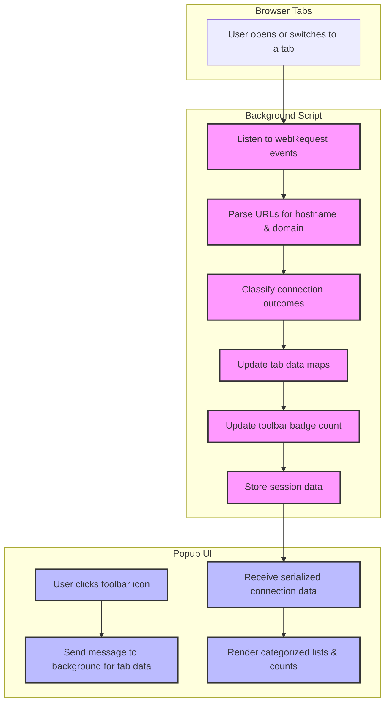

# System Architecture Overview

## Introduction

The System Architecture Overview page presents a clear, benefit-focused explanation of how uBO Scope operates behind the scenes to provide accurate, real-time visibility into browser network requests. This design enables users to effortlessly understand why they can trust and rely on the extension for privacy insights without needing to engage with complex technical details.

uBO Scope’s architecture is lightweight and modular, centered on background listeners that actively observe all network requests from the browser. This structure ensures data accuracy, performance efficiency, and seamless functionality across supported browsers.

---

## What is uBO Scope's System Architecture?

At its core, uBO Scope consists of two primary components working in tandem:

- **Background Script**: Continuously watches all outgoing network requests from browser tabs, captures their outcomes (allowed, blocked, stealth-blocked), and organizes this data efficiently.
- **User Interface Popup**: Displays concise, real-time summaries of these activities in an intuitive panel, accessible via the browser toolbar icon.

This separation helps keep the system modular and effective. The background script handles the heavy lifting of data collection without interfering with the user experience, while the popup provides instant access to meaningful insights.

### Core Purpose

The architecture exists to: 

- Provide accurate, real-time monitoring of all network connections initiated by active browser tabs.
- Remain independent of browser-specific implementations, ensuring consistent behavior across platforms.
- Minimize resource usage and avoid adversely affecting browser performance.
- Deliver clear, actionable data to help users understand and manage their exposure to third-party servers.

### Key Differentiators

Unlike many tools that rely on sampling or partial data, uBO Scope’s background script listens to every network event using browser `webRequest` APIs, capturing the precise outcome and details of each request. This guarantees comprehensive visibility into browser activity. Furthermore, the system operates without depending on any single browser’s internal mechanisms beyond standard APIs, maintaining its browser-agnostic flexibility.

---

## Architectural Components & Data Flow

### Background Listener

The background script acts as the engine of uBO Scope. It registers listeners for network request events such as redirects, errors, and successful responses using the browser's `webRequest` API. Upon receiving relevant events, it:

- Parses the request URL to extract the hostname and its associated domain.
- Categorizes each connection outcome into three states:
  - **Allowed:** The request succeeded and was not blocked.
  - **Blocked:** The request failed due to blocking.
  - **Stealth-Blocked:** The request was redirected or altered stealthily.
- Aggregates information per active browser tab, tracking both hostnames and their parent domains, including counts of connection attempts.
- Updates the toolbar badge count dynamically to reflect the number of unique third-party domains contacted.

### User Interface Popup

When users click the uBO Scope toolbar icon, the popup HTML is loaded. The popup:

- Requests tab-specific summary data from the background script via messaging APIs.
- Receives a serialized, compacted summary of network connections.
- Dynamically renders the connection data in three categorized sections (allowed, stealth-blocked, blocked) listing domains with request counts.
- Displays a summary count of all domains connected in the current tab.

The popup’s design emphasizes clarity and quick comprehension by organizing domains by their connection status and allowing users to see at a glance how many distinct domains are active.

---

## Data Persistence and Session Management

uBO Scope stores session data temporarily using browser storage APIs, allowing it to:

- Maintain connection tracking between page reloads within the same browser session.
- Clean up data when tabs are closed, ensuring accurate and current reporting.
- Cache the Public Suffix List used for determining domain boundaries, enabling precise domain extraction from hostnames.

This session storage strategy ensures that real-time data is available promptly without long-term persistence that might affect privacy or resource usage.

---

## Technical Workflow Summary

---

## Practical Implications for Users

By structuring uBO Scope's architecture into independent, focused components, the system offers users:

- **Immediate Visibility**: Up-to-the-second insights available through the popup without delay or complex navigation.
- **Comprehensive Coverage**: Captures connection outcomes regardless of third-party filtering methods or blocking techniques in use.
- **Browser Compatibility**: Works uniformly on Chromium, Firefox, and Safari, as each platform uses a manifest and background scripts adapted for MV3 standards but share the same core logic.
- **Low Resource Impact**: Efficient listening and data handling that doesn't hamper browsing speed or system performance.

Users benefit from access to unfiltered connection data that reflect actual privacy exposures, empowering better decisions about filter lists, privacy tools, and browsing habits.

---

## Tips & Best Practices

- Always check the popup panel after visiting a site to see which domains your browser actually connected to.
- Use the badge count as a quick indicator of your exposure to third-party servers; fewer unique domains mean tighter privacy.
- Remember that stealth-blocked connections highlight requests intercepted in ways not immediately visible on webpages — a crucial insight for privacy technicians.
- If the popup shows unexpected high counts, consider reviewing your content blocker settings or investigating suspicious domains.

---

## Troubleshooting

If data does not appear in the popup or badge counts seem inaccurate:

- Confirm that the extension has all required permissions, particularly access to webRequest APIs.
- Ensure you are using a supported browser version (see Supported Browsers documentation).
- Reload the browser tab or restart the browser to reset session data.
- Consult the Troubleshooting Setup Issues guide if problems persist.

---

## Next Steps

To deepen your understanding and make the most of uBO Scope:

- Visit [Popup Panel and Badge Explained](/overview/feature-overview-usage/popover-and-badge) to learn how to interpret the popup interface.
- Review [Supported Browsers & Compatibility](/overview/feature-overview-usage/supported-browsers) for environment details.
- Explore [Why Use uBO Scope?](/overview/introduction-and-value/product-value) to grasp the practical benefits.

For developers or curious users, the full source code is hosted on [GitHub](https://github.com/gorhill/uBO-Scope).

---