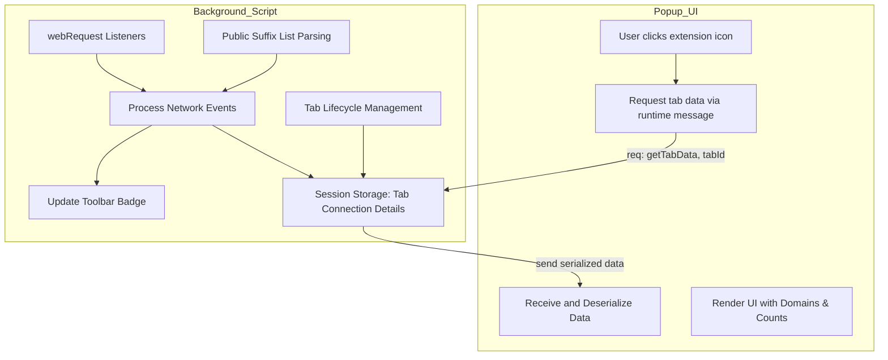

# System Architecture

## Visualizing uBO Scope's Core Components and Data Flow

Understanding how uBO Scope operates internally is essential to appreciating how it efficiently observes, tracks, and reports network connections from active browser tabs. This page provides a clear overview of the major components—the background script responsible for network monitoring, the popup user interface, and the data pipeline connecting them. By mapping these pieces together, users can grasp how uBO Scope delivers precise, real-time insights on network requests with minimal overhead.

---

## How uBO Scope Works: A High-Level Overview

At its heart, uBO Scope is a lightweight browser extension designed to capture all network requests a webpage initiates or attempts within the active tab and to clearly display this information to the user. It achieves this by combining three core parts:

- **Background Script:** Running persistently, it listens to the browser’s network events and builds detailed records on every connection attempt.
- **Popup UI:** The interactive panel users see when clicking the extension icon, which fetches and presents summarized connection data for the current tab.
- **Data Flows:** The communication channels exchanging connection data between the background script and popup UI, ensuring timely, accurate display.

Each component plays a distinct role, and their interplay forms the backbone of uBO Scope’s functionality.

---

## Major Internal Components

### 1. Background Script (Network Monitoring)

This is the engine room of uBO Scope, responsible for observing all network requests made by webpages within the browser. Key aspects include:

- **Network Events Monitoring:** Utilizes the browser’s `webRequest` API to listen for network lifecycle events such as `onBeforeRedirect`, `onErrorOccurred`, and `onResponseStarted`. This ensures all connection outcomes are captured.
- **Request Outcome Tracking:** For each network request, the background script categorizes it into one of three outcomes:
  - **Allowed:** Requests that succeed (e.g., response received).
  - **Stealth-Blocked:** Requests that are redirected in a way that conceals blocking.
  - **Blocked:** Requests that fail outright.
- **Session Data Management:** Maintains a session-level in-memory map linking each active tab to its detailed network outcomes, including counts and domain occurrences. This state is serialized and persisted regularly to session storage.
- **Public Suffix List Utilization:** Integrates a parsed version of the public suffix list to accurately extract domain names from hostnames for precise grouping and counting.
- **Tab Lifecycle Handling:** Detects tab closures and cleans up associated data proactively to maintain resource efficiency.

### 2. Popup UI

The friendly face of uBO Scope where users interact:

- When invoked, it queries the background script for the latest aggregated network connection data of the active tab.
- Presents a clean, categorized breakdown showing domains by outcome (allowed, stealth-blocked, blocked), alongside connection counts.
- Handles complex internationalized domain names by decoding punycode to Unicode for readability.
- Includes an intuitive summary count badge reflecting the number of distinct third-party domains connected.

The popup is built using HTML, CSS, and JavaScript modules to ensure a smooth, responsive experience.

### 3. Inter-Script Data Flow

Communication between background monitoring and the popup UI is crucial to deliver real-time accuracy:

- The popup sends a message requesting data for the current tab.
- The background script responds asynchronously with serialized tab-specific network data.
- Data is deserialized and rendered on the popup.

Additionally, the background script updates the toolbar badge dynamically based on changes to allowed domains within each tab.

---

## Data Flow Diagram

This flowchart illustrates:
- How the background script hooks into browser events to monitor network activity
- Session storage’s role as the shared state keeping per-tab details
- The messaging interface powering popup data retrieval and rendering
- UI events triggering data refreshes for user visibility

---

## How These Components Work Together In a Typical User Flow

1. **User Opens a Webpage:**
   The browser issues several network requests from the page.

2. **Background Script Observes Requests:**
   Listeners detect request events, categorize their outcome (allowed, blocked, stealth blocked), and update per-tab details.

3. **Tab and Data Maintenance:**
   The background script organizes these by domain, uses the public suffix list to accurately group them, and persists this state.

4. **User Clicks Extension Icon:**
   The popup UI queries the background script for the active tab’s current data.

5. **Popup Displays Results:**
   Data arrives serialized, is deserialized, then shown in an informative panel listing connections by category.

6. **Toolbar Badge Reflects Summary:**
   Independently, the background script updates the badge number to the count of distinct allowed third-party domains.

This design ensures minimal delay, robust data retention during browsing, and a seamless user experience.

---

## Practical Tips for Users

- The toolbar badge provides a quick summary: a lower badge count means fewer distinct third-party servers connected, helping alert you to privacy leakages.
- The popup separates domains by connection outcome, making it simple to spot which domains are fully allowed, stealthily blocked, or outright blocked.
- Data accuracy depends on browser support for the `webRequest` API; most modern browsers support the required events.
- Tab data is refreshed each time you activate the popup, ensuring current visibility without extraneous overhead.

---

## Troubleshooting Common Issues

<AccordionGroup title="Common System Architecture Issues">
<Accordion title="Popup shows no data or stale data">
Ensure the background script is running. Reloading the extension or the tab may resolve transient communication issues.
</Accordion>
<Accordion title="Toolbar badge is missing or incorrect">
Verify that the tab is active and network requests have been recorded. Badge updates occur asynchronously, typically within one second after network events.
</Accordion>
<Accordion title="Connections not being tracked as expected">
Check browser permissions and visibility of the `webRequest` API for your browser version. Network requests made bypassing the browser’s API cannot be tracked.
</Accordion>
</AccordionGroup>

---

By knowing how uBO Scope’s internal components interconnect, you can better leverage its diagnostic power to gain full transparency on third-party network activity within your browser environment.

---

## Additional Resources

- [What is uBO Scope?](/overview/introduction-and-value/what-is-ubo-scope) — Understand the core purpose and user benefits
- [Popup UI Guide](/guides/getting-started/understanding-the-ui) — Explore details on how the user interface presents data
- [Analyzing Third-Party Connections](/guides/core-workflows/analyzing-connections) — Walk through practical workflows using uBO Scope data
- [GitHub Repository](https://github.com/gorhill/uBO-Scope) — Access source code and follow development
