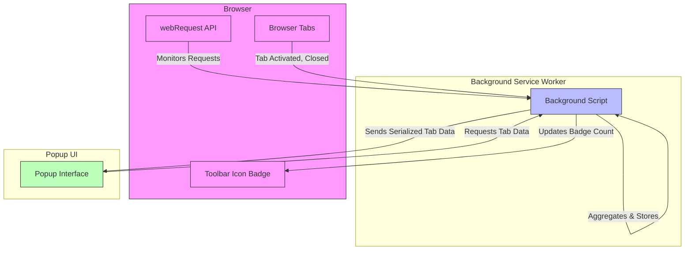

# Feature Overview & Quickstart

## Instant Domain Connection Tracking at Your Fingertips

uBO Scope is designed to give you real-time insight into the network connections initiated by the active browser tab — from first-party domains to third-party servers. Instantly see which domains are contacted, what was allowed, blocked, or stealth-blocked, without relying on specific content blocking engines or DNS settings.

### What This Page Covers
- Core features that power uBO Scope's connection tracking
- How the extension works seamlessly across browsers
- A quickstart guide to using the popup for connection inspection

---

## How uBO Scope Reveals Your Tab's Network Activity

At its core, uBO Scope hooks into the browser's `webRequest` API to capture detailed events on every network request made by the active tab. It tracks each distinct domain encountered, categorizing request outcomes irrespective of any blockers, DNS filters, or network conditions.

Key ideas:

- **Domain normalization:** Domains are resolved and grouped using the Public Suffix List to ensure precise counting.
- **Request outcomes:** The extension distinguishes requests into:
  - **Allowed:** Successfully connected and resource fetched.
  - **Blocked:** Explicitly blocked or failed requests.
  - **Stealth-blocked:** Redirected or suppressed connections often hidden by stealthy blockers.
- **Session awareness:** Connection data is kept per tab, ensuring accurate monitoring scoped to the active browsing context.

This approach guarantees you see the _full picture_ — including connections that stealth content blockers try to hide.

---

## Core Features

- **Cross-Browser Compatibility:** Works on Chromium-based browsers (Chrome, Edge), Firefox, and Safari, adapting to their respective extension API nuances.
- **Popup Interface for Quick Inspection:** Open the toolbar popup to see instantly the network domains contacted by the active tab, including counts of allowed, blocked, and stealth-blocked domains.
- **Accurate Session Statistics:** Captures live connection data, consolidates domain hits, and updates the popup dynamically.
- **Badge Count Indicator:** The toolbar icon displays the number of distinct third-party remote servers connected in the active tab, aiding quick status checks.
- **Independence from Blocking Engines:** Works regardless of which content blocking extension or DNS filtering is used, by tapping directly into browser network events.

---

## How It Works: Flow of Data

This diagram represents the main interaction:

- The background script listens to webRequest events for all tab network activity.
- Tab lifecycle events keep data fresh and accurate.
- Connection details are summarized and saved per tab.
- Badge updates reflect the number of distinct remote domains contacted.
- The popup interacts with the background script to fetch and display detailed connection summaries.

---

## Quickstart: Using the Popup Interface

The popup interface offers a clear and accessible way to view connection details for the current active tab.

### Step-by-Step Usage

<Steps>
<Step title="Open the Extension Popup">
Click the uBO Scope icon in your browser toolbar to open the popup. It will immediately load data for the current active tab.
</Step>
<Step title="View Domain Connection Summary">
At the top, the popup displays the tab's main hostname and the number of distinct domains connected.
</Step>
<Step title="Explore Outcomes">
Below the summary are three sections showing domains categorized by connection outcome:
- **Not Blocked:** Domains successfully contacted.
- **Stealth-Blocked:** Domains whose connections were stealthily redirected or suppressed.
- **Blocked:** Domains explicitly blocked or failed to connect.
</Step>
<Step title="Analyze Domain Counts">
Each domain entry shows how many requests were made, helping identify frequent connections.
</Step>
</Steps>

### What to Expect
- The popup shows data in near real-time, reflecting current tab browsing activity.
- If no data is available, the popup indicates "NO DATA".
- The lists automatically omit empty outcome sections for clarity.

---

## Practical Tips for Getting the Most from uBO Scope

- **Use the badge as a quick privacy indicator:** A lower badge number means fewer third-party connections, which is often preferable for privacy.
- **Investigate stealth-blocked domains:** These may signal sophisticated content blocking or tracking attempts that try to hide from you.
- **Track domains across your browsing session:** Switching tabs or reloading pages updates the connection data accordingly.
- **Combine with content blockers:** uBO Scope complements blockers by revealing what is truly connecting, helping you validate the effectiveness of your filters.

---

## Common Pitfalls & Troubleshooting

<AccordionGroup title="Common Issues with Popup Usage">
<Accordion title="The Popup Shows No Data or 'NO DATA'">
Ensure you have an active tab with a page loaded and network activity. The popup only reflects data for the current active tab. Reloading the tab or waiting for network requests to occur can help.
</Accordion>
<Accordion title="Badge Count Does Not Update">
Sometimes the badge may lag after tab changes. This clears up automatically after a short delay or when the tab is reactivated.
</Accordion>
<Accordion title="Domains Listed Seem Unexpected">
Domains are normalized using the public suffix list and punycode decoding. Some subdomains may appear separately if they represent different third-party services.
</Accordion>
</AccordionGroup>

---

## Summary

uBO Scope offers instant, accurate tracking of domain connections in your browser, across supported platforms. Its lightweight popup interface provides actionable visibility right from the toolbar, empowering users and filter maintainers alike with real-world connection data — transparent, comprehensive, and independent.

To dive deeper, explore the popup yourself and consult other documentation sections on interpreting badge counts, advanced tips for filter list maintainers, and system architecture.

---

## Next Steps

- Refer to the [Your First Run: Opening the Popup & Seeing Results](/getting-started/setup-begin/first-launch) page to follow a guided walkthrough.
- Explore [Interpreting Badge Counts and Request Outcomes](/guides/real-world-usage-analysis/interpreting-badge-and-panel) for understanding the meaning behind the data.
- If new to installation, see [Prerequisites & Supported Browsers](/getting-started/setup-begin/requirements) to confirm compatibility.

---

## References

- [uBO Scope README](README.md) for detailed purpose and conceptual overview.
- [Core Terminology & Concepts](/overview/architecture-and-core-concepts/core-terminology-and-concepts) for definitions used throughout the extension.
- [System Architecture Overview](/overview/architecture-and-core-concepts/system-architecture) for an in-depth diagram and walkthrough.

