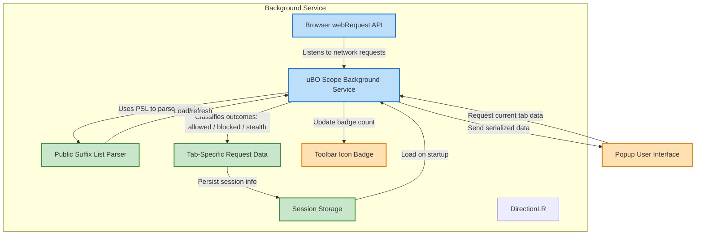

# How uBO Scope Works (with Architecture Diagram)

Discover the inner mechanics behind uBO Scope, a powerful browser extension designed to transparently monitor network activity within your browsing sessions. This page unpacks how uBO Scope operates under the hood, detailing how its background service leverages browser APIs to observe, classify, and report network requests—enabling you to understand what connections your browser makes to remote servers in real-time.

---

## Understanding uBO Scope's Design

At its core, uBO Scope acts as an observer running silently in the background of your browser. It uses dedicated browser `webRequest` listeners to intercept network requests made by webpages, regardless of any content blockers you may have enabled. By hooking into these APIs, uBO Scope gathers comprehensive data on each network call the browser attempts, categorizing each outcome for your clear insight.

This architecture ensures that you see the full landscape of remote servers accessed, including those blocked by other tools or stealthily suppressed connections. With this knowledge, uBO Scope empowers you to grasp the true extent of third-party connections on every webpage.

---

## Key Functional Flow

1. **Network Request Monitoring**
   - uBO Scope's background service registers event listeners on the browser's `webRequest` API.
   - It listens specifically to these network events across URLs permitted in the extension's `host_permissions`:
     - Requests about to be redirected.
     - Requests that fail (errors).
     - Requests that receive a response.

2. **Classifying Request Outcomes**
   - Each intercepted network request is tagged with one of three possible outcomes:
     - **Allowed:** The request succeeded and fetched resources.
     - **Blocked:** The request failed or was actively blocked.
     - **Stealth:** The request was redirected in a way that may bypass standard detection.
   - These classifications update internal data structures that track domains and hostnames involved.

3. **Tab-Specific Data Aggregation**
   - uBO Scope organizes data per browser tab.
   - For every tab, it maintains counts of allowed, blocked, and stealth connections, separated by domains and hostnames.
   - This fine-grained data helps identify distinct third-party domains accessed, not just raw request counts.

4. **Updating User Interface**
   - The extension's popup UI fetches tab-specific data by messaging the background service.
   - Data is deserialized and rendered into sections showing allowed, stealth, and blocked domains along with their request counts.
   - The extension icon's badge reflects the number of distinct allowed third-party domains for the active tab, providing an immediate summary.

5. **Session Memory & Persistence**
   - Session data is stored efficiently in browser session storage to persist data across tab reloads.
   - A public suffix list enables accurate domain parsing and grouping, accounting for registrable domain boundaries.

---

## How Network Requests are Processed

The background script queues network request events as they occur, grouping them for batch processing every second to optimize performance:

- On **redirect** events, requests that do not target network protocols are specially handled to mark them as stealth.
- On **error** events (failed requests), connections are marked as blocked.
- On **response started** events, results indicating success are recorded unless there is no IP or status code, in which case they are treated as errors.

This nuanced observation and classification ensure an accurate depiction of how network connections evolve per tab.

---

## Architecture Diagram

---

## Practical Example: What Happens When You Open a New Webpage?

Imagine opening a new tab with a news website:

- The browser begins loading the page, triggering multiple network requests for the main page frame and embedded resources.
- The background service captures each request:
  - The main frame request marks the beginning of fresh session data for that tab.
  - Requests to trusted CDN domains are typically marked **allowed**.
  - Requests to known advertising or tracking domains might be **blocked** or **stealth-blocked**.
- These outcomes accumulate counts by domain.
- The toolbar badge immediately reflects how many third-party domains successfully connected.
- Opening the extension popup reveals detailed lists grouped by allowed, stealth, and blocked, helping you understand your real exposure.

---

## Tips for Interpreting the Data

- **Badge Counts Reflect Distinct Allowed Domains**: The number on the toolbar icon corresponds to the number of unique third-party domains from which resources were loaded.
- **Stealth Blocked Means Redirected Connections**: Some connections might be redirected or masked, which can be a sign of advanced content blocking techniques or evasion by trackers.
- **Blocked Domains May Indicate Successful Content Blocking**: Seeing domains here confirms your content blocker or network filters are actively blocking those connections.
- **Data is Tab-Specific**: Each browser tab holds its own connection data, reflecting only that page's network activity.

---

## Common Pitfalls and Troubleshooting

- If the badge count seems unexpectedly high or low, remember that uBO Scope shows distinct connected domains, not raw request counts.
- Some network requests made outside the browser’s `webRequest` API (like certain non-HTTP protocols) will not be captured and thus not shown.
- The popup UI only fetches data for the active tab; switching tabs requires reopening or refreshing the popup to see new data.

---

## Next Steps

To deepen your understanding and maximize uBO Scope’s effectiveness:

- Explore how to analyze allowed, stealth, and blocked domains in detail.
- Learn how to interpret badge counts and popup feedback effectively.
- Discover best practices for using uBO Scope alongside your primary content blockers.

---

[Back to Architecture & Core Concepts Overview](../architecture-and-core-concepts/overview)

[Getting Started with uBO Scope](../../getting-started-introduction/what-is-ubo-scope) | [Value Proposition & Problems Solved](../../getting-started-introduction/value-proposition-and-problem-solved) | [Target Audience & Use Cases](../../getting-started-introduction/target-audience-and-use-cases)

---

This documentation is based on the uBO Scope source code and manifest files, reflecting the extension's precise operational design as of version 1.0.1.

---

## Source & Further Reading

- [uBO Scope Source Repository](https://github.com/gorhill/uBO-Scope)
- [Browser Manifest Files (Chromium, Firefox, Safari)](https://github.com/gorhill/uBO-Scope/tree/main/platform)
- [Background and Popup Script Details](https://github.com/gorhill/uBO-Scope/tree/main/js)

---

*This page focuses exclusively on uBO Scope's internal working mechanism and architecture. For detailed user guides and myth debunking, please refer to the Getting Started and Guides sections.*
